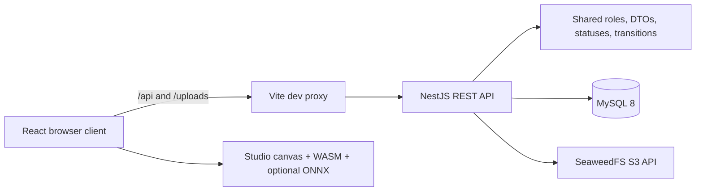

# Manga Creation Workflow & Publishing Management System

An internal manga-studio platform for coordinating creative production from the
first series proposal through publication decisions.

> This project is an operational workflow system for a manga studio. It is not a
> public manga reader.

## Table of Contents

- [Overview](#overview)
- [Production Workflow](#production-workflow)
- [Roles and Capabilities](#roles-and-capabilities)
- [Technology Stack](#technology-stack)
- [Architecture Overview](#architecture-overview)
- [Repository Structure](#repository-structure)
- [Quick Start](#quick-start)
- [Demo Authentication and Development OTP](#demo-authentication-and-development-otp)
- [API Examples](#api-examples)
- [Role-based Demo Walkthrough](#role-based-demo-walkthrough)
- [Testing Strategy](#testing-strategy)
- [Production Checklist](#production-checklist)
- [Troubleshooting and FAQ](#troubleshooting-and-faq)
- [Documentation](#documentation)
- [Contributing](#contributing)

## Overview

The platform gives authors, assistants, editors, board members, and administrators
one shared workflow for planning, producing, reviewing, publishing, and evaluating
manga series. Work is organized around chapters, pages, page regions, assignments,
submissions, reviews, rankings, and decisions.

Key capabilities include:

- Series proposal submission and editorial-board approval.
- Chapter and page production management.
- Region-based task assignment for production assistants.
- A browser-based drawing Studio with optional local AI assistance.
- Mangaka and editor review queues with revision workflows.
- Publishing, voting, ranking, and continuation decisions.
- Earnings tracking, disputes, notifications, RBAC, and administration.

## Production Workflow

```text
Series proposal
  -> Editorial-board approval
  -> Series and chapter planning
  -> Page upload
  -> Region definition
  -> Assistant task assignment
  -> Assistant submission
  -> Mangaka review
  -> Tantou editor review
  -> Publishing
  -> Voting and ranking
  -> Editorial decision
```

Statuses and transitions are enforced by shared state-machine definitions rather
than being inferred only by the UI. See the
[domain model and state machines](documents/02-architecture/03-domain-model-and-state-machines.md)
for the complete lifecycle.

## Roles and Capabilities

| Role | Primary responsibilities |
| --- | --- |
| `MANGAKA` | Submit proposals, manage series and chapters, upload pages, define regions, assign assistant tasks, and review submissions. |
| `ASSISTANT` | Accept assigned work, use the Studio and AI tools, submit completed work, view earnings, and raise disputes. |
| `TANTOU_EDITOR` | Review chapters, add annotations, approve work, or request revisions. |
| `EDITORIAL_BOARD` | Review proposals, assign editors, manage voting periods and rankings, and record editorial decisions. |
| `ADMIN` | Manage users and resolve disputes while respecting platform safety guards. |

Detailed guides are available under [Role documentation](documents/05-roles/).

## Technology Stack

| Area | Technology |
| --- | --- |
| Frontend | React, Vite, TypeScript, Tailwind CSS |
| Backend | NestJS, TypeScript, REST, Swagger/OpenAPI |
| Database | MySQL 8 |
| Object storage | SeaweedFS with an S3-compatible API |
| Shared contracts | Workspace package with roles, statuses, DTOs, and transitions |
| Studio | Browser canvas engine, WebAssembly, ONNX Runtime Web with heuristic fallbacks |
| Tooling | pnpm workspaces, Jest, Vitest, Docker Compose |

## Architecture Overview



### Request flow

1. A React page validates basic input and sends a request through the shared
   Axios client.
2. The request interceptor attaches the stored bearer token when the user is
   authenticated.
3. During development, Vite proxies `/api` and `/uploads` to NestJS on port
   `3000`.
4. NestJS applies throttling, authentication, role guards, and DTO validation
   before invoking a domain service.
5. The service enforces ownership and state-transition rules, then reads or
   writes MySQL and SeaweedFS as required.
6. The frontend receives the response, updates local UI state, and surfaces
   success or failure through inline states and toast notifications.

The shared workspace package keeps roles, statuses, DTOs, and workflow
transitions consistent across the frontend and backend. See the
[system architecture](documents/02-architecture/01-system-architecture.md) and
[security and RBAC guide](documents/02-architecture/04-security-and-rbac.md) for
deeper details.

## Repository Structure

```text
apps/
  backend/            NestJS API, authentication, workflows, and persistence
  frontend/           React application and browser-based Studio
packages/
  shared/             Shared roles, statuses, transitions, DTOs, and types
  canvas-wasm/        WebAssembly operations used by the Studio
db/                   MySQL schema, seed data, SeaweedFS config, Docker Compose
documents/            Product, architecture, API, diagram, and role documentation
test/                 Cross-application and end-to-end test assets
```

## Prerequisites

Install the following before running the project:

- Node.js 20 or newer.
- pnpm 11 or newer.
- Docker Desktop or Docker Engine with Docker Compose.

Confirm the tools are available:

```powershell
node --version
pnpm --version
docker --version
docker compose version
```

## Quick Start

Run all commands from the repository root.

### 1. Install dependencies

```powershell
pnpm install
```

### 2. Configure the backend

Create the local backend environment file from the tracked example.

Windows PowerShell:

```powershell
Copy-Item apps\backend\.env.example apps\backend\.env
```

macOS or Linux:

```bash
cp apps/backend/.env.example apps/backend/.env
```

The default development configuration connects to MySQL on port `3308` and uses
the database created by the Docker initialization scripts. Change the JWT secret
and OAuth values before using the application outside local development.

### 3. Start infrastructure

```powershell
pnpm db:up
```

This starts:

- MySQL on `localhost:3308`.
- SeaweedFS S3 API on `localhost:8333`.
- SeaweedFS filer UI on `localhost:8888`.

Check container health when startup is still in progress:

```powershell
docker ps --filter "name=manga-dev"
```

### 4. Start backend and frontend

Open two terminals in the repository root.

Terminal 1:

```powershell
pnpm dev:backend
```

Terminal 2:

```powershell
pnpm dev:frontend
```

Vite proxies `/api` and `/uploads` requests to the local backend, so the default
frontend configuration requires no additional API URL.

## Local URLs

| Service | URL |
| --- | --- |
| Frontend | <http://localhost:5173> |
| Backend API | <http://localhost:3000/api> |
| Swagger UI | <http://localhost:3000/api/docs> |
| SeaweedFS S3 API | <http://localhost:8333> |
| SeaweedFS filer | <http://localhost:8888> |

## Demo Authentication and Development OTP

On backend startup, the seed service prepares local demo accounts for each role.
The default local-only password is `Dung123456@` unless `DEMO_USER_PASSWORD` is
set in `apps/backend/.env`.

| Role | Demo email |
| --- | --- |
| Mangaka | `dungminer69@gmail.com` |
| Assistant | `mai.assistant@inkframe.studio` |
| Tantou editor | `hiroshi.editor@inkframe.studio` |
| Editorial board | `yamamoto.board@inkframe.studio` |
| Admin | `admin@inkframe.studio` |

Two-factor authentication is enabled in the local login flow. When SMTP is not
configured, the backend logs the OTP in its terminal. To display the code in the
development UI as well, add this to `apps/backend/.env` and restart the backend:

```env
OTP_DEV_ECHO=true
```

`OTP_DEV_ECHO` is a development aid. Never enable it in production.

## API Examples

The examples below target the local backend at `http://localhost:3000`. Values
inside angle brackets are placeholders and must be replaced. Never commit real
access tokens, passwords, or OTP codes.

### 1. Start a password login

```http
POST /api/auth/login
Content-Type: application/json

{
  "email": "mai.assistant@inkframe.studio",
  "password": "<demo-or-local-password>"
}
```

With 2FA enabled, the response contains a challenge token rather than the final
access token.

### 2. Verify the 2FA challenge

```http
POST /api/auth/2fa/verify
Content-Type: application/json

{
  "challengeToken": "<challenge-token-from-login>",
  "code": "<six-digit-code>"
}
```

A successful verification response provides the access token used by protected
endpoints. The frontend stores it locally and adds it to subsequent requests.

### 3. List the assistant's tasks

```http
GET /api/tasks/mine
Authorization: Bearer <access-token>
```

Only an authenticated assistant can access this endpoint.

### 4. Start an assigned task

```http
PATCH /api/tasks/42/start
Authorization: Bearer <access-token>
```

Replace `42` with an assigned task ID. The backend validates the assignee and
the allowed task-state transition.

### 5. Create a submission

```http
POST /api/submissions
Authorization: Bearer <access-token>
Content-Type: application/json

{
  "taskId": 42,
  "fileUrl": "/uploads/task-42.png",
  "versionNote": "First completed pass"
}
```

The IDs and upload URL are examples. The application normally uploads the file
through `POST /api/uploads`, receives its URL, and then creates the submission.
For the complete endpoint catalog, see the
[API reference](documents/03-api/01-api-reference.md) or local Swagger UI.

## Role-based Demo Walkthrough

This scenario demonstrates how one unit of work travels across the studio.

| Step | Role | Action | Expected result |
| --- | --- | --- | --- |
| 1 | Editorial Board | Open the proposal review queue and approve a submitted series proposal. | The approved proposal can become an active series with production planning. |
| 2 | Mangaka | Open a chapter, upload a page, draw a region, and assign that region to an assistant. | A priced task is created in `ASSIGNED` state and the assistant is notified. |
| 3 | Assistant | Open **My Tasks**, start the assignment, work in Studio, upload the result, and submit it. | The task advances through `IN_PROGRESS` to `SUBMITTED`, with a review item for the mangaka. |
| 4 | Mangaka | Review the submission and approve it or request a revision with feedback. | Approval completes the task; a revision returns actionable feedback to the assistant. |
| 5 | Tantou Editor | Review the chapter, inspect page work, add annotations, and approve or request changes. | The chapter follows its guarded editorial-review transition. |
| 6 | Editorial Board | Open and close voting periods, inspect rankings, and record a continuation decision. | Governance data is preserved for the series decision workflow. |
| 7 | Admin | Review users and resolve submitted payment disputes. | Administrative actions are recorded while platform safety guards remain enforced. |

Use the [role guides](documents/05-roles/) for exact permissions, UI routes, and
state rules before presenting a production demo.

## Testing Strategy

The monorepo keeps tests close to the component they verify:

- `@manga/shared` tests roles, statuses, and transition rules shared by clients.
- `@manga/canvas-wasm` tests the WebAssembly loader and canvas-facing operations.
- Backend Jest suites cover authentication, services, validation, and workflows.
- Frontend Vitest suites cover components, user interactions, and Studio behavior.
- The root build validates package order and production TypeScript compilation.

Run the complete suite:

```powershell
pnpm test
pnpm build
```

Run a focused workspace suite:

```powershell
pnpm -F @manga/shared test
pnpm -F @manga/canvas-wasm test
pnpm -F backend test
pnpm -F frontend test
```

Focused tests are useful while developing, but run the complete suite before a
pull request is merged.

## Production Checklist

- [ ] Replace development JWT and OAuth values with managed secrets.
- [ ] Configure SMTP delivery and confirm `OTP_DEV_ECHO` is disabled.
- [ ] Restrict `CLIENT_URL` and CORS to approved production origins.
- [ ] Provision MySQL with migrations/init procedures, backups, and restore tests.
- [ ] Provision S3-compatible storage and verify bucket access and retention.
- [ ] Disable or replace local demo credentials in the production environment.
- [ ] Run the full test suite and production build from a clean checkout.
- [ ] Review throttling, logs, health monitoring, alerts, and rollback procedures.
- [ ] Confirm TLS termination and secret rotation with the deployment owner.

This repository documents application setup but does not claim to provide a
complete production deployment platform. Infrastructure and operational controls
must be supplied by the target environment.

## Available Commands

| Command | Purpose |
| --- | --- |
| `pnpm build:packages` | Build shared TypeScript and canvas WebAssembly packages. |
| `pnpm dev:backend` | Build workspace packages and start NestJS in watch mode. |
| `pnpm dev:frontend` | Build workspace packages and start Vite. |
| `pnpm build` | Build all workspace projects. |
| `pnpm test` | Run workspace tests. |
| `pnpm db:up` | Start MySQL and SeaweedFS containers. |
| `pnpm db:down` | Stop the development containers. |

## Troubleshooting and FAQ

### `No database selected`

The backend did not load `DB_NAME`. Confirm that
`apps/backend/.env` exists and contains:

```env
DB_NAME=manga_creation_workflow_and_publishing_management_system
```

Restart `pnpm dev:backend` after changing the environment file.

### `EADDRINUSE: address already in use :::3000`

Another backend process is already using port `3000`. On Windows, identify it:

```powershell
Get-NetTCPConnection -LocalPort 3000 -State Listen |
  Select-Object LocalAddress, LocalPort, OwningProcess
```

Stop only the confirmed stale development process, then restart the backend:

```powershell
Stop-Process -Id <OwningProcess>
pnpm dev:backend
```

Use the same check with port `5173` if Vite reports a frontend port conflict.

### OTP is not visible

1. Confirm the backend completed startup without database errors.
2. Log in again to issue a fresh OTP.
3. Check the backend terminal for the development OTP message.
4. If UI echo is required, set `OTP_DEV_ECHO=true` and restart the backend.

### S3 bucket or upload warnings

Ensure the Docker services are running:

```powershell
pnpm db:up
docker ps --filter "name=manga-dev"
```

The backend can start while storage is unavailable, but upload and Studio submission
flows require SeaweedFS.

### Which local folder and branch should I edit?

Work inside the repository created by `git clone`, not an older ZIP extraction or
manually initialized folder. Before editing, check:

```powershell
git remote -v
git branch --show-current
git status
```

Create a focused branch from the team's integration branch and keep unrelated
changes out of the same pull request.

### Why do saved frontend changes not appear?

A different Vite process may own port `5173`, especially when multiple clones
exist. Identify the listener and confirm its command path before stopping it:

```powershell
Get-NetTCPConnection -LocalPort 5173 -State Listen |
  Select-Object LocalAddress, LocalPort, OwningProcess
Get-CimInstance Win32_Process -Filter "ProcessId=<OwningProcess>" |
  Select-Object ProcessId, CommandLine
```

Restart `pnpm dev:frontend` from the intended repository and branch.

### Where is the API documentation?

Use Swagger at <http://localhost:3000/api/docs> while the backend is running. The
tracked reference is available at
[`documents/03-api/01-api-reference.md`](documents/03-api/01-api-reference.md).

### Why do uploads fail while the rest of the app works?

MySQL and the NestJS API may be healthy while SeaweedFS is unavailable. Check the
`manga-dev-seaweedfs` container, ports `8333` and `8888`, and backend storage logs.
Restart the infrastructure with `pnpm db:up` after confirming Docker is running.

## Documentation

Start with the [documentation index](documents/README.md), then use the relevant
guide:

- [Product overview](documents/01-overview/01-product-overview.md)
- [Requirements and use cases](documents/01-overview/02-requirements-and-use-cases.md)
- [System architecture](documents/02-architecture/01-system-architecture.md)
- [Database design](documents/02-architecture/02-database-design.md)
- [Domain model and state machines](documents/02-architecture/03-domain-model-and-state-machines.md)
- [Security and RBAC](documents/02-architecture/04-security-and-rbac.md)
- [API reference](documents/03-api/01-api-reference.md)
- [Use-case diagrams](documents/04-diagrams/01-use-case-diagrams.md)
- [Sequence diagrams](documents/04-diagrams/02-sequence-diagrams.md)
- [Activity and workflow diagrams](documents/04-diagrams/03-activity-and-workflow-diagrams.md)
- [Class diagrams](documents/04-diagrams/04-class-diagrams.md)
- [Role guides](documents/05-roles/)

## Contributing

Create focused branches from the team's integration branch instead of committing
directly to `development` or `main`:

```powershell
git fetch origin
git switch development
git pull --ff-only origin development
git switch -c feature/descriptive-name
```

After making and validating a focused change:

```powershell
git status
git add <changed-files>
git commit -m "feat: describe the change"
git push -u origin feature/descriptive-name
```

Open a pull request from the feature branch into `development`. Review the diff,
automated checks, and requested changes before merge. Promotion from `development`
to `main` should follow the repository owner's release workflow.

## License

This repository currently does not declare an open-source license. Treat the code
and documentation as project-owned material unless the repository owner states
otherwise.
