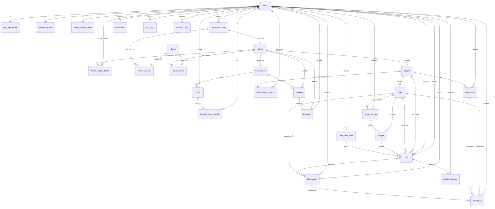

# Database Design

**Purpose:** Canonical schema for the manga-studio production & publishing management system. Defines all 29 tables, enumerations, relationships, and optimization indexes for a MySQL 8 backend.

**Tech stack:** MySQL 8, utf8mb4 collation, raw SQL via mysql2 (no ORM); single schema `manga_creation_workflow_and_publishing_management_system`. Upload files stored in S3-compatible SeaweedFS (:8333); image URLs point to `/uploads/<key>` served by NestJS API with path-traversal guard.

**Last updated:** 2026-06-05 — 29 tables, verified against actual schema.

---

## 1. Entity-Relationship Diagram

---

## 2. Table Catalog by Domain

### Users & Profiles

#### User
**Purpose:** Core authentication and identity. All roles derive from this table; profiles are nullable extension tables.

| Column | Type | Null | Key | Notes |
|--------|------|------|-----|-------|
| `user_id` | BIGINT | NO | PK, AI | Auto-increment; unique identity |
| `email` | VARCHAR(255) | NO | UQ | Unique per user; login identifier |
| `password_hash` | VARCHAR(255) | YES | — | Nullable for OAuth-only users (auth_provider='GOOGLE') |
| `full_name` | VARCHAR(100) | NO | — | Display name across the system |
| `avatar_url` | VARCHAR(500) | YES | — | URL to avatar image; S3 key or URL, stored in SeaweedFS; used by profile editing (PATCH /users/me) |
| `role` | ENUM | NO | IDX | `MANGAKA`, `ASSISTANT`, `TANTOU_EDITOR`, `EDITORIAL_BOARD`, `ADMIN` |
| `auth_provider` | ENUM | NO | — | `LOCAL` (email/password), `GOOGLE` (OAuth); default `LOCAL` |
| `google_id` | VARCHAR(255) | YES | UQ | Google "sub" ID; unique per Google account; nullable for LOCAL users |
| `is_activated` | BOOLEAN | NO | — | Account activation flag; default `false` |
| `created_at` | DATETIME | NO | — | Record creation timestamp |
| `updated_at` | DATETIME | NO | — | Auto-update on any column change |

**Constraints:** UQ `email`, UQ `google_id`, IDX `role`.

---

#### Mangaka_Profile
**Purpose:** Creator (manga author) metadata. PK is user_id; 1:1 relationship with User role=MANGAKA.

| Column | Type | Null | Key | Notes |
|--------|------|------|-----|-------|
| `user_id` | BIGINT | NO | PK, FK | References User(user_id) ON DELETE CASCADE |
| `pen_name` | VARCHAR(100) | NO | — | Pen name or creative alias |
| `biography` | TEXT | YES | — | Short bio |
| `years_experrence` | INT | NO | — | Experience years; note: column name is misspelled (typo in schema) |
| `studio_name` | VARCHAR(100) | YES | — | Studio affiliation |
| `social_link` | VARCHAR(500) | YES | — | URL to social media |

---

#### Assistant_Profile
**Purpose:** Assistant (colorist/background artist/effect artist) metrics and earnings.

| Column | Type | Null | Key | Notes |
|--------|------|------|-----|-------|
| `user_id` | BIGINT | NO | PK, FK | References User(user_id) ON DELETE CASCADE |
| `salary_rate` | DECIMAL(10,2) | NO | — | Hourly or flat rate; default 0 |
| `skill_set` | VARCHAR(500) | YES | — | Comma-separated or structured skills (e.g., "background,shading,effect") |
| `total_earnings` | DECIMAL(15,2) | NO | — | Accrued earnings; updated on Submission APPROVED; adjustable via Earning_Dispute resolution |

---

#### Tantou_Editor_Profile
**Purpose:** Editor (Tantou) metadata; manages series editorial workflow.

| Column | Type | Null | Key | Notes |
|--------|------|------|-----|-------|
| `user_id` | BIGINT | NO | PK, FK | References User(user_id) ON DELETE CASCADE |
| `department_name` | VARCHAR(100) | YES | — | Department (e.g., Editorial, Quality) |
| `specialization` | VARCHAR(100) | YES | — | Genre specialization (e.g., Shonen, Shojo, Seinen) |
| `years_experience` | INT | NO | — | Editorial experience years |
| `managed_series_count` | INT | NO | — | Count of series currently managed; informational |

---

#### Editorial_Board_Profile
**Purpose:** Board member voting power and seniority for ranking decisions.

| Column | Type | Null | Key | Notes |
|--------|------|------|-----|-------|
| `user_id` | BIGINT | NO | PK, FK | References User(user_id) ON DELETE CASCADE |
| `position` | VARCHAR(100) | YES | — | Board position title |
| `seniority_level` | INT | NO | — | Rank/tier; default 1 |
| `voting_power` | INT | NO | — | Weight in vote aggregation; default 1 |
| `joined_at` | DATETIME | NO | — | Board membership start date |

---

### Genre & Series

#### Genre
**Purpose:** Master list of manga genres.

| Column | Type | Null | Key | Notes |
|--------|------|------|-----|-------|
| `genre_id` | BIGINT | NO | PK, AI | Auto-increment |
| `genre_name` | VARCHAR(50) | NO | UQ | Genre label (e.g., "Shonen", "Shoujo", "Seinen") |

---

#### Series_Proposal
**Purpose:** Proposal lifecycle from mangaka submission → board approval → Series creation.

| Column | Type | Null | Key | Notes |
|--------|------|------|-----|-------|
| `proposal_id` | BIGINT | NO | PK, AI | Auto-increment |
| `mangaka_user_id` | BIGINT | YES | FK, IDX | References User(user_id); proposer |
| `title` | VARCHAR(200) | NO | — | Proposal title |
| `synopsis` | TEXT | YES | — | Series synopsis/description |
| `proposal_status` | ENUM | NO | IDX | `DRAFT`, `SUBMITTED`, `UNDER_REVIEW`, `APPROVED`, `REJECTED`; default `DRAFT` |
| `proposed_frequency` | ENUM | NO | — | `WEEKLY`, `MONTHLY`; publication cadence |
| `review_due_date` | DATE | YES | — | Board review deadline |
| `submitted_at` | DATETIME | YES | — | Timestamp when moved to SUBMITTED state |
| `created_at` | DATETIME | NO | — | Record creation timestamp |
| `updated_at` | DATETIME | NO | — | Auto-update on any column change |

**Constraints:** IDX `proposal_status`, IDX `mangaka_user_id`.

**State machine:** DRAFT → SUBMITTED → UNDER_REVIEW → (APPROVED or REJECTED); terminal states are APPROVED/REJECTED.

---

#### Proposal_Genre
**Purpose:** Bridge table linking Series_Proposal to Genre (many-to-many).

| Column | Type | Null | Key | Notes |
|--------|------|------|-----|-------|
| `proposal_id` | BIGINT | NO | PK, FK | References Series_Proposal(proposal_id) ON DELETE CASCADE |
| `genre_id` | BIGINT | NO | PK, FK | References Genre(genre_id) |

---

#### Series
**Purpose:** Approved manga series; created when Series_Proposal is APPROVED. Tracks publication status and mangaka ownership.

| Column | Type | Null | Key | Notes |
|--------|------|------|-----|-------|
| `series_id` | BIGINT | NO | PK, AI | Auto-increment |
| `proposal_id` | BIGINT | YES | FK, UQ | References Series_Proposal(proposal_id); unique (one Series per approved Proposal) |
| `mangaka_user_id` | BIGINT | YES | FK, IDX | References User(user_id); series owner |
| `title` | VARCHAR(200) | NO | — | Series title |
| `publication_frequency` | ENUM | NO | — | `WEEKLY`, `MONTHLY`; inherited from proposal; changeable via Decision |
| `series_status` | ENUM | NO | IDX | `ACTIVE`, `AT_RISK`, `HIATUS`, `CANCELLED`, `COMPLETED`; default `ACTIVE` |
| `created_at` | DATETIME | NO | — | Record creation timestamp |
| `updated_at` | DATETIME | NO | — | Auto-update on any column change |

**Constraints:** FK `proposal_id` (uniq), IDX `series_status`, IDX `mangaka_user_id`.

**Status transitions:** ACTIVE ↔ AT_RISK (board ranking risk alert); ACTIVE/AT_RISK → HIATUS/CANCELLED/COMPLETED (via Decision); terminal states are CANCELLED/COMPLETED.

---

#### Series_Genre
**Purpose:** Bridge table linking Series to Genre (many-to-many).

| Column | Type | Null | Key | Notes |
|--------|------|------|-----|-------|
| `series_id` | BIGINT | NO | PK, FK | References Series(series_id) ON DELETE CASCADE |
| `genre_id` | BIGINT | NO | PK, FK | References Genre(genre_id) |

---

#### Series_Tantou_Editor
**Purpose:** Editor assignment history; active editor is the row where `unassigned_at IS NULL`. Allows time-series tracking of editor changes.

| Column | Type | Null | Key | Notes |
|--------|------|------|-----|-------|
| `series_id` | BIGINT | NO | PK, FK | References Series(series_id) |
| `editor_user_id` | BIGINT | NO | PK, FK | References User(user_id) |
| `assigned_at` | DATETIME | NO | PK | Timestamp of assignment; part of composite PK |
| `unassigned_at` | DATETIME | YES | IDX | Timestamp of unassignment; NULL means currently active |

**Constraints:** IDX `(series_id, unassigned_at)` for fast lookup of active editor.

---

### Chapter / Page / Manuscript / Region

#### Chapter
**Purpose:** Chapter metadata within a series; defines chapter lifecycle and editor review workflow.

| Column | Type | Null | Key | Notes |
|--------|------|------|-----|-------|
| `chapter_id` | BIGINT | NO | PK, AI | Auto-increment |
| `series_id` | BIGINT | YES | FK | References Series(series_id) |
| `chapter_number` | INT | NO | UQ(series_id) | Sequential chapter number within series |
| `chapter_title` | VARCHAR(200) | NO | — | Chapter title/name |
| `deadline` | DATETIME | YES | — | Completion or review deadline |
| `chapter_status` | ENUM | NO | IDX | `DRAFT`, `IN_PROGRESS`, `READY_FOR_EDITOR_REVIEW`, `EDITOR_APPROVED`, `PUBLISHED`; default `DRAFT` |
| `is_locked` | BOOLEAN | NO | — | Read-only lock (post-publication); default FALSE |
| `created_at` | DATETIME | NO | — | Record creation timestamp |
| `updated_at` | DATETIME | NO | — | Auto-update on any column change |

**Constraints:** UQ `(series_id, chapter_number)`, IDX `chapter_status`.

**State machine:** DRAFT → IN_PROGRESS → READY_FOR_EDITOR_REVIEW → (EDITOR_APPROVED or IN_PROGRESS); EDITOR_APPROVED → PUBLISHED; PUBLISHED is terminal.

---

#### Page
**Purpose:** Individual page within a chapter; tracks page composition, versioning, and assignment status.

| Column | Type | Null | Key | Notes |
|--------|------|------|-----|-------|
| `page_id` | BIGINT | NO | PK, AI | Auto-increment |
| `chapter_id` | BIGINT | YES | FK | References Chapter(chapter_id) |
| `page_number` | INT | NO | UQ(chapter_id) | Sequential page number within chapter |
| `current_version` | INT | NO | — | Latest version number in Page_Version; default 1 |
| `page_status` | ENUM | NO | — | `RAW`, `ASSIGNED`, `IN_PROGRESS`, `REVIEWING`, `COMPLETED`; default `RAW` |
| `created_at` | DATETIME | NO | — | Record creation timestamp |
| `updated_at` | DATETIME | NO | — | Auto-update on any column change |

**Constraints:** UQ `(chapter_id, page_number)`.

**Status flow:** RAW (pencils only) → ASSIGNED (task assigned) → IN_PROGRESS (assistant working) → REVIEWING (editor review) → COMPLETED; or REVIEWING → IN_PROGRESS (revision requested).

---

#### Page_Version
**Purpose:** Versioned page images; assistants may upload multiple iterations per page.

| Column | Type | Null | Key | Notes |
|--------|------|------|-----|-------|
| `page_version_id` | BIGINT | NO | PK, AI | Auto-increment |
| `page_id` | BIGINT | YES | FK | References Page(page_id) ON DELETE CASCADE |
| `version_number` | INT | NO | UQ(page_id) | Version sequence |
| `image_url` | VARCHAR(500) | NO | — | S3 key or URL to raster image (PNG/JPG); stored in SeaweedFS, served via /uploads/<key> |
| `uploaded_by_user_id` | BIGINT | YES | FK | References User(user_id); uploader |
| `upload_note` | VARCHAR(500) | YES | — | Optional annotation on version |
| `created_at` | DATETIME | NO | — | Upload timestamp |

**Constraints:** UQ `(page_id, version_number)`.

---

#### Manuscript
**Purpose:** Chapter-level manuscript file; largely unused in current flow (editors review via Chapter/Page instead). Present in schema for future use.

| Column | Type | Null | Key | Notes |
|--------|------|------|-----|-------|
| `manuscript_id` | BIGINT | NO | PK, AI | Auto-increment |
| `chapter_id` | BIGINT | YES | FK | References Chapter(chapter_id) |
| `version_number` | INT | NO | UQ(chapter_id) | Version sequence |
| `file_url` | VARCHAR(500) | NO | — | S3 key or URL to file (PDF/ZIP); stored in SeaweedFS |
| `manuscript_status` | ENUM | NO | — | `DRAFT`, `REVIEWING`, `FINAL`; default `DRAFT` |
| `uploaded_by_user_id` | BIGINT | YES | FK | References User(user_id); uploader |
| `uploaded_at` | DATETIME | NO | — | Upload timestamp |

**Constraints:** UQ `(chapter_id, version_number)`.

---

#### Region
**Purpose:** Geometric regions within a page defining task areas; used for task assignment and pricing. Supports AI auto-detection.

| Column | Type | Null | Key | Notes |
|--------|------|------|-----|-------|
| `region_id` | BIGINT | NO | PK, AI | Auto-increment |
| `page_id` | BIGINT | YES | FK, IDX | References Page(page_id) |
| `page_version_id` | BIGINT | YES | FK, IDX | References Page_Version(page_version_id); which image version defines this region |
| `region_type` | ENUM | NO | — | `PANEL`, `BACKGROUND`, `CHARACTER`, `DIALOGUE_BUBBLE`, `EFFECT` |
| `x_coordinate` | DECIMAL(10,4) | NO | — | Top-left x offset (0.0 to page width) |
| `y_coordinate` | DECIMAL(10,4) | NO | — | Top-left y offset (0.0 to page height) |
| `width` | DECIMAL(10,4) | NO | — | Region width in pixels/units |
| `height` | DECIMAL(10,4) | NO | — | Region height in pixels/units |
| `z-index` | INT | NO | — | Stacking order; default 0. Note: column name `z-index` is unconventional SQL but valid. |
| `ai_suggested` | BOOLEAN | NO | — | Flag: region auto-detected by AI; default FALSE |
| `created_at` | DATETIME | NO | — | Record creation timestamp |
| `uploaded_at` | DATETIME | NO | — | Last update timestamp |

**Constraints:** IDX `page_id`, IDX `page_version_id`.

---

### Task & Submission

#### Task_Price_Rule
**Purpose:** Configuration for automatic task pricing by region type. Used at task creation to set payment_amount.

| Column | Type | Null | Key | Notes |
|--------|------|------|-----|-------|
| `rule_id` | BIGINT | NO | PK | Primary key (manually assigned or auto-generated via app) |
| `rule_name` | VARCHAR(100) | NO | — | Display name (e.g., "Panel coloring standard") |
| `region_type` | ENUM | NO | IDX | `PANEL`, `BACKGROUND`, `CHARACTER`, `DIALOGUE_BUBBLE`, `EFFECT` |
| `base_price` | DECIMAL(10,2) | NO | — | Base payment amount for this region type |
| `is_active` | BOOLEAN | NO | IDX | Active rule flag; inactive rules are archived; default TRUE |
| `effective_from` | DATE | NO | — | Rule start date |
| `effective_to` | DATE | YES | — | Rule end date; NULL = no expiration |
| `created_by_user_id` | BIGINT | YES | FK | References User(user_id); rule creator |
| `created_at` | DATETIME | NO | — | Record creation timestamp |

**Constraints:** IDX `(region_type, is_active)` for active rule lookup at task creation.

---

#### Task
**Purpose:** Work assignment to assistant; defines deliverable, deadline, and compensation. Links region to submission workflow.

| Column | Type | Null | Key | Notes |
|--------|------|------|-----|-------|
| `task_id` | BIGINT | NO | PK, AI | Auto-increment |
| `region_id` | BIGINT | YES | FK, IDX | References Region(region_id); the region to work on |
| `page_id` | BIGINT | YES | FK, IDX | References Page(page_id); denormalized for query convenience |
| `assignor_user_id` | BIGINT | YES | FK | References User(user_id); typically the mangaka |
| `assignee_user_id` | BIGINT | YES | FK, IDX | References User(user_id); assigned assistant |
| `task_description` | TEXT | YES | — | Work description |
| `instruction` | TEXT | YES | — | Detailed instructions |
| `deadline` | DATETIME | YES | — | Work deadline |
| `task_status` | ENUM | NO | — | `ASSIGNED`, `IN_PROGRESS`, `SUBMITTED`, `REVISION_REQUIRED`, `APPROVED`; default `ASSIGNED` |
| `payment_amount` | DECIMAL(10,2) | NO | — | Price for this task; auto-set from Task_Price_Rule.base_price at creation; may be adjusted; default 0 |
| `task_price_rule_id` | BIGINT | YES | FK | References Task_Price_Rule(rule_id); applied rule |
| `created_at` | DATETIME | NO | — | Record creation timestamp |
| `uploaded_at` | DATETIME | NO | — | Auto-update on any column change |

**Constraints:** IDX `(assignee_user_id, task_status)`, IDX `region_id`, IDX `page_id`.

**State machine:** ASSIGNED → IN_PROGRESS → SUBMITTED → (APPROVED or REVISION_REQUIRED); REVISION_REQUIRED → IN_PROGRESS or SUBMITTED; APPROVED is terminal.

---

#### Submission
**Purpose:** Assistant work deliverable; tracks versioned submissions, reviewer feedback, and approval chain.

| Column | Type | Null | Key | Notes |
|--------|------|------|-----|-------|
| `submission_id` | BIGINT | NO | PK, AI | Auto-increment |
| `task_id` | BIGINT | YES | FK, IDX | References Task(task_id); which task this submission addresses |
| `page_id` | BIGINT | YES | FK | References Page(page_id); page being submitted |
| `assistant_user_id` | BIGINT | YES | FK | References User(user_id); assistant submitting |
| `version_number` | INT | NO | UQ(task_id) | Version sequence per task |
| `file_url` | VARCHAR(500) | NO | — | S3 key or URL to submitted work file; stored in SeaweedFS |
| `version_note` | VARCHAR(500) | YES | — | Submission note |
| `submission_status` | ENUM | NO | IDX | `PENDING`, `UNDER_REVIEW`, `REVISION_REQUIRED`, `APPROVED`, `REJECTED`; default `PENDING` |
| `feedback` | TEXT | YES | — | Reviewer feedback |
| `submitted_at` | DATETIME | NO | — | Submission timestamp |
| `reviewed_by_user_id` | BIGINT | YES | FK | References User(user_id); reviewer (typically mangaka) |
| `reviewed_at` | DATETIME | YES | — | Review completion timestamp |

**Constraints:** UQ `(task_id, version_number)`, IDX `task_id`, IDX `submission_status`.

**State machine:** PENDING → UNDER_REVIEW → (APPROVED, REVISION_REQUIRED, or REJECTED); terminal states are APPROVED/REJECTED. On APPROVED, `Assistant_Profile.total_earnings += Task.payment_amount`. Submission state transitions typically wrapped in `DbService.transaction()` for atomicity.

---

### Annotation

#### Annotation
**Purpose:** Polymorphic editorial feedback. Target can be page, manuscript, or submission; supports spatial coordinates for region-specific comments.

| Column | Type | Null | Key | Notes |
|--------|------|------|-----|-------|
| `annotation_id` | BIGINT | NO | PK, AI | Auto-increment |
| `target_type` | ENUM | NO | IDX | `PAGE`, `MANUSCRIPT`, `SUBMISSION`; identifies which table target_id references |
| `target_id` | BIGINT | NO | IDX | ID of the target record (page_id, manuscript_id, or submission_id) |
| `created_by_user_id` | BIGINT | YES | FK | References User(user_id); typically editor |
| `annotation_category` | ENUM | NO | — | `CONTENT_ISSUE`, `DIALOGUE_ISSUE`, `SCRIPT_ISSUE`, `VISUAL_ISSUE`, `GENERAL`; default `GENERAL` |
| `context` | TEXT | NO | — | Annotation text (comment, feedback) |
| `x_coordinate` | DECIMAL(10,4) | YES | — | Optional x position on page/image |
| `y_coordinate` | DECIMAL(10,4) | YES | — | Optional y position on page/image |
| `is_resolved` | BOOLEAN | NO | — | Resolution flag; default FALSE |
| `resolved_at` | DATETIME | YES | — | Timestamp when marked resolved |
| `created_at` | DATETIME | NO | — | Record creation timestamp |

**Constraints:** IDX `(target_type, target_id)` for polymorphic lookup.

---

### Publishing

#### Publication_Schedule
**Purpose:** Chapter publication scheduling. One schedule per chapter. Tracks planned release and actual publication.

| Column | Type | Null | Key | Notes |
|--------|------|------|-----|-------|
| `schedule_id` | BIGINT | NO | PK, AI | Auto-increment |
| `chapter_id` | BIGINT | YES | FK, UQ | References Chapter(chapter_id); one schedule per chapter |
| `release_date` | DATETIME | NO | — | Planned publication date/time |
| `publish_status` | ENUM | NO | — | `SCHEDULED`, `PUBLISHED`, `CANCELLED`; default `SCHEDULED` |
| `scheduled_by_user_id` | BIGINT | YES | FK | References User(user_id); typically editorial board |
| `scheduled_at` | DATETIME | NO | — | When the schedule was created |
| `published_at` | DATETIME | YES | — | Actual publication timestamp (set when PUBLISHED) |

**Constraints:** UQ `chapter_id`.

**Status transitions:** SCHEDULED → PUBLISHED or SCHEDULED → CANCELLED; terminal states are PUBLISHED/CANCELLED.

---

### Voting / Ranking / Decision

#### Vote_Period
**Purpose:** Opens a voting window for a series; editorial board votes on series quality/risk.

| Column | Type | Null | Key | Notes |
|--------|------|------|-----|-------|
| `vote_period_id` | BIGINT | NO | PK, AI | Auto-increment |
| `series_id` | BIGINT | YES | FK | References Series(series_id); series under review |
| `ranking_period_type` | ENUM | NO | UQ(series_id) | `WEEKLY`, `MONTHLY`; vote cadence |
| `period_start_date` | DATE | NO | UQ(series_id) | Period start |
| `period_end_date` | DATE | NO | — | Period end |
| `status` | ENUM | NO | — | `OPEN`, `CLOSED`; default `OPEN` |
| `created_at` | DATETIME | NO | — | Record creation timestamp |

**Constraints:** UQ `(series_id, ranking_period_type, period_start_date)`.

**Status transitions:** OPEN → CLOSED (via close endpoint, which computes Ranking rows); terminal state is CLOSED.

---

#### Vote
**Purpose:** Individual board member vote within a vote period.

| Column | Type | Null | Key | Notes |
|--------|------|------|-----|-------|
| `vote_id` | BIGINT | NO | PK, AI | Auto-increment |
| `vote_period_id` | BIGINT | YES | FK | References Vote_Period(vote_period_id); which period this vote belongs to |
| `board_user_id` | BIGINT | YES | FK | References User(user_id); voting board member |
| `score` | DECIMAL(5,2) | NO | — | Score (e.g., 1–10 or 0–100) |
| `comment` | TEXT | YES | — | Optional comment |
| `voted_at` | DATETIME | NO | — | Vote timestamp |

**Constraints:** UQ `(vote_period_id, board_user_id)` — one vote per member per period.

---

#### Ranking
**Purpose:** Aggregated ranking for a series in a vote period. Computed when Vote_Period is CLOSED.

| Column | Type | Null | Key | Notes |
|--------|------|------|-----|-------|
| `ranking_id` | BIGINT | NO | PK, AI | Auto-increment |
| `series_id` | BIGINT | YES | FK | References Series(series_id) |
| `vote_period_id` | BIGINT | YES | FK | References Vote_Period(vote_period_id) |
| `rank_position` | INT | NO | — | Final rank within series (1=top) |
| `total_score` | DECIMAL(10,2) | NO | — | Sum or average of board votes |
| `risk_level` | ENUM | NO | — | `LOW`, `MEDIUM`, `HIGH`; computed from votes; triggers Series AT_RISK if HIGH |
| `calculated_at` | DATETIME | NO | — | Timestamp when ranking was computed |

**Constraints:** UQ `(series_id, vote_period_id)`.

---

#### Decision
**Purpose:** Editorial board decision post-ranking. Applies action to series (continue, cancel, change frequency, hiatus).

| Column | Type | Null | Key | Notes |
|--------|------|------|-----|-------|
| `decision_id` | BIGINT | NO | PK, AI | Auto-increment |
| `series_id` | BIGINT | YES | FK, IDX | References Series(series_id); series affected |
| `ranking_id` | BIGINT | YES | FK | References Ranking(ranking_id); associated ranking |
| `decision_type` | ENUM | NO | IDX | `CONTINUE`, `CANCEL`, `CHANGE_FREQUENCY`, `HIATUS` |
| `new_frequency` | ENUM | YES | — | `WEEKLY`, `MONTHLY`; nullable; only set if decision_type=CHANGE_FREQUENCY |
| `reason` | TEXT | NO | — | Justification |
| `decided_by_user_id` | BIGINT | YES | FK | References User(user_id); deciding board member(s) or admin |
| `decided_at` | DATETIME | NO | — | Decision timestamp |

**Constraints:** IDX `series_id`, IDX `decision_type`.

---

### Earnings & Dispute

#### Earning_Dispute
**Purpose:** Assistant disputes over payment; open/resolve cycle with optional amount adjustment.

| Column | Type | Null | Key | Notes |
|--------|------|------|-----|-------|
| `dispute_id` | BIGINT | NO | PK, AI | Auto-increment |
| `assistant_user_id` | BIGINT | YES | FK, IDX | References User(user_id); assistant filing dispute |
| `task_id` | BIGINT | YES | FK | References Task(task_id); disputed task |
| `dispute_reason` | TEXT | NO | — | Reason for dispute |
| `expected_amount` | DECIMAL(10,2) | YES | — | Requested payment |
| `dispute_status` | ENUM | NO | IDX | `OPEN`, `UNDER_REVIEW`, `RESOLVED`, `REJECTED`; default `OPEN` |
| `resolution_note` | TEXT | YES | — | Admin note on resolution |
| `resolved_by_user_id` | BIGINT | YES | FK | References User(user_id); admin who resolved |
| `resolved_at` | DATETIME | YES | — | Resolution timestamp |
| `created_at` | DATETIME | NO | — | Record creation timestamp |

**Constraints:** IDX `(assistant_user_id, dispute_status)`.

**State machine:** OPEN → UNDER_REVIEW → (RESOLVED or REJECTED); terminal states are RESOLVED/REJECTED. On RESOLVED, if adjustedAmount differs from Task.payment_amount, delta is applied to Assistant_Profile.total_earnings.

---

### Cross-cutting

#### Notification
**Purpose:** In-app notifications for system events (task assignment, submission review, decisions, etc.).

| Column | Type | Null | Key | Notes |
|--------|------|------|-----|-------|
| `notification_id` | BIGINT | NO | PK, AI | Auto-increment |
| `recipient_user_id` | BIGINT | YES | FK, IDX | References User(user_id); recipient |
| `notification_type` | ENUM | NO | — | `DEADLINE`, `TASK_ASSIGNMENT`, `SUBMISSION`, `REVISION`, `REVIEW`, `PROPOSAL_DECISION`, `RISK_ALERT`, `DECISION`, `DISPUTE`, `GENERAL` |
| `title` | VARCHAR(200) | NO | — | Notification title |
| `content` | TEXT | YES | — | Notification body |
| `related_entity_type` | VARCHAR(50) | YES | — | Entity type (e.g., "Task", "Submission", "Series") |
| `related_entity_id` | BIGINT | YES | — | Entity ID for deep-linking |
| `is_read` | BOOLEAN | NO | IDX | Read flag; default FALSE |
| `created_at` | DATETIME | NO | — | Record creation timestamp |
| `read_at` | DATETIME | YES | — | Timestamp when marked read |

**Constraints:** IDX `(recipient_user_id, is_read)` for unread notification queries.

---

#### Audit_Log
**Purpose:** Change audit trail. Captures who did what, when, to which entity. Present in schema; not yet wired by controllers.

| Column | Type | Null | Key | Notes |
|--------|------|------|-----|-------|
| `log_id` | BIGINT | NO | PK, AI | Auto-increment |
| `actor_user_id` | BIGINT | YES | FK, IDX | References User(user_id); who performed the action |
| `action` | ENUM | NO | — | `CREATE`, `UPDATE`, `DELETE`, `APPROVE`, `REJECT`, `PUBLISH`, `CANCEL`, `ASSIGN`, `SUBMIT`, `REVISE`, `VOTE`, `DECIDE` |
| `entity_type` | VARCHAR(50) | NO | IDX | Entity class (e.g., "Submission", "Series", "Decision") |
| `entity_id` | BIGINT | NO | IDX | Entity record ID |
| `before_value` | JSON | YES | — | Pre-change state (JSON snapshot) |
| `after_value` | JSON | YES | — | Post-change state (JSON snapshot) |
| `ip_address` | VARCHAR(45) | YES | — | Client IP (IPv4 or IPv6) |
| `user_agent` | VARCHAR(500) | YES | — | Browser user agent |
| `created_at` | DATETIME | NO | IDX | Record creation timestamp |

**Constraints:** IDX `(entity_type, entity_id)`, IDX `actor_user_id`, IDX `created_at`.

---

#### System_Config
**Purpose:** Key-value configuration store for runtime settings (feature flags, pricing multipliers, etc.). Present in schema; not yet wired by controllers.

| Column | Type | Null | Key | Notes |
|--------|------|------|-----|-------|
| `config_key` | VARCHAR(100) | NO | PK | Configuration key (e.g., "ai_region_detection_enabled") |
| `config_value` | TEXT | NO | — | Configuration value (JSON or scalar) |
| `description` | VARCHAR(500) | YES | — | Human-readable description |
| `updated_by_user_id` | BIGINT | YES | FK | References User(user_id); last updater |
| `updated_at` | DATETIME | NO | — | Last update timestamp; auto-update on change |

---

## 3. Enumerated Types Catalog

| Table | Column | Enum Name | Allowed Values |
|-------|--------|-----------|-----------------|
| User | `role` | Role | `MANGAKA`, `ASSISTANT`, `TANTOU_EDITOR`, `EDITORIAL_BOARD`, `ADMIN` |
| User | `auth_provider` | AuthProvider | `LOCAL`, `GOOGLE` |
| Series_Proposal | `proposal_status` | ProposalStatus | `DRAFT`, `SUBMITTED`, `UNDER_REVIEW`, `APPROVED`, `REJECTED` |
| Series_Proposal | `proposed_frequency` | Frequency | `WEEKLY`, `MONTHLY` |
| Series | `publication_frequency` | Frequency | `WEEKLY`, `MONTHLY` |
| Series | `series_status` | SeriesStatus | `ACTIVE`, `AT_RISK`, `HIATUS`, `CANCELLED`, `COMPLETED` |
| Chapter | `chapter_status` | ChapterStatus | `DRAFT`, `IN_PROGRESS`, `READY_FOR_EDITOR_REVIEW`, `EDITOR_APPROVED`, `PUBLISHED` |
| Page | `page_status` | PageStatus | `RAW`, `ASSIGNED`, `IN_PROGRESS`, `REVIEWING`, `COMPLETED` |
| Region | `region_type` | RegionType | `PANEL`, `BACKGROUND`, `CHARACTER`, `DIALOGUE_BUBBLE`, `EFFECT` |
| Task_Price_Rule | `region_type` | RegionType | `PANEL`, `BACKGROUND`, `CHARACTER`, `DIALOGUE_BUBBLE`, `EFFECT` |
| Task | `task_status` | TaskStatus | `ASSIGNED`, `IN_PROGRESS`, `SUBMITTED`, `REVISION_REQUIRED`, `APPROVED` |
| Submission | `submission_status` | SubmissionStatus | `PENDING`, `UNDER_REVIEW`, `REVISION_REQUIRED`, `APPROVED`, `REJECTED` |
| Annotation | `target_type` | AnnotationTargetType | `PAGE`, `MANUSCRIPT`, `SUBMISSION` |
| Annotation | `annotation_category` | AnnotationCategory | `CONTENT_ISSUE`, `DIALOGUE_ISSUE`, `SCRIPT_ISSUE`, `VISUAL_ISSUE`, `GENERAL` |
| Manuscript | `manuscript_status` | ManuscriptStatus | `DRAFT`, `REVIEWING`, `FINAL` |
| Publication_Schedule | `publish_status` | PublishStatus | `SCHEDULED`, `PUBLISHED`, `CANCELLED` |
| Vote_Period | `ranking_period_type` | Frequency | `WEEKLY`, `MONTHLY` |
| Vote_Period | `status` | VotePeriodStatus | `OPEN`, `CLOSED` |
| Ranking | `risk_level` | RiskLevel | `LOW`, `MEDIUM`, `HIGH` |
| Decision | `decision_type` | DecisionType | `CONTINUE`, `CANCEL`, `CHANGE_FREQUENCY`, `HIATUS` |
| Decision | `new_frequency` | Frequency | `WEEKLY`, `MONTHLY` |
| Earning_Dispute | `dispute_status` | DisputeStatus | `OPEN`, `UNDER_REVIEW`, `RESOLVED`, `REJECTED` |
| Notification | `notification_type` | NotificationType | `DEADLINE`, `TASK_ASSIGNMENT`, `SUBMISSION`, `REVISION`, `REVIEW`, `PROPOSAL_DECISION`, `RISK_ALERT`, `DECISION`, `DISPUTE`, `GENERAL` |
| Audit_Log | `action` | AuditAction | `CREATE`, `UPDATE`, `DELETE`, `APPROVE`, `REJECT`, `PUBLISH`, `CANCEL`, `ASSIGN`, `SUBMIT`, `REVISE`, `VOTE`, `DECIDE` |

---

## 4. Indexes & Uniqueness

| Index Name | Table | Columns | Type | Purpose |
|------------|-------|---------|------|---------|
| PK | User | user_id | PRIMARY | Auto-increment identity |
| uq_user_email | User | email | UNIQUE | Login by email; prevent duplicate accounts |
| uq_user_google | User | google_id | UNIQUE | OAuth identity; prevent duplicate google_id |
| idx_user_role | User | role | INDEX | Filter users by role (e.g., find all ASSISTANT) |
| UQ | Mangaka_Profile | user_id | PRIMARY | 1:1 with User |
| UQ | Assistant_Profile | user_id | PRIMARY | 1:1 with User |
| UQ | Tantou_Editor_Profile | user_id | PRIMARY | 1:1 with User |
| UQ | Editorial_Board_Profile | user_id | PRIMARY | 1:1 with User |
| UQ | Genre | genre_name | UNIQUE | Prevent duplicate genres |
| idx_proposal_status | Series_Proposal | proposal_status | INDEX | Filter proposals by status |
| idx_proposal_mangaka | Series_Proposal | mangaka_user_id | INDEX | Find proposals by author |
| PK (compound) | Proposal_Genre | (proposal_id, genre_id) | PRIMARY | Bridge M-N relationship |
| uq_series_proposal | Series | proposal_id | UNIQUE | One Series per Proposal |
| idx_series_status | Series | series_status | INDEX | Filter series by status (e.g., ACTIVE, AT_RISK) |
| idx_series_mangaka | Series | mangaka_user_id | INDEX | Find series by owner |
| PK (compound) | Series_Genre | (series_id, genre_id) | PRIMARY | Bridge M-N relationship |
| PK (compound) | Series_Tantou_Editor | (series_id, editor_user_id, assigned_at) | PRIMARY | Assignment history; time-series |
| idx_ste_active | Series_Tantou_Editor | (series_id, unassigned_at) | INDEX | Fast lookup of active editor (WHERE unassigned_at IS NULL) |
| uq_chapter_number | Chapter | (series_id, chapter_number) | UNIQUE | Prevent duplicate chapter numbers in series |
| idx_chapter_status | Chapter | chapter_status | INDEX | Filter chapters by status |
| uq_page_number | Page | (chapter_id, page_number) | UNIQUE | Prevent duplicate page numbers in chapter |
| uq_page_version | Page_Version | (page_id, version_number) | UNIQUE | Prevent duplicate versions per page |
| uq_manuscript_version | Manuscript | (chapter_id, version_number) | UNIQUE | Prevent duplicate versions per chapter |
| idx_region_page | Region | page_id | INDEX | Find regions on a page |
| idx_region_page_version | Region | page_version_id | INDEX | Find regions for a page version |
| idx_task_price_active | Task_Price_Rule | (region_type, is_active) | INDEX | Fast lookup of active pricing rule by region type |
| idx_task_assignee_status | Task | (assignee_user_id, task_status) | INDEX | Find tasks assigned to assistant, filtered by status |
| idx_task_region | Task | region_id | INDEX | Find tasks for a region |
| idx_task_page | Task | page_id | INDEX | Find tasks on a page |
| uq_submission_version | Submission | (task_id, version_number) | UNIQUE | Prevent duplicate submission versions per task |
| idx_submission_task | Submission | task_id | INDEX | Find submissions for a task |
| idx_submission_status | Submission | submission_status | INDEX | Filter submissions by status |
| idx_annotation_target | Annotation | (target_type, target_id) | INDEX | Polymorphic lookup (which target is annotated?) |
| uq_publication_schedule | Publication_Schedule | chapter_id | UNIQUE | One schedule per chapter |
| uq_vote_period | Vote_Period | (series_id, ranking_period_type, period_start_date) | UNIQUE | Prevent duplicate vote periods for series/frequency |
| uq_vote_per_period | Vote | (vote_period_id, board_user_id) | UNIQUE | One vote per member per period |
| uq_ranking | Ranking | (series_id, vote_period_id) | UNIQUE | One ranking per series per period |
| idx_decision_series | Decision | series_id | INDEX | Find decisions for a series |
| idx_decision_type | Decision | decision_type | INDEX | Filter decisions by type |
| idx_dispute_assistant_status | Earning_Dispute | (assistant_user_id, dispute_status) | INDEX | Find disputes by assistant and status |
| idx_notification_recipient_read | Notification | (recipient_user_id, is_read) | INDEX | Fast lookup of unread notifications per user |
| idx_audit_entity | Audit_Log | (entity_type, entity_id) | INDEX | Find audit trail for an entity |
| idx_audit_actor | Audit_Log | actor_user_id | INDEX | Find actions by a user |
| idx_audit_created | Audit_Log | created_at | INDEX | Time-range queries |

---

## 5. Design Notes

### Raw SQL + No ORM + Transactions
The API uses **mysql2** with raw SQL queries (DbService.query/queryOne/insert/transaction) instead of a traditional ORM (e.g., TypeORM, Prisma). This choice:
- Enforces schema awareness and explicit control over queries.
- Avoids ORM performance pitfalls (N+1, lazy-loading surprises).
- Keeps compiled queries cacheable at the database layer.
- `DbService.transaction(async fn)` provides atomic multi-step operations with automatic rollback on error (used by submission approval, dispute resolution, proposal approval, and decision workflows).

### Foreign Key Constraints
All foreign keys are defined with **ON DELETE CASCADE** (except a few reference rows in audit/config that exist independently). This ensures data integrity and cascading deletes (e.g., deleting a User cascades through all profiles, tasks, submissions, etc.).

### Bridge Tables & Many-to-Many Relationships
- **Proposal_Genre** and **Series_Genre** link proposals/series to genres (M-N).
- **Series_Tantou_Editor** is a temporal bridge: records editor assignments with `assigned_at` and `unassigned_at`. The active editor is identified by `unassigned_at IS NULL`.

### Editor Assignment History
**Series_Tantou_Editor** uses a composite primary key `(series_id, editor_user_id, assigned_at)` to maintain an immutable audit trail of editor changes. The index `(series_id, unassigned_at)` allows fast lookup of the currently assigned editor.

### Polymorphic Annotation Table
**Annotation** uses a `target_type` ENUM + `target_id` BIGINT pattern to reference different tables (PAGE, MANUSCRIPT, SUBMISSION) without separate columns. This is a common SQL pattern for "single-table polymorphism." The index `(target_type, target_id)` enables efficient polymorphic queries.

### Accrual Column & Earnings Flow
**Assistant_Profile.total_earnings** is an accrual column:
- Incremented on Submission APPROVED: `total_earnings += Task.payment_amount`.
- Adjusted during Earning_Dispute resolution: `total_earnings += delta` (if resolvedAmount ≠ original Task.payment_amount).

This denormalization avoids repeated SUM(Task.payment_amount) queries and supports fast dashboard queries.

### Auto-Pricing via Task_Price_Rule
When a Task is created, the API:
1. Looks up the active Task_Price_Rule for the region's `region_type`.
2. Sets `Task.payment_amount = Task_Price_Rule.base_price`.
3. Stores `Task.task_price_rule_id` for audit trail.

This enables dynamic pricing adjustments without recomputing historical tasks.

### Schema-Present, Largely Unwired
Three tables exist in the schema but are not yet integrated into the main flow:
- **Manuscript** — Chapter-level file upload. Current code reviews via Chapter/Page/Submission instead.
- **Audit_Log** — Change audit trail. Schema is present; controllers do not yet populate it.
- **System_Config** — Runtime configuration store. Schema is present; no config endpoints yet.

These tables are available for future integration.

### File Storage & S3 Integration
**SeaweedFS S3-compatible object storage** replaces disk-based file uploads:
- All `*_url` columns (image_url, avatar_url, file_url) store S3 keys or full URLs pointing to SeaweedFS.
- NestJS **StorageService** (@aws-sdk/client-s3, forcePathStyle=true) handles PUT/GET operations.
- **GET /uploads/:key** in main.ts serves files publicly with path-traversal protection (`/^[A-Za-z0-9._-]+$/`); includes legacy disk fallback for pre-S3 files.
- Docker container: `seaweedfs:latest` on :8333 (S3 API) + :8888 (filer HTTP).
- Environment variables: S3_ENDPOINT, S3_BUCKET, S3_ACCESS_KEY, S3_SECRET_KEY (dev defaults in .env).

### Known Schema Quirks
1. **Typo in Mangaka_Profile:** Column `years_experrence` (should be `years_experience`). Preserved as-is to match deployed schema.
2. **Unconventional column name in Region:** Column `z-index` uses a hyphen (CSS naming). Valid SQL, but unusual; consider `z_index` in future migrations.

### Temporal Columns & Audit
Most tables include:
- `created_at` — Immutable record creation timestamp.
- `updated_at` — Auto-update on any column change (MySQL `DEFAULT CURRENT_TIMESTAMP ON UPDATE CURRENT_TIMESTAMP`).

Specific action timestamps (e.g., `submitted_at`, `reviewed_at`, `voted_at`) capture workflow event moments.

### Character Encoding & Collation
All tables use **utf8mb4** charset and **utf8mb4_unicode_ci** collation, enabling full Unicode support (including emoji) and case-insensitive collation for user input.

---

## Cross-References

- **State machines & transitions:** See `packages/shared/src/enums/transitions.ts` and `docs/domain-model-and-state-machines.md`.
- **API contracts & request/response shapes:** See `apps/backend/src/<module>/*.controller.ts` and `*.dto.ts`.
- **System architecture & service layer:** See `docs/03-system-architecture.md`.
