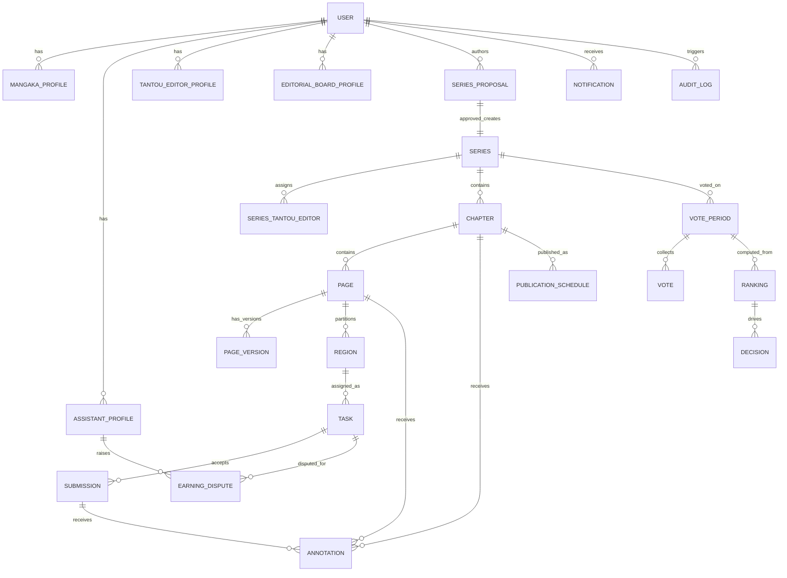
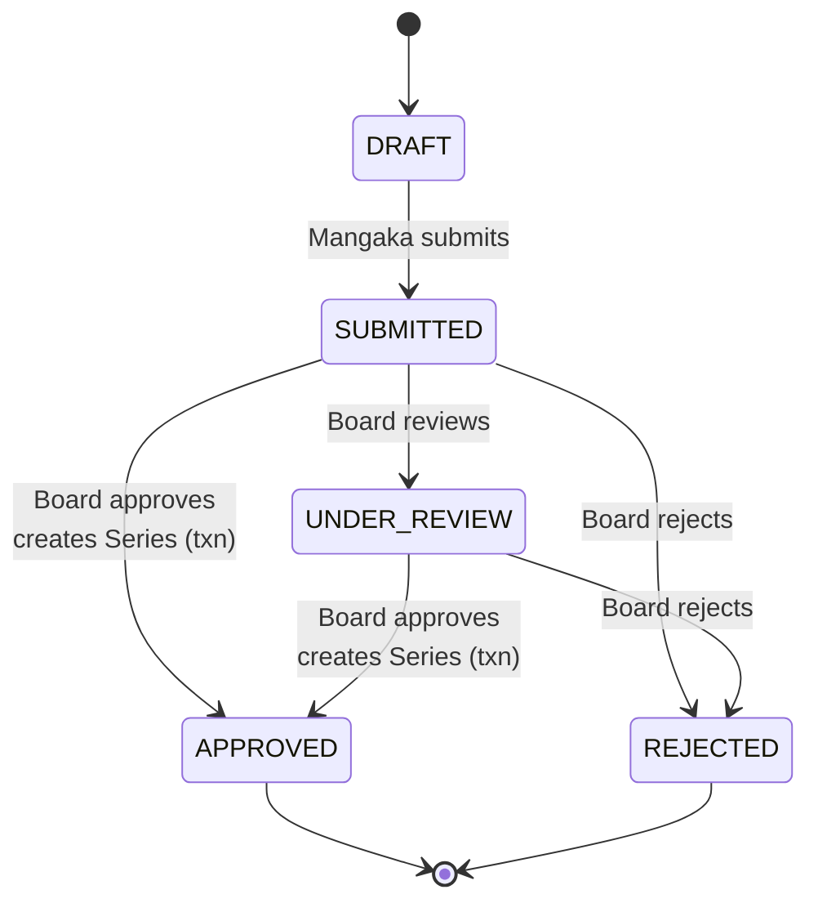
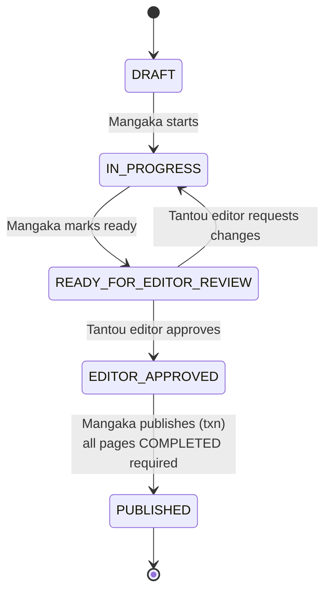
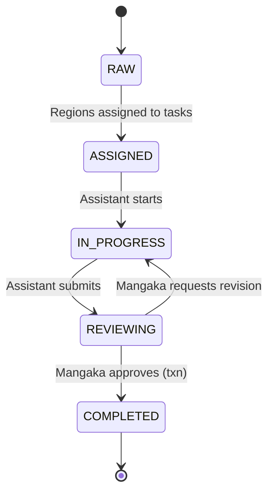
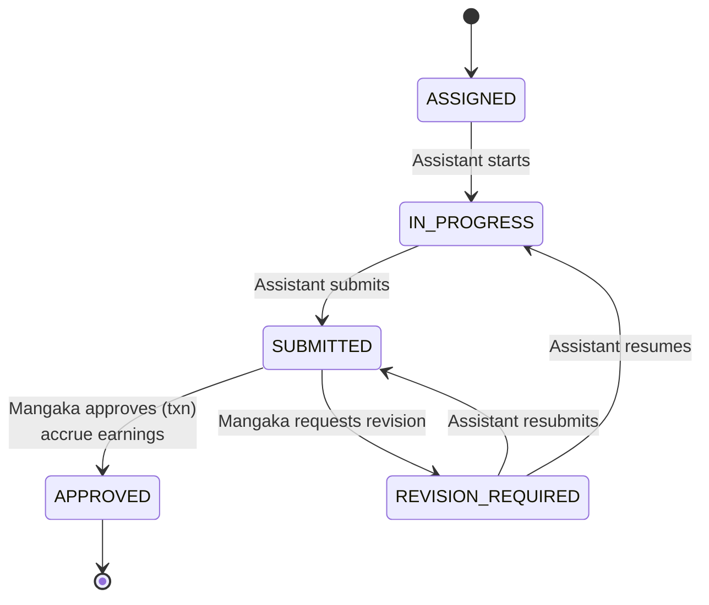
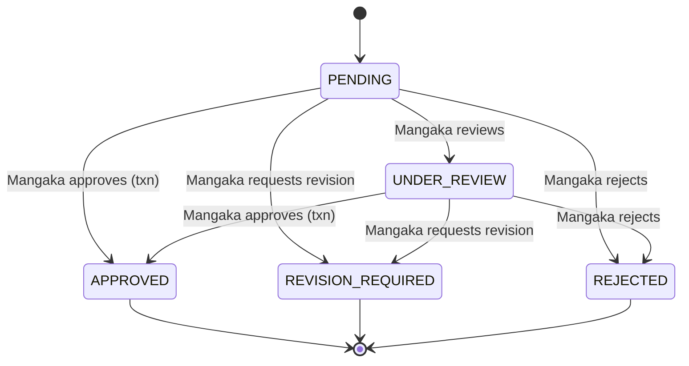
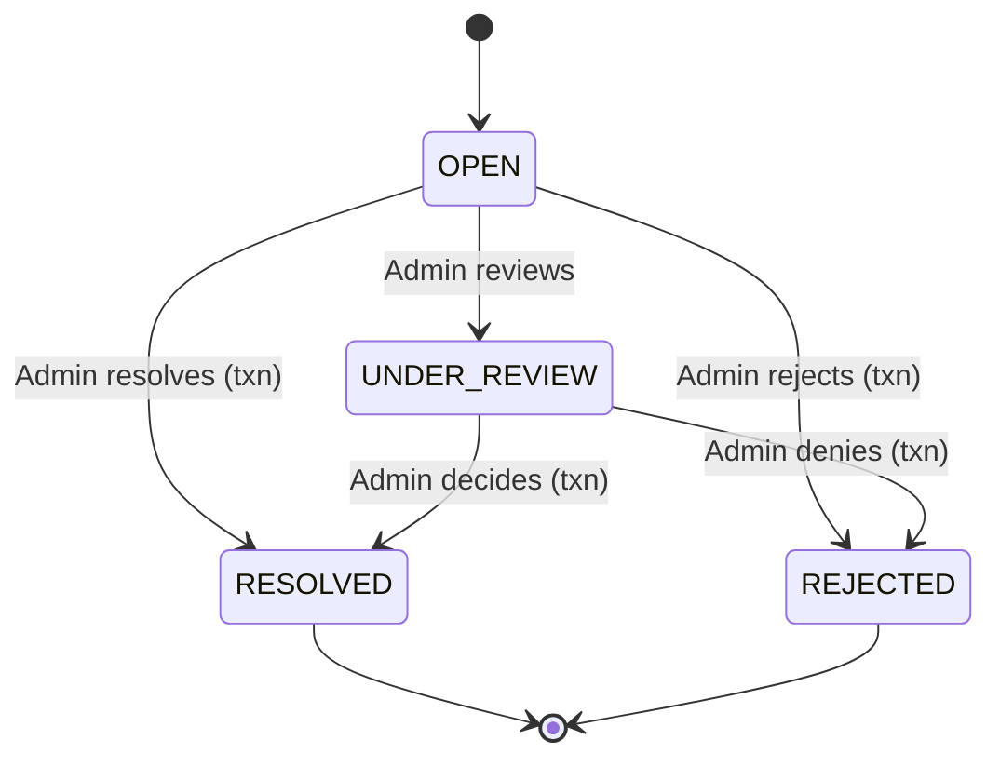
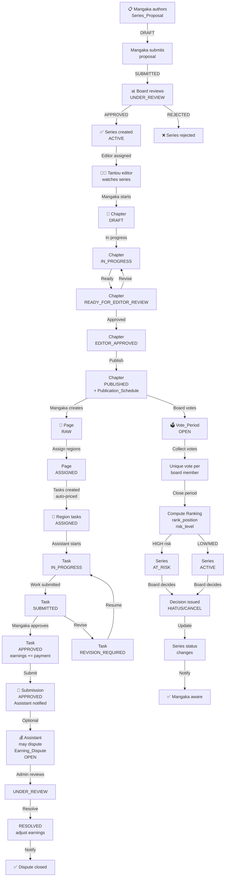

# Domain Model & State Machines

Conceptual structure and stateful entity lifecycle for the Manga Creation Workflow & Publishing Management System. Describes the 8 domain aggregates, 6 state machines with exact allowed transitions, enforcement mechanisms, and the complete editorial pipeline from proposal through earnings disputes.

## Table of Contents

1. [Domain Aggregates](#1-domain-aggregates)
2. [State Machines](#2-state-machines)
3. [Transition Enforcement](#3-transition-enforcement)
4. [Business Rules](#4-business-rules)
5. [Lifecycle Overview](#5-lifecycle-overview)

---

## 1. Domain Aggregates

The system organizes entities into 8 conceptual groupings reflecting the editorial and business workflows:

### 1.1 Identity & Profiles

- **User**: Core identity (email uniq, password_hash nullable for OAuth, role ENUM). OAuth support via Google provider + google_id.
- **Mangaka_Profile**: Pen name, biography, studio, social links. Authors series proposals.
- **Assistant_Profile**: Salary rate, skill set, **total_earnings** (accrued on submission approval). Accepts tasks and submits work.
- **Tantou_Editor_Profile**: Department, specialization, years_experience, managed series count. Assigned to series; reviews chapters.
- **Editorial_Board_Profile**: Position, seniority, voting_power. Cast votes on series; make editorial decisions.

### 1.2 Series Lifecycle

- **Series_Proposal**: Author (Mangaka) draft a concept (title, synopsis, genres, proposed frequency). Proposal moves through DRAFT→SUBMITTED→UNDER_REVIEW→APPROVED or REJECTED. Board members vote (implicit consensus model in current code) to APPROVED.
- **Series**: Created automatically on PROPOSAL APPROVED. Holds publication_frequency (WEEKLY/MONTHLY), series_status (ACTIVE/AT_RISK/HIATUS/CANCELLED/COMPLETED). Linked to the proposal (one-to-one).
- **Series_Tantou_Editor**: Assignment history. Active editor has unassigned_at = NULL. Only the active Tantou editor can review chapters in the series.
- **Genre** & **Proposal_Genre**, **Series_Genre**: M-N bridges mapping genres to proposals and series.

### 1.3 Production Pipeline

- **Chapter**: Per series. Lifecycle: DRAFT→IN_PROGRESS→READY_FOR_EDITOR_REVIEW→(EDITOR_APPROVED or back to IN_PROGRESS)→PUBLISHED. Unique per series+chapter_number. Tantou editor reviews; when approved, a Publication_Schedule record is created.
- **Page**: Per chapter. Lifecycle: RAW→ASSIGNED→IN_PROGRESS→REVIEWING→(COMPLETED or back to IN_PROGRESS). Current_version tracks active Page_Version. Unique per chapter+page_number. Model for regionalized work.
- **Page_Version**: Versioned artwork. Version_number, image_url, uploaded_by user, upload_note, created_at. Multiple versions per page as assistants iterate.
- **Region**: Segmented work unit on a page_version (PANEL, BACKGROUND, CHARACTER, DIALOGUE_BUBBLE, EFFECT). Positioned (x_coordinate, y_coordinate, width, height, z-index). Optional ai_suggested flag from AI panel detect.
- **Task**: Assigned work unit wrapping a region. Links region_id + page_id. Auto-priced via active Task_Price_Rule for region_type. Assignor (Mangaka/editor) assigns to Assistant. Lifecycle: ASSIGNED→IN_PROGRESS→SUBMITTED→(APPROVED or REVISION_REQUIRED→IN_PROGRESS or SUBMITTED). Payment_amount set at creation.
- **Page_Version** (implicit in the model): Tracks artist/assistant output per page iteration. Linked to Region for regionalized review.

### 1.4 Editorial Feedback (Polymorphic)

- **Annotation**: Editor feedback tied to PAGE, MANUSCRIPT, or SUBMISSION targets. Category: CONTENT_ISSUE, DIALOGUE_ISSUE, SCRIPT_ISSUE, VISUAL_ISSUE, GENERAL. Spatial (x_coordinate, y_coordinate for visual markup). Flag is_resolved; resolved_at tracks when cleared. Tantou editor creates; typically on chapters assigned to them.

### 1.5 Publishing

- **Publication_Schedule**: Created when Chapter moves to PUBLISHED. Links chapter_id (uniq). Holds release_date, publish_status (SCHEDULED→PUBLISHED or CANCELLED), scheduled_by user, timestamp fields. Mangaka initiates publish; system auto-creates on chapter approval.
- **Manuscript**: Present in schema; largely unused by current flow. Editors review via Chapter/Page, not Manuscript.

### 1.6 Governance & Voting

- **Vote_Period**: Time window (WEEKLY/MONTHLY) for board voting on a series. Status: OPEN→CLOSED. Unique per series+period_type+period_start_date. Created by Editorial_Board to open voting.
- **Vote**: Board member scores (DECIMAL(5,2)) a series in a period. Unique per vote_period+board_user_id (one vote per member per period). Voted_at timestamp; optional comment.
- **Ranking**: Computed when vote period closes. Aggregates vote_period scores for a series. Holds rank_position, total_score, risk_level (LOW/MEDIUM/HIGH). Unique per series+vote_period. Rows inserted after /close endpoint runs.
- **Decision**: Editorial board applies a decision post-ranking. Type: CONTINUE, CANCEL, CHANGE_FREQUENCY, HIATUS. Reason, decided_by user, decided_at. Updates Series.series_status accordingly (AT_RISK from high risk; HIATUS/CANCELLED/COMPLETED from decision).

### 1.7 Earnings & Disputes

- **Assistant_Profile.total_earnings**: Accrued DECIMAL. Incremented on Submission APPROVED by Task.payment_amount. Can be adjusted by Earning_Dispute resolve with optional adjustedAmount delta.
- **Earning_Dispute**: Assistant raises dispute on own APPROVED task. Reason, expected_amount, dispute_status (OPEN→UNDER_REVIEW→RESOLVED/REJECTED). Admin reviews and resolves, optionally adjusting Task.payment_amount and Assistant_Profile.total_earnings by delta.

### 1.8 Cross-Cutting

- **Notification**: Type-tagged alerts (DEADLINE, TASK_ASSIGNMENT, SUBMISSION, REVISION, REVIEW, PROPOSAL_DECISION, RISK_ALERT, DECISION, DISPUTE, GENERAL). Recipient, title, content, related_entity (type + id). is_read, read_at track consumption.
- **Audit_Log**: Schema present; not yet wired. Logs CREATE/UPDATE/DELETE/APPROVE/REJECT/PUBLISH/CANCEL/ASSIGN/SUBMIT/REVISE/VOTE/DECIDE with before/after JSON diffs, IP, user agent.
- **System_Config**: Key-value store for runtime config. Updated_by user, updated_at. Not yet wired.

### 1.9 Domain Model Diagram



---

## 2. State Machines

Each stateful entity follows strict allowed transitions defined in `packages/shared/src/enums/transitions.ts`. The `canTransition(map, from, to)` function enforces these at the service layer; illegal transitions return HTTP 400.

### 2.1 Series_Proposal State Machine

**Enum values** (ProposalStatus): `DRAFT`, `SUBMITTED`, `UNDER_REVIEW`, `APPROVED`, `REJECTED`

**Transitions** (verified from `packages/shared/src/enums/transitions.ts`):
- DRAFT → SUBMITTED: Mangaka submits proposal for board review.
- SUBMITTED → UNDER_REVIEW: Editorial board begins deliberation.
- SUBMITTED → APPROVED: Board approves; auto-creates Series within **DbService.transaction()**, then notifies all EDITORIAL_BOARD members and the MANGAKA after commit.
- SUBMITTED → REJECTED: Board rejects.
- UNDER_REVIEW → APPROVED: Board approves after review; auto-creates Series within **DbService.transaction()**.
- UNDER_REVIEW → REJECTED: Board rejects after review.
- APPROVED: Terminal. Series now live.
- REJECTED: Terminal. No series created.



**Triggers & Authorization**:
- DRAFT → SUBMITTED: PATCH `/api/proposals/:id/submit` by MANGAKA (author).
- SUBMITTED → UNDER_REVIEW: Implicit when board starts deliberation (no explicit endpoint yet).
- SUBMITTED/UNDER_REVIEW → APPROVED/REJECTED: PATCH `/api/proposals/:id/decision` by EDITORIAL_BOARD with decision body. APPROVED auto-creates Series with publication_frequency from proposed_frequency.

---

### 2.2 Chapter State Machine

**Enum values** (ChapterStatus): `DRAFT`, `IN_PROGRESS`, `READY_FOR_EDITOR_REVIEW`, `EDITOR_APPROVED`, `PUBLISHED`

**Transitions** (verified from `packages/shared/src/enums/transitions.ts`):
- DRAFT → IN_PROGRESS: Mangaka starts work.
- IN_PROGRESS → READY_FOR_EDITOR_REVIEW: Mangaka marks ready for Tantou editor review.
- READY_FOR_EDITOR_REVIEW → EDITOR_APPROVED: Tantou editor approves chapter; Publication_Schedule created.
- READY_FOR_EDITOR_REVIEW → IN_PROGRESS: Tantou editor requests rework.
- EDITOR_APPROVED → PUBLISHED: Mangaka publishes within **DbService.transaction()** (updates Chapter.status and creates/updates Publication_Schedule). Requires **all pages must be COMPLETED** before publishing.
- PUBLISHED: Terminal.



**Triggers & Authorization**:
- DRAFT → IN_PROGRESS: PATCH `/api/chapters/:id/status` by MANGAKA.
- IN_PROGRESS → READY_FOR_EDITOR_REVIEW: PATCH `/api/chapters/:id/status` by MANGAKA.
- READY_FOR_EDITOR_REVIEW ↔ EDITOR_APPROVED/IN_PROGRESS: PATCH `/api/chapters/:id/editor-review` by TANTOU_EDITOR (assigned to series only). Body specifies approve or request-changes; notifies MANGAKA.
- EDITOR_APPROVED → PUBLISHED: PATCH `/api/chapters/:id/status` by MANGAKA. Auto-creates Publication_Schedule(chapter_id, release_date=now, publish_status=PUBLISHED).

---

### 2.3 Page State Machine

**Enum values** (PageStatus): `RAW`, `ASSIGNED`, `IN_PROGRESS`, `REVIEWING`, `COMPLETED`

**Transitions** (verified from `packages/shared/src/enums/transitions.ts`):
- RAW → ASSIGNED: Mangaka assigns regions/tasks to assistants.
- ASSIGNED → IN_PROGRESS: Assistant begins work.
- IN_PROGRESS → REVIEWING: Assistant submits; Mangaka reviews submission.
- REVIEWING → COMPLETED: Mangaka approves submission within **DbService.transaction()** (updates Submission + Task + Assistant_Profile + Page).
- REVIEWING → IN_PROGRESS: Mangaka requests revision.
- COMPLETED: Terminal.



**Triggers & Authorization**:
- RAW → ASSIGNED: POST `/api/tasks` by MANGAKA (creates tasks for regions on the page).
- ASSIGNED → IN_PROGRESS: PATCH `/api/tasks/:id/start` by ASSISTANT.
- IN_PROGRESS → REVIEWING: POST `/api/submissions` by ASSISTANT (task status→SUBMITTED, page status→REVIEWING).
- REVIEWING → COMPLETED/IN_PROGRESS: PATCH `/api/submissions/:id/review` by MANGAKA with action APPROVED/REVISION_REQUIRED. On APPROVED, Task.status→APPROVED, Page.status→COMPLETED. On REVISION_REQUIRED, Task.status→REVISION_REQUIRED, page loops back.

---

### 2.4 Task State Machine

**Enum values** (TaskStatus): `ASSIGNED`, `IN_PROGRESS`, `SUBMITTED`, `REVISION_REQUIRED`, `APPROVED`

**Transitions** (verified from `packages/shared/src/enums/transitions.ts`):
- ASSIGNED → IN_PROGRESS: Assistant accepts task.
- IN_PROGRESS → SUBMITTED: Assistant completes and submits work (via Submission POST).
- SUBMITTED → APPROVED: Mangaka approves submission within **DbService.transaction()** (updates Submission + Task + Assistant_Profile.total_earnings += payment_amount). Notifications sent after commit.
- SUBMITTED → REVISION_REQUIRED: Mangaka requests changes.
- REVISION_REQUIRED → IN_PROGRESS: Assistant resumes work.
- REVISION_REQUIRED → SUBMITTED: Assistant resubmits (after revision).
- APPROVED: Terminal. Payment accrued.



**Triggers & Authorization**:
- ASSIGNED → IN_PROGRESS: PATCH `/api/tasks/:id/start` by ASSISTANT.
- IN_PROGRESS → SUBMITTED: POST `/api/submissions` by ASSISTANT (implicit task status transition).
- SUBMITTED → APPROVED/REVISION_REQUIRED: PATCH `/api/submissions/:id/review` by MANGAKA. APPROVED increments Assistant_Profile.total_earnings by Task.payment_amount and notifies ASSISTANT.
- REVISION_REQUIRED ↔ IN_PROGRESS/SUBMITTED: PATCH `/api/tasks/:id/start` (back to IN_PROGRESS) or POST `/api/submissions` again (back to SUBMITTED).

---

### 2.5 Submission State Machine

**Enum values** (SubmissionStatus): `PENDING`, `UNDER_REVIEW`, `APPROVED`, `REVISION_REQUIRED`, `REJECTED`

**Transitions** (verified from `packages/shared/src/enums/transitions.ts`):
- PENDING → UNDER_REVIEW: Mangaka opens for review.
- PENDING → APPROVED: Direct approval by Mangaka within **DbService.transaction()**.
- PENDING → REVISION_REQUIRED: Direct revision request.
- PENDING → REJECTED: Direct rejection.
- UNDER_REVIEW → APPROVED: Mangaka approves within **DbService.transaction()** (atomically updates Submission, Task, and Assistant_Profile.total_earnings).
- UNDER_REVIEW → REVISION_REQUIRED: Mangaka requests revision.
- UNDER_REVIEW → REJECTED: Mangaka rejects.
- APPROVED: Terminal. Earnings accrued. Notification sent after commit.
- REVISION_REQUIRED: Terminal (no further transitions; Assistant must resubmit as new Submission).
- REJECTED: Terminal.



**Triggers & Authorization**:
- PENDING → (any): PATCH `/api/submissions/:id/review` by MANGAKA (author of the task's series). Body specifies action (APPROVED/REVISION_REQUIRED/REJECTED) and optional feedback.
- On APPROVED: Task.status→APPROVED, Page.status→COMPLETED, Assistant_Profile.total_earnings += Task.payment_amount, notification sent.
- On REVISION_REQUIRED: Task.status→REVISION_REQUIRED, no new submission yet (Assistant must POST new submission after revising).
- On REJECTED: Submission terminal; task/page status unclear in current code (likely needs refinement).

---

### 2.6 Earning_Dispute State Machine

**Enum values** (EarningDisputeStatus): `OPEN`, `UNDER_REVIEW`, `RESOLVED`, `REJECTED`

**Transitions** (verified from `packages/shared/src/enums/transitions.ts`):
- OPEN → UNDER_REVIEW: Admin begins investigation.
- OPEN → RESOLVED: Admin resolves with outcome within **DbService.transaction()** (optional adjustedAmount updates Task.payment_amount and Assistant_Profile.total_earnings by delta).
- OPEN → REJECTED: Admin rejects dispute outright within **DbService.transaction()**.
- UNDER_REVIEW → RESOLVED: Admin completes investigation within **DbService.transaction()**; optional adjustedAmount adjusts earnings atomically.
- UNDER_REVIEW → REJECTED: Admin denies claim within **DbService.transaction()**.
- RESOLVED: Terminal. Notification sent to ASSISTANT after commit.
- REJECTED: Terminal. Notification sent to ASSISTANT after commit.



**Triggers & Authorization**:
- OPEN → UNDER_REVIEW: PATCH `/api/disputes/:id/review` by ADMIN.
- UNDER_REVIEW → RESOLVED/REJECTED: PATCH `/api/disputes/:id/resolve` by ADMIN. Body includes resolution_note and optional adjustedAmount (delta). If adjustedAmount, Task.payment_amount adjusted and Assistant_Profile.total_earnings incremented by delta. Notification sent to ASSISTANT.
- OPEN (creation): POST `/api/disputes` by ASSISTANT on own APPROVED task (not on tasks with active disputes). Notifies ADMIN.

---

### 2.7 Service-Managed Statuses (No Transition Map)

These entities have status enums but no explicit transition map; services drive state changes through business logic.

#### Series Status

**Enum values** (SeriesStatus): `ACTIVE`, `AT_RISK`, `HIATUS`, `CANCELLED`, `COMPLETED`

**State drivers**:
- ACTIVE: Default on proposal APPROVED.
- ACTIVE ↔ AT_RISK: Closing a vote period computes Ranking. If risk_level = HIGH, Series.series_status → AT_RISK; otherwise remains ACTIVE.
- AT_RISK/ACTIVE → HIATUS/CANCELLED/COMPLETED: Editorial board issues Decision with type HIATUS/CANCEL. Decision updates Series.series_status accordingly.

#### Vote_Period Status

**Enum values** (VotePeriodStatus): `OPEN`, `CLOSED`

**State drivers**:
- OPEN: Default on POST `/api/vote-periods` by EDITORIAL_BOARD. Board members vote (POST `/api/votes`, one per member per period enforced by unique constraint).
- OPEN → CLOSED: POST `/api/vote-periods/:id/close` by EDITORIAL_BOARD. Computes Ranking rows (one per series in period), calculates total_score and rank_position, determines risk_level (business logic: HIGH if score below threshold). Updates Series.series_status to AT_RISK if HIGH risk. Notifies MANGAKA of risk.

#### Publication_Schedule Status

**Enum values** (publish_status): `SCHEDULED`, `PUBLISHED`, `CANCELLED`

**State drivers**:
- SCHEDULED: Default on Chapter PUBLISHED (auto-created by PATCH `/api/chapters/:id/status`). Release_date set from request body or defaults to now.
- SCHEDULED → PUBLISHED: Implicit based on release_date passage or explicit PATCH endpoint (if wired; current code auto-publishes on chapter approval).
- SCHEDULED → CANCELLED: If chapter is unpublished or series cancelled, schedule may be cancelled (business logic).

---

## 3. Transition Enforcement

All transitions are guarded at the service layer by the `canTransition()` function.

**Signature** (from `packages/shared/src/enums/transitions.ts`):
```typescript
export function canTransition<T extends string>(
  map: Record<T, T[]>,
  from: T,
  to: T
): boolean {
  return map[from]?.includes(to) ?? false;
}
```

**Usage pattern**:
```typescript
// In NestJS service method
if (!canTransition(CHAPTER_TRANSITIONS, currentStatus, newStatus)) {
  throw new BadRequestException(
    `Cannot transition Chapter from ${currentStatus} to ${newStatus}`
  );
}
// Perform state change and side effects
```

**Response on invalid transition**: HTTP 400 Bad Request with reason. Client must handle by refreshing entity state and presenting valid action options.

---

## 4. Business Rules

1. **Proposal Approval Auto-Creates Series**: When an EDITORIAL_BOARD member approves a Series_Proposal (PATCH `/api/proposals/:id/decision` with decision=APPROVED), the service executes within a **DbService.transaction()** to immediately create a Series record with publication_frequency copied from proposal.proposed_frequency and series_status set to ACTIVE. Notifications are sent to the MANGAKA and all EDITORIAL_BOARD members **after the transaction commits**.

2. **Tantou Editor Assignment Gate**: Only the currently assigned Tantou editor (Series_Tantou_Editor.unassigned_at IS NULL) can review chapters in the series or create annotations targeting pages in chapters of the series. Assignment and unassignment via EDITORIAL_BOARD (PUT/DELETE `/api/series/:id/editor`). Notifies editor on assignment; notifies mangaka when unassigned.

3. **Task Auto-Pricing**: When a MANGAKA creates a Task (POST `/api/tasks`), the service looks up the active Task_Price_Rule for the region_type. If found, Task.payment_amount is auto-set. If multiple rules active, the latest effective_from is used. If no rule, payment_amount defaults to 0 or a fallback amount (implementation detail).

4. **Submission Approval Accrues Earnings**: On PATCH `/api/submissions/:id/review` with action=APPROVED, the service executes within a **DbService.transaction()** to atomically increment Assistant_Profile.total_earnings by Task.payment_amount, update Submission status, and update Task status. Submission.reviewed_by_user_id and reviewed_at are recorded. Notification (type=REVIEW) is sent to ASSISTANT **after the transaction commits**.

5. **Dispute Adjust Earnings**: On PATCH `/api/disputes/:id/resolve` with a status and optional adjustedAmount (positive or negative delta), the service executes within a **DbService.transaction()** to atomically update Dispute.status, Task.payment_amount by the delta, and adjust Assistant_Profile.total_earnings accordingly. Notification (type=DISPUTE) is sent to ASSISTANT **after the transaction commits**. Resolution_note and resolved_at are recorded.

6. **One Vote Per Board Member Per Period**: Vote table has unique constraint (vote_period_id, board_user_id). Enforced at DB level. Attempting to vote twice returns constraint violation; client should prevent or handle gracefully.

7. **Vote Period Close Computes Ranking**: POST `/api/vote-periods/:id/close` triggers computation: sum all Vote.score for the series in the period, compute rank_position (position in leaderboard), determine risk_level (business logic: HIGH if total_score < low_threshold, MEDIUM if < mid_threshold, else LOW). Insert Ranking row. If HIGH, update Series.series_status→AT_RISK and notify MANGAKA (type=RISK_ALERT).

8. **Decision Updates Series Status**: EDITORIAL_BOARD issues Decision with decision_type (CONTINUE/CANCEL/CHANGE_FREQUENCY/HIATUS) to set the editorial outcome. Depending on type:
   - CONTINUE: No status change (series remains ACTIVE unless already AT_RISK).
   - CANCEL: Series.series_status → CANCELLED.
   - CHANGE_FREQUENCY: Series.publication_frequency updated to new_frequency, status unchanged.
   - HIATUS: Series.series_status → HIATUS.
   Notify MANGAKA (type=DECISION) with decision reason.

9. **Last Admin Guard**: When updating user role to/from ADMIN via PATCH `/api/admin/users/:id`, if the user is the last ADMIN in the system, reject the operation (HTTP 400). Prevents accidental admin-lockout.

10. **Chapter Publish Requires All Pages Completed**: When MANGAKA attempts to transition a Chapter to PUBLISHED status, the service enforces that all pages in the chapter have page_status = COMPLETED. If any pages remain in RAW, ASSIGNED, IN_PROGRESS, or REVIEWING, the transition is rejected (HTTP 400). The chapter must also have at least one page.

11. **Notifications on Key Events**: NotificationsService.notify() fires on:
    - Task assignment (type=TASK_ASSIGNMENT to ASSISTANT).
    - Submission received (type=SUBMISSION to MANGAKA).
    - Submission reviewed with REVISION_REQUIRED (type=REVISION to ASSISTANT).
    - Submission reviewed with APPROVED (type=REVIEW to ASSISTANT, sent after transaction commit).
    - Editor chapter review decision (type=REVIEW to MANGAKA).
    - Proposal approved/rejected (type=PROPOSAL_DECISION to MANGAKA and all EDITORIAL_BOARD, sent after transaction commit).
    - Editor assigned/unassigned (type=GENERAL to both parties).
    - Series flagged AT_RISK (type=RISK_ALERT to MANGAKA).
    - Board decision issued (type=DECISION to MANGAKA).
    - Dispute opened/resolved (type=DISPUTE to ASSISTANT, sent after transaction commit).

---

## 5. Lifecycle Overview

A single-chapter pipeline from proposal through earnings dispute:



---

## Cross-References

- **API Reference**: See `docs/03-api/01-api-reference.md` for endpoint signatures, request/response bodies, and authorization guards.
- **Database Design**: See `docs/02-architecture/02-database-design.md` for schema, column types, indexes, and constraints.
- **Activity & Workflow Diagrams**: See `docs/04-diagrams/03-activity-and-workflow-diagrams.md` for swim-lane and sequence views of complex workflows (e.g., chapter review, earnings accrual).
