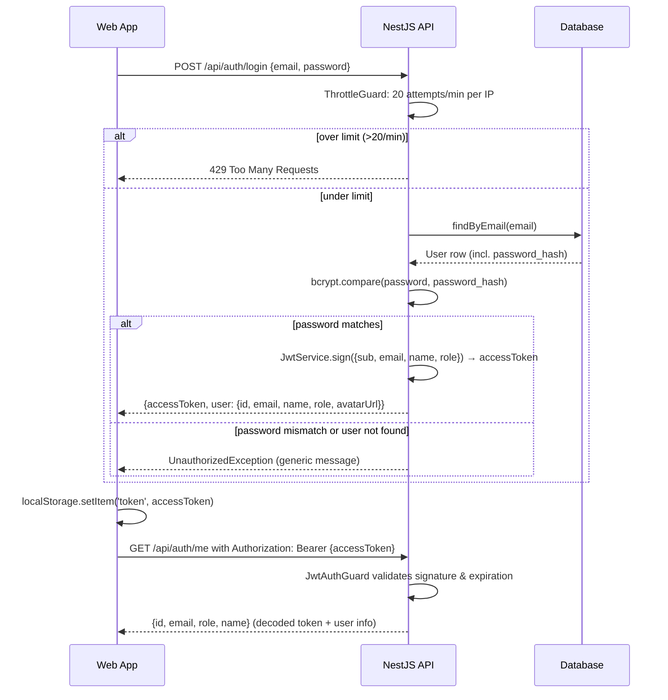
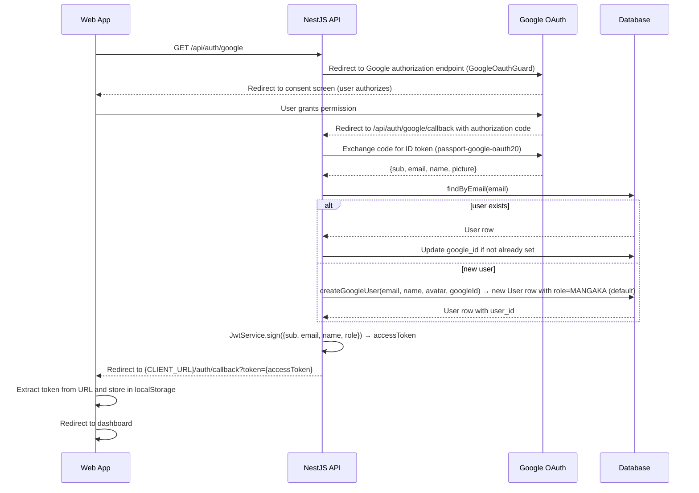

# Security & Access Control (RBAC)

**Purpose:** Describe authentication flows, JWT issuance, role-based authorization guards, the 5-role permission matrix, data-level ownership checks, rate limiting, and security hardening state of the manga platform.

**Date:** 2026-06-05

**Table of Contents:**
1. [Authentication](#1-authentication)
2. [Authentication Flows](#2-authentication-flows)
3. [Authorization Model](#3-authorization-model)
4. [Permission Matrix](#4-permission-matrix)
5. [Data-Level Authorization](#5-data-level-authorization)
6. [Rate Limiting](#6-rate-limiting)
7. [Input & Transport Security](#7-input--transport-security)
8. [Client-Side & Privacy](#8-client-side--privacy)
9. [Secrets & Configuration](#9-secrets--configuration)
10. [Error Handling & Logging](#10-error-handling--logging)
11. [Hardening Backlog](#11-hardening-backlog)

---

## 1. Authentication

The platform supports two authentication methods:

### Local Authentication
- Email + password credentials stored in the `User` table.
- Passwords hashed with **bcryptjs** at cost factor 10 (NIST SPP 800-132 compatible).
- `password_hash` field is nullable to support OAuth-only users.
- Validation: `AuthService.validateLocal(email, password)` compares plaintext input against stored hash using `bcrypt.compare()`.
- Failure message is intentionally generic ("Email hoặc mật khẩu không đúng") to prevent account enumeration.

### Google OAuth 2.0
- Redirects to Google's authorization server; Google returns an authorization code.
- `GoogleOauthGuard` (passport-google-oauth20) exchanges the code for an ID token.
- First-time Google login auto-creates a user account with email, name, and avatar from the Google profile; existing users are linked.
- OAuth profile is idempotent: if a user with the same email exists, `google_id` is stored/updated; no duplicate accounts.

### JWT Token Issuance
The `AuthService.issue(user: UserRow)` method signs a JWT with the following payload claims:
- `sub` (subject): user ID (BIGINT from `User.user_id`)
- `email`: user email address
- `name`: user full name (`User.full_name`)
- `role`: user role enum (MANGAKA | ASSISTANT | TANTOU_EDITOR | EDITORIAL_BOARD | ADMIN)

The token is signed using `@nestjs/jwt` with the secret loaded from `JWT_SECRET` environment variable. **In development, if `JWT_SECRET` is not set, a warning is logged and a default 'dev-secret' is used** (auth.module.ts line 20-21). **In production, ensure `JWT_SECRET` is configured via environment variable; using the default is a security risk.**
Token expiration is managed by `JWT_EXPIRES` environment variable (default '7d'); refresh tokens are not yet implemented.

The signed token is returned as `accessToken` to the client and included in all subsequent API requests via the `Authorization: Bearer <token>` HTTP header.

---

## 2. Authentication Flows

### Flow A: Local Email + Password Login (with Rate Limiting)



### Flow B: Google OAuth 2.0 Redirect + Callback



---

## 3. Authorization Model

### Guards & Decorators
All protected endpoints use a two-guard pattern via `@UseGuards(JwtAuthGuard, RolesGuard)`:

1. **JwtAuthGuard** (`JwtAuthGuard extends AuthGuard('jwt')`)
   - Validates the JWT signature and expiration using the `JWT_SECRET`.
   - Extracts the token from the `Authorization: Bearer` header.
   - Populates `req.user` with the decoded payload: `{id, email, role, name}`.
   - Returns 401 Unauthorized if the token is missing, invalid, or expired.

2. **RolesGuard** (`RolesGuard implements CanActivate`)
   - Inspects the `@Roles(...)` decorator metadata on the handler.
   - If no roles are specified, the endpoint is accessible to any authenticated user.
   - If roles are specified, only users whose `req.user.role` matches one of the allowed roles can proceed.
   - Returns 403 Forbidden if the user's role is not in the allowed list.

### Role Decorator
```typescript
// Example controller handler
@Controller('proposals')
export class ProposalsController {
  
  @Post()
  @UseGuards(JwtAuthGuard, RolesGuard)
  @Roles(Role.MANGAKA)
  create(@Body() dto: CreateProposalDto, @Req() req: any) {
    // req.user.id is the authenticated MANGAKA's user_id
    // Only MANGAKA role can call this endpoint
  }

  @Get('review-queue')
  @UseGuards(JwtAuthGuard, RolesGuard)
  @Roles(Role.EDITORIAL_BOARD)
  reviewQueue() {
    // Only EDITORIAL_BOARD members can access the proposal queue
  }
}
```

---

## 4. Permission Matrix

The following matrix shows which roles may invoke each endpoint or endpoint group. ✓ = permitted; blank = forbidden.

| Endpoint / Group | MANGAKA | ASSISTANT | TANTOU_EDITOR | EDITORIAL_BOARD | ADMIN | Public |
|---|:---:|:---:|:---:|:---:|:---:|:---:|
| **auth/** |
| POST /api/auth/login | ✓ | ✓ | ✓ | ✓ | ✓ | ✓ |
| GET /api/auth/me | ✓ | ✓ | ✓ | ✓ | ✓ | |
| POST /api/auth/logout | ✓ | ✓ | ✓ | ✓ | ✓ | |
| GET /api/auth/google | ✓ | ✓ | ✓ | ✓ | ✓ | ✓ |
| GET /api/auth/google/callback | ✓ | ✓ | ✓ | ✓ | ✓ | ✓ |
| **proposals/** |
| POST /api/proposals | ✓ | | | | | |
| GET /api/proposals/mine | ✓ | | | | | |
| PATCH /api/proposals/:id/submit | ✓ | | | | | |
| GET /api/proposals/review-queue | | | | ✓ | | |
| PATCH /api/proposals/:id/decision | | | | ✓ | | |
| **series/** |
| GET /api/series/all | | | | ✓ | ✓ | |
| GET /api/series/mine | ✓ | | | | | |
| GET /api/series/:id | ✓ | ✓ | ✓ | ✓ | ✓ | |
| PUT /api/series/:id/editor | | | | ✓ | | |
| DELETE /api/series/:id/editor | | | | ✓ | | |
| **chapters/** |
| POST /api/chapters | ✓ | | | | | |
| GET /api/chapters?seriesId= | ✓ | ✓ | ✓ | ✓ | ✓ | |
| PATCH /api/chapters/:id/status | ✓ | | | | | |
| GET /api/chapters/review-queue | | | ✓ | | | |
| GET /api/chapters/:id/pages | | | ✓ | | | |
| PATCH /api/chapters/:id/editor-review | | | ✓ | | | |
| **pages/** |
| POST /api/pages | ✓ | | | | | |
| GET /api/pages?chapterId= | ✓ | ✓ | ✓ | ✓ | ✓ | |
| GET /api/pages/:id | ✓ | ✓ | ✓ | ✓ | ✓ | |
| **regions/** |
| POST /api/regions | ✓ | | | | | |
| GET /api/regions?pageId= | ✓ | ✓ | ✓ | ✓ | ✓ | |
| DELETE /api/regions/:id | ✓ | | | | | |
| **tasks/** |
| POST /api/tasks | ✓ | | | | | |
| GET /api/tasks/mine | | ✓ | | | | |
| GET /api/tasks?pageId= | ✓ | ✓ | ✓ | ✓ | ✓ | |
| PATCH /api/tasks/:id/start | | ✓ | | | | |
| **submissions/** |
| POST /api/submissions | | ✓ | | | | |
| GET /api/submissions/review-queue | ✓ | | | | | |
| PATCH /api/submissions/:id/review | ✓ | | | | | |
| **annotations/** |
| POST /api/annotations | | | ✓ | | | |
| GET /api/annotations?targetType=&targetId= | | | ✓ | | | |
| PATCH /api/annotations/:id/resolve | | | ✓ | | | |
| **rankings/** |
| POST /api/vote-periods | | | | ✓ | | |
| GET /api/vote-periods/open | | | | ✓ | | |
| POST /api/votes | | | | ✓ | | |
| POST /api/vote-periods/:id/close | | | | ✓ | | |
| GET /api/rankings?... | | | | ✓ | ✓ | |
| **decisions/** |
| POST /api/decisions | | | | ✓ | | |
| GET /api/decisions?seriesId= | ✓ | | | ✓ | | |
| **earnings/** |
| GET /api/earnings/mine | | ✓ | | | | |
| **disputes/** |
| POST /api/disputes | | ✓ | | | | |
| GET /api/disputes/mine | | ✓ | | | | |
| GET /api/disputes | | | | | ✓ | |
| PATCH /api/disputes/:id/review | | | | | ✓ | |
| PATCH /api/disputes/:id/resolve | | | | | ✓ | |
| **notifications/** |
| GET /api/notifications | ✓ | ✓ | ✓ | ✓ | ✓ | |
| PATCH /api/notifications/read-all | ✓ | ✓ | ✓ | ✓ | ✓ | |
| PATCH /api/notifications/:id/read | ✓ | ✓ | ✓ | ✓ | ✓ | |
| **dashboard/** |
| GET /api/dashboard/summary | ✓ | ✓ | ✓ | ✓ | ✓ | |
| GET /api/dashboard/series | ✓ | ✓ | ✓ | ✓ | ✓ | |
| GET /api/dashboard/tasks | ✓ | ✓ | ✓ | ✓ | ✓ | |
| GET /api/dashboard/submissions | ✓ | ✓ | ✓ | ✓ | ✓ | |
| GET /api/dashboard/notifications | ✓ | ✓ | ✓ | ✓ | ✓ | |
| **admin/** |
| GET /api/admin/users | | | | | ✓ | |
| GET /api/admin/overview | | | | | ✓ | |
| PATCH /api/admin/users/:id | | | | | ✓ | |
| **users/** |
| GET /api/users/me | ✓ | ✓ | ✓ | ✓ | ✓ | |
| PATCH /api/users/me | ✓ | ✓ | ✓ | ✓ | ✓ | |
| GET /api/users/assistants | ✓ | | | ✓ | | |
| GET /api/users/editors | | | | ✓ | | |
| **genres/** |
| GET /api/genres | ✓ | ✓ | ✓ | ✓ | ✓ | ✓ |
| **uploads/** |
| POST /api/uploads | ✓ | ✓ | ✓ | ✓ | ✓ | |
| GET /uploads/:key | ✓ | ✓ | ✓ | ✓ | ✓ | ✓ |
| **studio/** |
| POST /api/studio/page-versions | ✓ | ✓ | | | | |
| POST /api/studio/docs | ✓ | ✓ | | | | |
| GET /api/studio/docs/:pageId | ✓ | ✓ | | | | |
| **app/** |
| GET /api (health) | ✓ | ✓ | ✓ | ✓ | ✓ | ✓ |

---

## 5. Data-Level Authorization

Beyond role-based endpoint access, several endpoints enforce **ownership** and **assignment** checks to prevent users from accessing data outside their scope:

### Mangaka Ownership
- **GET /api/proposals/mine**: Returns only proposals created by the authenticated mangaka (`proposal.mangaka_user_id == req.user.id`).
- **GET /api/series/mine**: Returns only series authored by the authenticated mangaka.
- **POST /api/chapters** / **GET /api/chapters?seriesId=**: Mangaka may only create chapters or query chapters for series they own.

### Assistant Task Assignment
- **GET /api/tasks/mine**: Returns only tasks assigned to the authenticated assistant (`Task.assignee_user_id == req.user.id`).
- **GET /api/earnings/mine**: Returns only earnings and tasks for the authenticated assistant.
- **GET /api/disputes/mine**: Returns only disputes filed by the authenticated assistant.

### Tantou Editor Series Assignment
- **GET /api/chapters/review-queue**: Returns only chapters from series where the editor is the active Tantou Editor (`Series_Tantou_Editor.editor_user_id == req.user.id` and `unassigned_at IS NULL`).
- **GET /api/chapters/:id/pages**: Tantou editor may only view pages for chapters in their assigned series.

### Last-Admin Guard
- **PATCH /api/admin/users/:id** (deactivate/role change): The system prevents removing or deactivating the final ADMIN user. If a user is the only active admin and a deactivation is attempted, the request fails with a validation error.

---

## 6. Rate Limiting

Rate limiting is enforced via `@nestjs/throttler` module (ThrottlerModule, ThrottlerGuard) integrated at the application level.

### Global Rate Limit
- **Global threshold**: 120 requests per minute (60,000 ms window) per IP address.
- **Applied to**: All endpoints via APP_GUARD (ThrottlerGuard) in `app.module.ts`.
- **Response on limit exceeded**: HTTP 429 Too Many Requests.

### Login-Specific Rate Limit
- **Endpoint**: POST `/api/auth/login`
- **Threshold**: 20 attempts per minute per IP address (60,000 ms window).
- **Applied via**: `@Throttle({ default: { ttl: 60000, limit: 20 } })` decorator in `auth.controller.ts` (line 28).
- **Purpose**: Mitigate brute-force password attacks. Threshold is tolerant of shared NATs and demo/test environments.
- **Response on limit exceeded**: HTTP 429 Too Many Requests.

---

## 7. Input & Transport Security

### Request Validation
- **Global ValidationPipe**: All POST/PATCH/PUT endpoints validate request bodies against Data Transfer Objects (DTOs) using class-validator decorators.
  - `whitelist: true` — unknown properties are stripped from the request body before reaching handlers.
  - `transform: true` — type coercion (e.g., string "123" → number 123) is applied according to DTO field types.
  - Invalid input (missing required fields, wrong types, constraint violations) returns 400 Bad Request with detailed error messages.

### CORS Policy
- CORS is enabled with a single-origin policy: `origin: process.env.CLIENT_URL` (default http://localhost:5173 in development).
- Only the configured client URL may make cross-origin requests; `credentials: true` allows cookie-based authentication (for future use).
- Requests from other origins are rejected at the browser level.

### File Upload & Path-Traversal Guard
- **POST /api/uploads**: Multer middleware validates and stores files to S3-compatible storage (SeaweedFS).
  - Requires authentication (JwtAuthGuard).
  - File size limit: 30 MB.
  - Filenames are randomized using UUID to prevent collisions and path traversal.
  - Returns a stable `/uploads/{key}` URL.

- **GET /uploads/:key** (Public read): Serves uploaded files from SeaweedFS with a path-traversal guard.
  - **Guard**: Key must match regex `^[A-Za-z0-9._-]+$` (alphanumeric, dot, underscore, hyphen only). No slashes, parent-dir references (`..`), or special characters allowed.
  - Requests with invalid keys are rejected with HTTP 400 ("Invalid key").
  - Falls back to on-disk uploads directory if S3 fetch fails (legacy support).
  - Response includes standard caching headers (`Cache-Control: public, max-age=86400`).

### HTTPS
- In production, all API traffic must use HTTPS (not enforced at the application level; delegated to a reverse proxy or load balancer).

---

## 7. Client-Side & Privacy

### Token Storage
- The web SPA (`apps/frontend/src/lib/api.ts`) stores the JWT accessToken in browser `localStorage` after login.
- The token is attached to every outgoing API request via the `Authorization: Bearer` header using an axios interceptor.
- On logout, the token is removed from localStorage (JWT is stateless; no server-side revocation required).

### Frontend Role-Protected Routes
- The web app (`apps/frontend/src/App.tsx`) uses `<RoleProtected>` component to guard role-specific routes.
- `<RoleProtected roles={[Role.MANGAKA]}>` wraps routes that only MANGAKA can access; enforced client-side and server-side.
- On unauthorized access (wrong role), displays a `<Forbidden>` page (HTTP 403 equivalent).
- Routes are nested inside `<Protected>` (authentication guard), ensuring unauthenticated users are redirected to `/login`.
- **Note**: Client-side role checks are cosmetic; all API endpoints enforce role via JwtAuthGuard + RolesGuard on the server.

### On-Device AI Inference
- The Studio includes optional AI assists for region detection, smart selection, and colorization.
- All models (YOLO, MobileSAM, DeOldify) run **in-browser** using ONNX Runtime Web (`onnxruntime-web 1.26`).
- Model inference happens in web workers to avoid blocking the UI thread.
- **Privacy benefit**: Manuscript images never leave the client; no images are sent to any server or third-party API.
- Fallback heuristics are available if models fail to load or are unavailable.

---

## 8. Secrets & Configuration

The following environment variables are loaded via `@nestjs/config` at API startup:

- **DB_HOST**, **DB_PORT**, **DB_USER**, **DB_PASSWORD**, **DB_NAME**: MySQL connection parameters (host port 3308 in Docker).
- **JWT_SECRET**: Secret key used to sign and verify JWT tokens (fallback 'dev-secret' in development).
- **GOOGLE_CLIENT_ID**: OAuth client ID from Google Cloud Console.
- **GOOGLE_CLIENT_SECRET**: OAuth client secret from Google Cloud Console.
- **GOOGLE_OAUTH_CALLBACK_URL**: Redirect URI registered in Google Cloud (e.g., http://localhost:3000/api/auth/google/callback).
- **CLIENT_URL**: Web SPA origin (used for CORS and OAuth callback redirect; default http://localhost:5173).
- **PORT**: API server port (default 3000).

### Storage Backend
- **File storage**: SeaweedFS (self-hosted S3-compatible object store).
  - Started via `pnpm db:up` (Docker); listens on `:8333` (default).
  - Used for uploads and manuscript images (no hardcoded disk paths in production).
  - MinIO is no longer used (verified deprecated 2026-06).

### .env File
- The `.env` file (and `.env.local`, `.env.*.local`) is **gitignored** and never committed to version control.
- Secrets are never printed in logs or error messages.
- Demo/local seed data uses a throwaway password; this value is not shared in documentation.

---

## 10. Error Handling & Logging

### Global Exception Filter
- **AllExceptionsFilter** (common/all-exceptions.filter.ts) is applied globally via `app.useGlobalFilters(new AllExceptionsFilter())` in `main.ts` (line 20).
- **Behavior**:
  - **HttpException**: Returns the exception's status code and body as-is (e.g., validation errors, 403 Forbidden, custom business logic errors).
  - **Unhandled exceptions** (e.g., database errors, null-pointer dereferences): Logged server-side with full stack trace and context. Client receives a generic HTTP 500 response without sensitive details.
- **Security benefit**: SQL errors, stack traces, and internal implementation details are never leaked to the client. Error message is generic Vietnamese: "Lỗi máy chủ. Vui lòng thử lại." (Server error. Please try again.)

### Logging
- Errors are logged to `console.error()` server-side.
- In production, logs should be aggregated via a centralized logging service (ELK, Datadog, CloudWatch) for security auditing and incident response.
- **Backlog**: Wire structured logging (e.g., Winston, Pino) for better observability.

---

## 11. Hardening Backlog

The following security features are architecturally in place but not yet fully implemented:

### Audit Logging
- The **Audit_Log** table schema exists (`db/01-schema.sql`) with columns for actor, action, entity, before/after JSON, IP, user-agent, and timestamp.
- Wiring is incomplete: audit events are not yet fired by the application services.
- **Backlog**: Integrate `@BeforeUpdate`, `@BeforeInsert`, `@BeforeRemove` NestJS listeners (or middleware) to log all data mutations.

### Refresh Token Rotation
- Currently, access tokens are issued once per login with a fixed expiration (typically 1 hour).
- No refresh token mechanism exists; expired tokens require re-authentication.
- **Backlog**: Implement a refresh token table and a `/api/auth/refresh` endpoint to extend sessions without re-prompting users for credentials.

### Rate Limiting
- No rate limiting is enforced on any endpoint.
- **Backlog**: Integrate `@nestjs/throttler` to limit login attempts (e.g., 5 per minute per IP) and other sensitive endpoints.

### Structured Logging & Observability
- Logging is currently done via `console.error()` and `Logger.warn()` (NestJS built-in).
- **Backlog**: Integrate structured logging (Winston, Pino) with JSON output for better log aggregation and security auditing.

### Secrets Management
- Environment variables are loaded from a `.env` file at startup.
- In production, this should be replaced with a managed secrets service (AWS Secrets Manager, HashiCorp Vault, or similar).
- **Backlog**: Integrate a secrets manager to centralize credential rotation and audit.

---

## Cross-Links

- [System Architecture](01-system-architecture.md) — overall system design and module organization.
- [API Reference](../03-api/01-api-reference.md) — detailed endpoint specifications, request/response bodies, and status codes.
- [Database Design](02-database-design.md) — table definitions, relationships, and key constraints.
