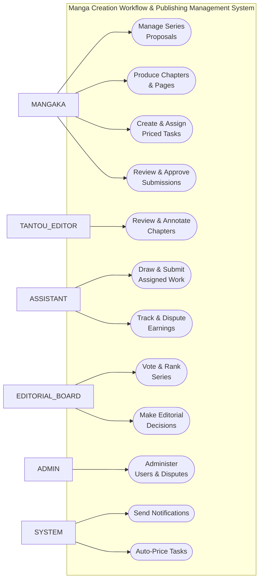
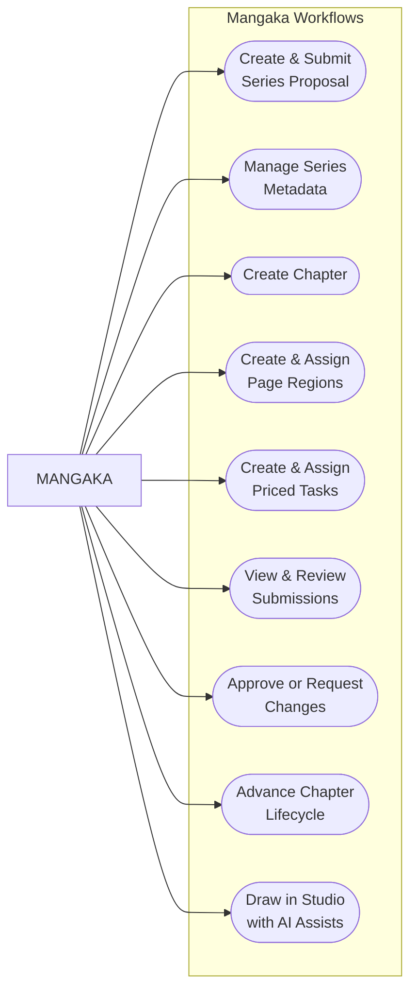
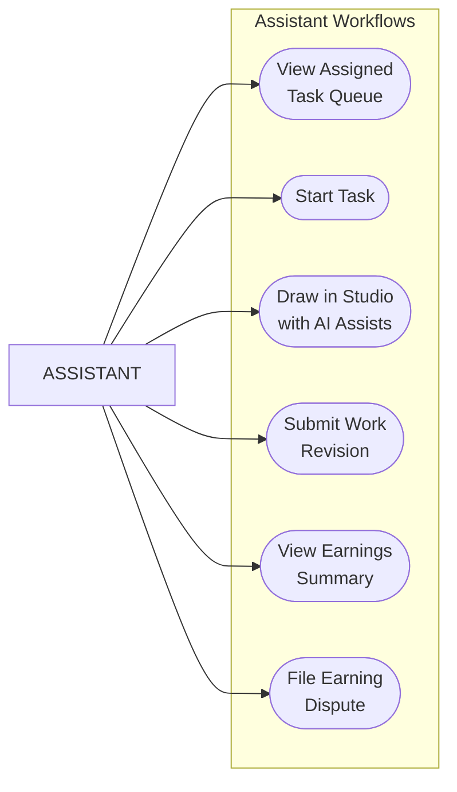
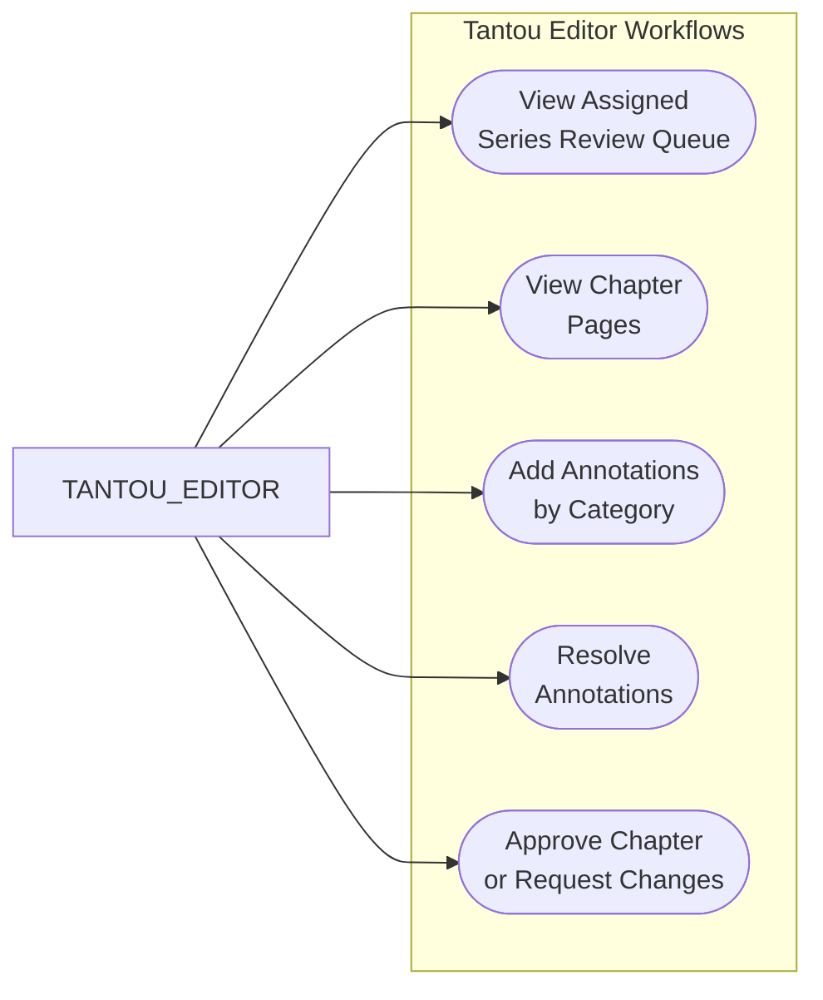
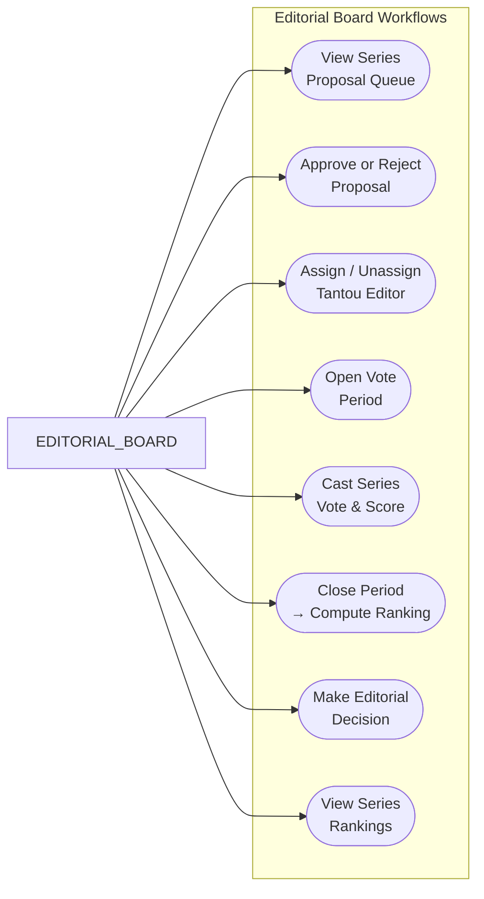
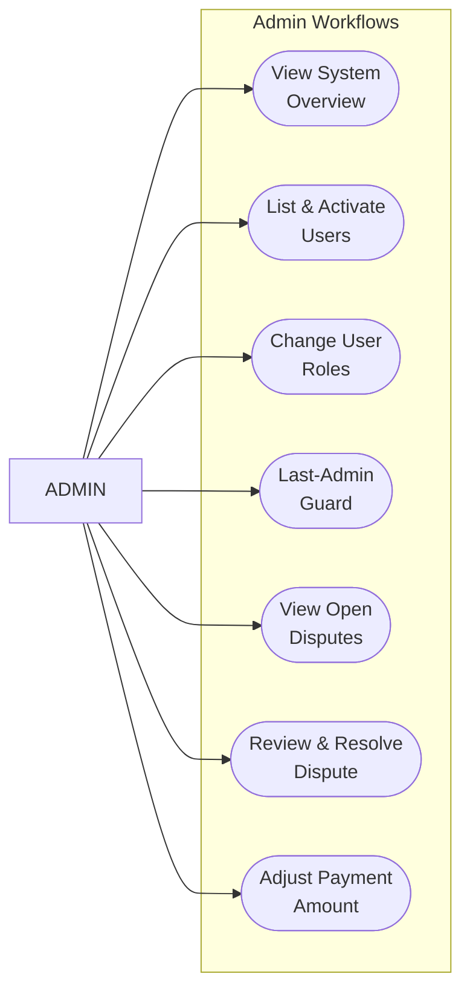
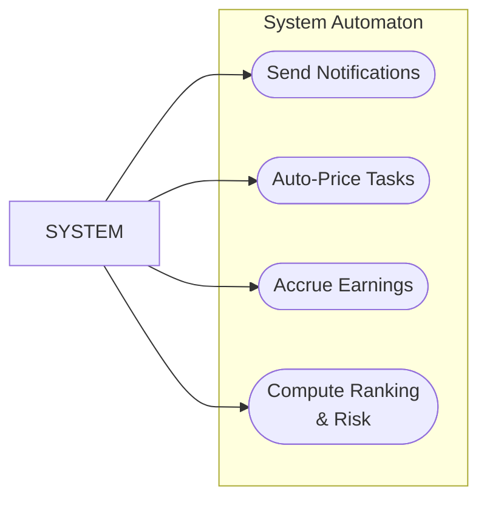

# Use-Case Diagrams

**Purpose:** Model the key actor-system interactions in the Manga Creation Workflow & Publishing Management System. Maps each use case to real endpoints and UI pages verified from the project source.

**Note on diagrams:** Mermaid has no native UML use-case notation, so we emulate it cleanly with `flowchart LR`: actors appear as plain rectangles on the left; use cases (system functions) appear as rounded/stadium nodes grouped inside a logical "System" boundary; edges link each actor to their callable use cases.

## Table of Contents
1. [System Overview](#1-system-overview-all-actors)
2. [Mangaka](#2-mangaka)
3. [Assistant](#3-assistant)
4. [Tantou Editor](#4-tantou-editor)
5. [Editorial Board](#5-editorial-board)
6. [Admin](#6-admin)
7. [System Automaton](#7-system-automaton)

---

## 1. System Overview (All Actors)

Top-level use cases by all 5 user roles + System automaton, showing the breadth of the platform.

| Actor | Top-Level Use Cases |
|-------|---------------------|
| **MANGAKA** | Manage Series Proposals, Produce Chapters & Pages, Create & Assign Priced Tasks, Review & Approve Submissions |
| **ASSISTANT** | Draw & Submit Assigned Work, Track & Dispute Earnings |
| **TANTOU_EDITOR** | Review & Annotate Chapters |
| **EDITORIAL_BOARD** | Vote & Rank Series, Make Editorial Decisions |
| **ADMIN** | Administer Users & Disputes |
| **SYSTEM** | Send Notifications, Auto-Price Tasks |

---

## 2. Mangaka

The mangaka authors series, manages the production pipeline, and reviews assistant submissions.

| Use Case | Realizing Endpoints & Pages |
|----------|---------------------------|
| Create & Submit Series Proposal | `POST /api/proposals` (create), `PATCH /api/proposals/:id/submit` (DRAFT→SUBMITTED), Route: `/proposals` |
| Manage Series Metadata | `GET /api/series/mine`, Routes: `/series`, `/series/:id` |
| Create Chapter | `POST /api/chapters`, Route: `/series/:seriesId/chapters/:chapterId` (ChapterWorkspace) |
| Create & Assign Page Regions | `POST /api/pages`, `POST /api/regions`, Route: ChapterWorkspace |
| Create & Assign Priced Tasks | `POST /api/tasks` (auto-prices via Task_Price_Rule), Route: ChapterWorkspace |
| View & Review Submissions | `GET /api/submissions/review-queue`, Route: `/review` (mangaka submission review) |
| Approve or Request Changes | `PATCH /api/submissions/:id/review` (APPROVED accrues earnings; REVISION_REQUIRED loops), Route: `/review` |
| Advance Chapter Lifecycle | `PATCH /api/chapters/:id/status` (lifecycle, writes Publication_Schedule on PUBLISHED), Route: ChapterWorkspace |
| Draw in Studio with AI Assists | `POST /api/studio/page-versions`, `POST /api/studio/docs`, Route: `/studio/page/:pageId` (canvas Studio) |

---

## 3. Assistant

The assistant views assigned tasks, works on them in the Studio, and manages earnings.

| Use Case | Realizing Endpoints & Pages |
|----------|---------------------------|
| View Assigned Task Queue | `GET /api/tasks/mine`, Route: `/my-tasks` (assistant) |
| Start Task | `PATCH /api/tasks/:id/start` (ASSIGNED→IN_PROGRESS), Route: `/my-tasks` |
| Draw in Studio with AI Assists | `POST /api/studio/page-versions`, `POST /api/studio/docs`, Route: `/studio/region/:taskId` (canvas Studio) |
| Submit Work Revision | `POST /api/submissions` (upload work, task→SUBMITTED), Route: Studio or `/my-tasks` |
| View Earnings Summary | `GET /api/earnings/mine` (total, approved tasks, earnedAt, hasDispute), Route: `/earnings` (assistant) |
| File Earning Dispute | `POST /api/disputes` (open dispute on own APPROVED task), Route: `/earnings` |

---

## 4. Tantou Editor

The Tantou Editor reviews chapters assigned to their managed series and provides structured feedback.

| Use Case | Realizing Endpoints & Pages |
|----------|---------------------------|
| View Assigned Series Review Queue | `GET /api/chapters/review-queue` (assigned series only), Route: `/editor/review` (chapter review) |
| View Chapter Pages | `GET /api/chapters/:id/pages`, Route: `/editor/review/:chapterId` (chapter review + annotations) |
| Add Annotations by Category | `POST /api/annotations` (polymorphic feedback: CONTENT_ISSUE, DIALOGUE_ISSUE, SCRIPT_ISSUE, VISUAL_ISSUE, GENERAL), Route: `/editor/review/:chapterId` |
| Resolve Annotations | `PATCH /api/annotations/:id/resolve`, Route: `/editor/review/:chapterId` |
| Approve Chapter or Request Changes | `PATCH /api/chapters/:id/editor-review` (approve/request-changes, +notify mangaka), Route: `/editor/review/:chapterId` |

---

## 5. Editorial Board

The Editorial Board votes on series, ranks them by risk, and makes decisions that affect publication schedules.

| Use Case | Realizing Endpoints & Pages |
|----------|---------------------------|
| View Series Proposal Queue | `GET /api/proposals/review-queue`, Route: `/board/proposals` |
| Approve or Reject Proposal | `PATCH /api/proposals/:id/decision` (APPROVED auto-creates Series; REJECTED), Route: `/board/proposals` |
| Assign / Unassign Tantou Editor | `PUT /api/series/:id/editor` (assign, +notify), `DELETE /api/series/:id/editor` (unassign), Route: `/board/series` (assign editor) |
| Open Vote Period | `POST /api/vote-periods` (open a period), Route: `/board/rankings` (vote/close/decision) |
| Cast Series Vote & Score | `POST /api/votes` (cast score, uniq per member/period), Route: `/board/rankings` |
| Close Period → Compute Ranking | `POST /api/vote-periods/:id/close` (computes Ranking rows, sets Series AT_RISK, +notify), Route: `/board/rankings` |
| Make Editorial Decision | `POST /api/decisions` (CONTINUE/CANCEL/CHANGE_FREQUENCY/HIATUS, +notify mangaka), Route: `/board/rankings` |
| View Series Rankings | `GET /api/rankings?...` (leaderboard with rank_position, total_score, risk_level), Route: `/board/rankings` |

---

## 6. Admin

The Admin manages users, resolves disputes, and enforces system guardrails.

| Use Case | Realizing Endpoints & Pages |
|----------|---------------------------|
| View System Overview | `GET /api/admin/overview`, Route: `/admin` (Console) |
| List & Activate Users | `GET /api/admin/users`, Route: `/admin` |
| Change User Roles | `PATCH /api/admin/users/:id` (activate/role), Route: `/admin` |
| Last-Admin Guard | `PATCH /api/admin/users/:id` (last-admin guard prevents final admin demotion), Route: `/admin` |
| View Open Disputes | `GET /api/disputes` (OPEN/UNDER_REVIEW/RESOLVED/REJECTED), Route: `/admin/disputes` |
| Review & Resolve Dispute | `PATCH /api/disputes/:id/review` (OPEN→UNDER_REVIEW), `PATCH /api/disputes/:id/resolve` (RESOLVED/REJECTED), Route: `/admin/disputes` |
| Adjust Payment Amount | `PATCH /api/disputes/:id/resolve` (optional adjustedAmount updates Task.payment_amount + Assistant_Profile.total_earnings by delta, +notify), Route: `/admin/disputes` |

---

## 7. System Automaton

Automated processes triggered by state transitions and time-based events.

| Use Case | Realizing Mechanisms |
|----------|---------------------|
| Send Notifications | `NotificationsService.notify()` on: task assignment, submission, review decision, editor review, proposal decision, editor (un)assignment, ranking risk, board decision, dispute open/resolve; Event: `POST /api/notifications` (internal) |
| Auto-Price Tasks | `POST /api/tasks` auto-sets `payment_amount` from active `Task_Price_Rule` for region_type at creation |
| Accrue Earnings | `PATCH /api/submissions/:id/review` (APPROVED) → `Assistant_Profile.total_earnings += Task.payment_amount`; disputes adjust by delta |
| Compute Ranking & Risk | `POST /api/vote-periods/:id/close` → computes Ranking rows (rank_position, total_score, risk_level ∈ {LOW, MEDIUM, HIGH}), sets Series.series_status = AT_RISK |

---

## Cross-References

- **Detailed use-case specifications:** [Requirements and Use Cases](../01-overview/02-requirements-and-use-cases.md)
- **API endpoints reference:** [API Reference](../03-api/01-api-reference.md)
- **Web routes and pages:** [System Architecture — Frontend](../02-architecture/01-system-architecture.md)
