# Sequence Diagrams — Manga Platform Flows

Key user-facing and system-internal sequences that illustrate the complete pipeline from authentication through disputes. Each diagram grounds real endpoints, role guards, state transitions, and side effects (notifications, earnings, database writes).

## 1. Local Login & Authenticated Request

A user logs in with email/password, receives a JWT, and then makes an authenticated API request under role-based access control.

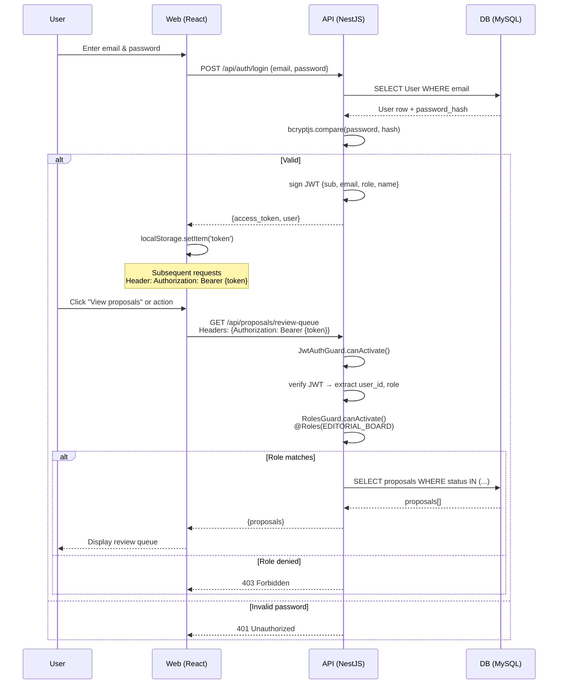
```mermaid
sequenceDiagram
    participant User
    participant Web as Web (React)
    participant API as API (NestJS)
    participant DB as DB (MySQL)

    User->>Web: Enter email & password
    Web->>API: POST /api/auth/login {email, password}
    API->>DB: SELECT User WHERE email
    DB-->>API: User row + password_hash
    API->>API: bcryptjs.compare(password, hash)
    alt Valid
        API->>API: sign JWT {sub, email, role, name}
        API-->>Web: {access_token, user}
        Web->>Web: localStorage.setItem('token')
        Note over Web: Subsequent requests<br/>Header: Authorization: Bearer {token}
        User->>Web: Click "View proposals" or action
        Web->>API: GET /api/proposals/review-queue<br/>Headers: {Authorization: Bearer {token}}
        API->>API: JwtAuthGuard.canActivate()
        API->>API: verify JWT → extract user_id, role
        API->>API: RolesGuard.canActivate()<br/>@Roles(EDITORIAL_BOARD)
        alt Role matches
            API->>DB: SELECT proposals WHERE status IN (...)
            DB-->>API: proposals[]
            API-->>Web: {proposals}
            Web-->>User: Display review queue
        else Role denied
            API-->>Web: 403 Forbidden
        end
    else Invalid password
        API-->>Web: 401 Unauthorized
    end
```

## 2. Proposal Submission & Board Decision

A Mangaka authors a draft, submits it for review, and the Editorial Board approves (auto-creating Series + notifying the Mangaka).

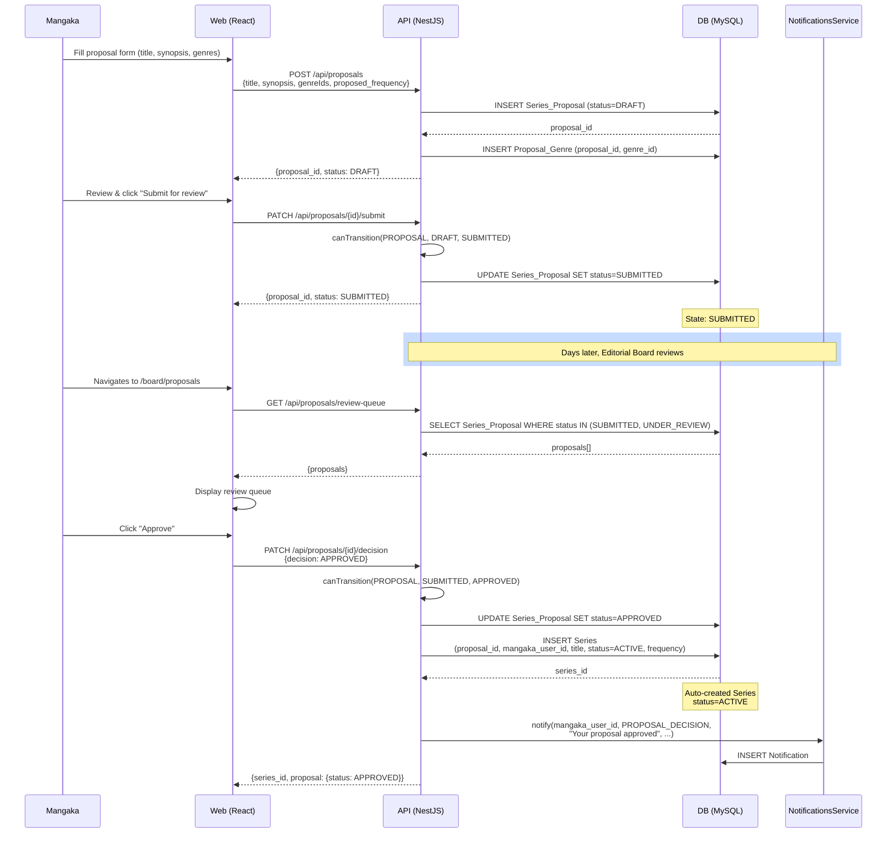
```mermaid
sequenceDiagram
    participant Mangaka
    participant Web as Web (React)
    participant API as API (NestJS)
    participant DB as DB (MySQL)
    participant Notif as NotificationsService

    Mangaka->>Web: Fill proposal form (title, synopsis, genres)
    Web->>API: POST /api/proposals<br/>{title, synopsis, genreIds, proposed_frequency}
    API->>DB: INSERT Series_Proposal (status=DRAFT)
    DB-->>API: proposal_id
    API->>DB: INSERT Proposal_Genre (proposal_id, genre_id)
    API-->>Web: {proposal_id, status: DRAFT}
    
    Mangaka->>Web: Review & click "Submit for review"
    Web->>API: PATCH /api/proposals/{id}/submit
    API->>API: canTransition(PROPOSAL, DRAFT, SUBMITTED)
    API->>DB: UPDATE Series_Proposal SET status=SUBMITTED
    API-->>Web: {proposal_id, status: SUBMITTED}
    Note over DB: State: SUBMITTED

    rect rgb(200, 220, 255)
        Note over API,Notif: Days later, Editorial Board reviews
    end

    Mangaka->>Web: Navigates to /board/proposals
    Web->>API: GET /api/proposals/review-queue
    API->>DB: SELECT Series_Proposal WHERE status IN (SUBMITTED, UNDER_REVIEW)
    DB-->>API: proposals[]
    API-->>Web: {proposals}
    Web->>Web: Display review queue

    Mangaka->>Web: Click "Approve"
    Web->>API: PATCH /api/proposals/{id}/decision<br/>{decision: APPROVED}
    API->>API: canTransition(PROPOSAL, SUBMITTED, APPROVED)
    API->>DB: UPDATE Series_Proposal SET status=APPROVED
    
    API->>DB: INSERT Series<br/>(proposal_id, mangaka_user_id, title, status=ACTIVE, frequency)
    DB-->>API: series_id
    Note over DB: Auto-created Series<br/>status=ACTIVE
    
    API->>Notif: notify(mangaka_user_id, PROPOSAL_DECISION,<br/>"Your proposal approved", ...)
    Notif->>DB: INSERT Notification
    
    API-->>Web: {series_id, proposal: {status: APPROVED}}
```

## 3. Assign Tantou Editor

Editorial Board assigns a Tantou (Responsible) Editor to a Series.

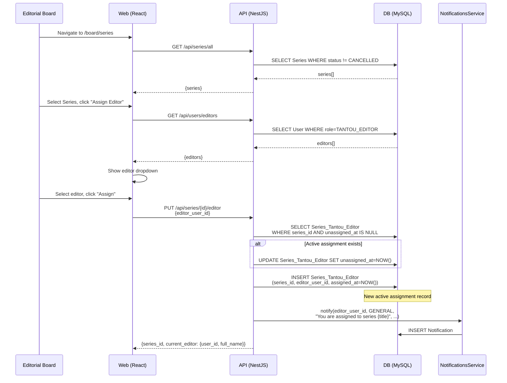
```mermaid
sequenceDiagram
    participant Board as Editorial Board
    participant Web as Web (React)
    participant API as API (NestJS)
    participant DB as DB (MySQL)
    participant Notif as NotificationsService

    Board->>Web: Navigate to /board/series
    Web->>API: GET /api/series/all
    API->>DB: SELECT Series WHERE status != CANCELLED
    DB-->>API: series[]
    API-->>Web: {series}
    
    Board->>Web: Select Series, click "Assign Editor"
    Web->>API: GET /api/users/editors
    API->>DB: SELECT User WHERE role=TANTOU_EDITOR
    DB-->>API: editors[]
    API-->>Web: {editors}
    Web->>Web: Show editor dropdown

    Board->>Web: Select editor, click "Assign"
    Web->>API: PUT /api/series/{id}/editor<br/>{editor_user_id}
    
    API->>DB: SELECT Series_Tantou_Editor<br/>WHERE series_id AND unassigned_at IS NULL
    alt Active assignment exists
        API->>DB: UPDATE Series_Tantou_Editor SET unassigned_at=NOW()
    end
    
    API->>DB: INSERT Series_Tantou_Editor<br/>(series_id, editor_user_id, assigned_at=NOW())
    Note over DB: New active assignment record
    
    API->>Notif: notify(editor_user_id, GENERAL,<br/>"You are assigned to series {title}", ...)
    Notif->>DB: INSERT Notification
    
    API-->>Web: {series_id, current_editor: {user_id, full_name}}
```

## 4. Build a Chapter for Production

Mangaka creates a Chapter, adds Pages, draws Regions (panels), and creates Tasks (auto-priced by region type). Each task triggers a notification to the assigned Assistant.

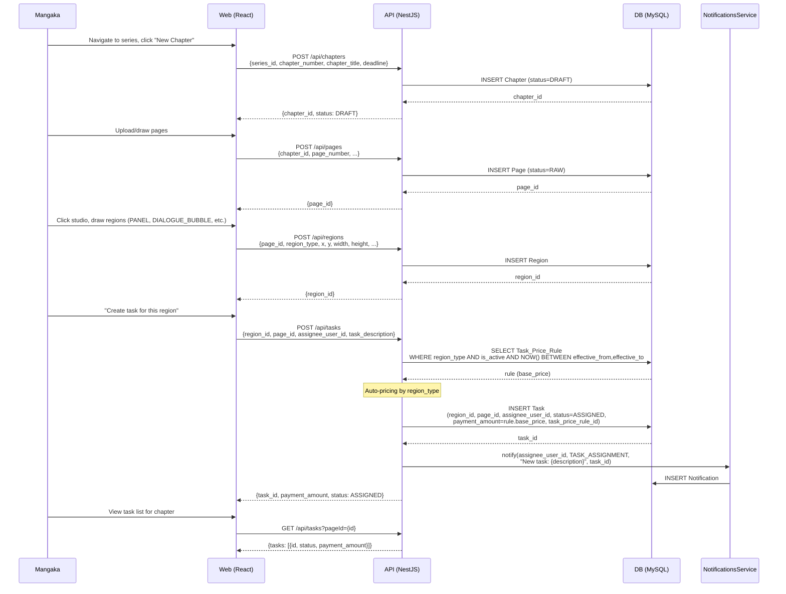
```mermaid
sequenceDiagram
    participant Mangaka
    participant Web as Web (React)
    participant API as API (NestJS)
    participant DB as DB (MySQL)
    participant Notif as NotificationsService

    Mangaka->>Web: Navigate to series, click "New Chapter"
    Web->>API: POST /api/chapters<br/>{series_id, chapter_number, chapter_title, deadline}
    API->>DB: INSERT Chapter (status=DRAFT)
    DB-->>API: chapter_id
    API-->>Web: {chapter_id, status: DRAFT}
    
    Mangaka->>Web: Upload/draw pages
    Web->>API: POST /api/pages<br/>{chapter_id, page_number, ...}
    API->>DB: INSERT Page (status=RAW)
    DB-->>API: page_id
    API-->>Web: {page_id}
    
    Mangaka->>Web: Click studio, draw regions (PANEL, DIALOGUE_BUBBLE, etc.)
    Web->>API: POST /api/regions<br/>{page_id, region_type, x, y, width, height, ...}
    API->>DB: INSERT Region
    DB-->>API: region_id
    API-->>Web: {region_id}
    
    Mangaka->>Web: "Create task for this region"
    Web->>API: POST /api/tasks<br/>{region_id, page_id, assignee_user_id, task_description}
    
    API->>DB: SELECT Task_Price_Rule<br/>WHERE region_type AND is_active AND NOW() BETWEEN effective_from,effective_to
    DB-->>API: rule (base_price)
    Note over API: Auto-pricing by region_type
    
    API->>DB: INSERT Task<br/>(region_id, page_id, assignee_user_id, status=ASSIGNED,<br/>payment_amount=rule.base_price, task_price_rule_id)
    DB-->>API: task_id
    
    API->>Notif: notify(assignee_user_id, TASK_ASSIGNMENT,<br/>"New task: {description}", task_id)
    Notif->>DB: INSERT Notification
    
    API-->>Web: {task_id, payment_amount, status: ASSIGNED}
    
    Mangaka->>Web: View task list for chapter
    Web->>API: GET /api/tasks?pageId={id}
    API-->>Web: {tasks: [{id, status, payment_amount}]}
```

## 5. Assistant Produces & Submits Work

Assistant claims a task (IN_PROGRESS), optionally uses Studio with AI, uploads final work, and submits. Task transitions ASSIGNED → IN_PROGRESS → SUBMITTED.

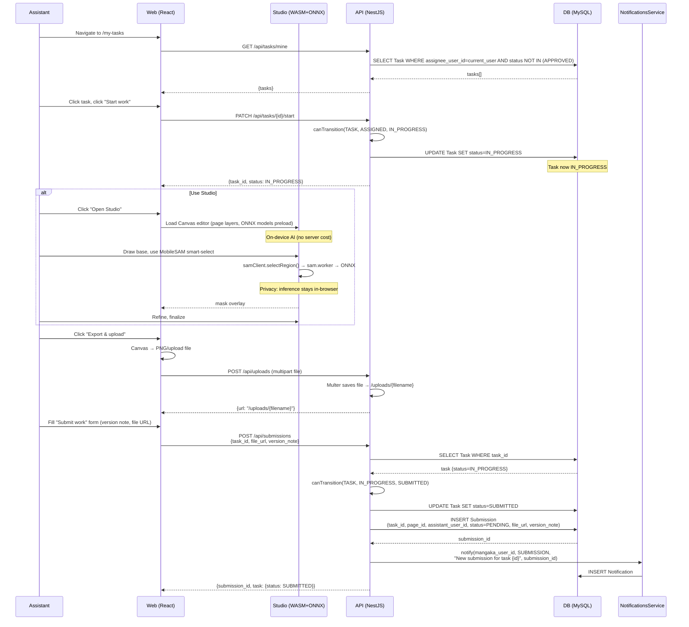
```mermaid
sequenceDiagram
    participant Assistant
    participant Web as Web (React)
    participant Studio as Studio (WASM+ONNX)
    participant API as API (NestJS)
    participant DB as DB (MySQL)
    participant Notif as NotificationsService

    Assistant->>Web: Navigate to /my-tasks
    Web->>API: GET /api/tasks/mine
    API->>DB: SELECT Task WHERE assignee_user_id=current_user AND status NOT IN (APPROVED)
    DB-->>API: tasks[]
    API-->>Web: {tasks}
    
    Assistant->>Web: Click task, click "Start work"
    Web->>API: PATCH /api/tasks/{id}/start
    API->>API: canTransition(TASK, ASSIGNED, IN_PROGRESS)
    API->>DB: UPDATE Task SET status=IN_PROGRESS
    Note over DB: Task now IN_PROGRESS
    API-->>Web: {task_id, status: IN_PROGRESS}
    
    alt Use Studio
        Assistant->>Web: Click "Open Studio"
        Web->>Studio: Load Canvas editor (page layers, ONNX models preload)
        Note over Studio: On-device AI (no server cost)
        Assistant->>Studio: Draw base, use MobileSAM smart-select
        Studio->>Studio: samClient.selectRegion() → sam.worker → ONNX
        Note over Studio: Privacy: inference stays in-browser
        Studio-->>Web: mask overlay
        Assistant->>Studio: Refine, finalize
    end
    
    Assistant->>Web: Click "Export & upload"
    Web->>Web: Canvas → PNG/upload file
    Web->>API: POST /api/uploads (multipart file)
    API->>API: Multer saves file → /uploads/{filename}
    API-->>Web: {url: "/uploads/{filename}"}
    
    Assistant->>Web: Fill "Submit work" form (version note, file URL)
    Web->>API: POST /api/submissions<br/>{task_id, file_url, version_note}
    
    API->>DB: SELECT Task WHERE task_id
    DB-->>API: task {status=IN_PROGRESS}
    API->>API: canTransition(TASK, IN_PROGRESS, SUBMITTED)
    API->>DB: UPDATE Task SET status=SUBMITTED
    
    API->>DB: INSERT Submission<br/>(task_id, page_id, assistant_user_id, status=PENDING, file_url, version_note)
    DB-->>API: submission_id
    
    API->>Notif: notify(mangaka_user_id, SUBMISSION,<br/>"New submission for task {id}", submission_id)
    Notif->>DB: INSERT Notification
    
    API-->>Web: {submission_id, task: {status: SUBMITTED}}
```

## 6. Profile Edit & Update

User views their profile, edits full name and avatar URL, and submits via `PATCH /api/users/me`.

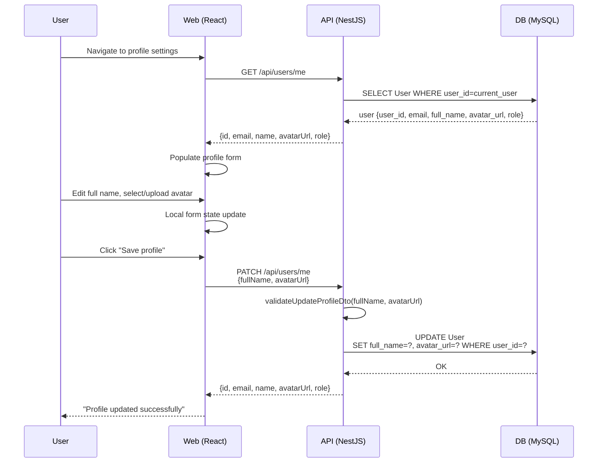
```mermaid
sequenceDiagram
    participant User
    participant Web as Web (React)
    participant API as API (NestJS)
    participant DB as DB (MySQL)

    User->>Web: Navigate to profile settings
    Web->>API: GET /api/users/me
    API->>DB: SELECT User WHERE user_id=current_user
    DB-->>API: user {user_id, email, full_name, avatar_url, role}
    API-->>Web: {id, email, name, avatarUrl, role}
    Web->>Web: Populate profile form
    
    User->>Web: Edit full name, select/upload avatar
    Web->>Web: Local form state update
    
    User->>Web: Click "Save profile"
    Web->>API: PATCH /api/users/me<br/>{fullName, avatarUrl}
    
    API->>API: validateUpdateProfileDto(fullName, avatarUrl)
    API->>DB: UPDATE User<br/>SET full_name=?, avatar_url=? WHERE user_id=?
    DB-->>API: OK
    
    API-->>Web: {id, email, name, avatarUrl, role}
    Web-->>User: "Profile updated successfully"
```

## 6b. Avatar/File Upload to S3

User selects a file, uploads it to `POST /api/uploads` which stores in SeaweedFS S3, returns stable URL for `GET /uploads/{key}`.

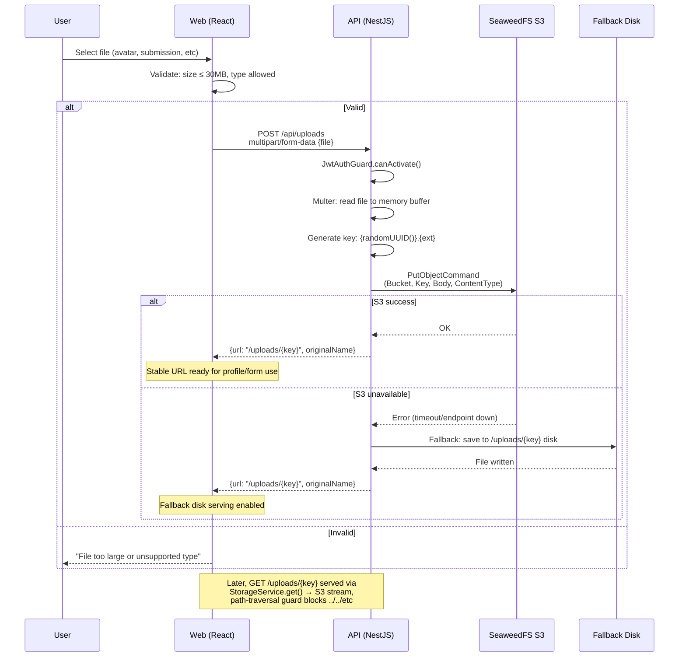
```mermaid
sequenceDiagram
    participant User
    participant Web as Web (React)
    participant API as API (NestJS)
    participant S3 as SeaweedFS S3
    participant Disk as Fallback Disk

    User->>Web: Select file (avatar, submission, etc)
    Web->>Web: Validate: size ≤ 30MB, type allowed
    
    alt Valid
        Web->>API: POST /api/uploads<br/>multipart/form-data {file}
        
        API->>API: JwtAuthGuard.canActivate()
        API->>API: Multer: read file to memory buffer
        API->>API: Generate key: {randomUUID()}.{ext}
        
        API->>S3: PutObjectCommand<br/>(Bucket, Key, Body, ContentType)
        
        alt S3 success
            S3-->>API: OK
            API-->>Web: {url: "/uploads/{key}", originalName}
            Note over Web: Stable URL ready for profile/form use
        else S3 unavailable
            S3-->>API: Error (timeout/endpoint down)
            API->>Disk: Fallback: save to /uploads/{key} disk
            Disk-->>API: File written
            API-->>Web: {url: "/uploads/{key}", originalName}
            Note over Web: Fallback disk serving enabled
        end
    else Invalid
        Web-->>User: "File too large or unsupported type"
    end
    
    Note over Web,API: Later, GET /uploads/{key} served via<br/>StorageService.get() → S3 stream,<br/>path-traversal guard blocks ../../etc
```

## 7. Mangaka Reviews Submission

Mangaka reviews submitted work and either approves (accrue earnings in transaction) or requests revision (loop back to assistant). All database writes happen in a single transaction, with notifications fired AFTER commit.

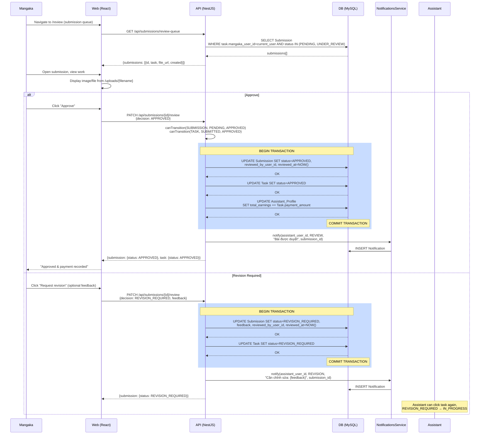
```mermaid
sequenceDiagram
    participant Mangaka
    participant Web as Web (React)
    participant API as API (NestJS)
    participant DB as DB (MySQL)
    participant Notif as NotificationsService

    Mangaka->>Web: Navigate to /review (submission queue)
    Web->>API: GET /api/submissions/review-queue
    API->>DB: SELECT Submission<br/>WHERE task.mangaka_user_id=current_user AND status IN (PENDING, UNDER_REVIEW)
    DB-->>API: submissions[]
    API-->>Web: {submissions: [{id, task, file_url, created}]}
    
    Mangaka->>Web: Open submission, view work
    Web->>Web: Display image/file from /uploads/{filename}
    
    alt Approve
        Mangaka->>Web: Click "Approve"
        Web->>API: PATCH /api/submissions/{id}/review<br/>{decision: APPROVED}
        
        API->>API: canTransition(SUBMISSION, PENDING, APPROVED)<br/>canTransition(TASK, SUBMITTED, APPROVED)
        
        rect rgb(200, 220, 255)
            Note over API,DB: BEGIN TRANSACTION
            API->>DB: UPDATE Submission SET status=APPROVED,<br/>reviewed_by_user_id, reviewed_at=NOW()
            DB-->>API: OK
            API->>DB: UPDATE Task SET status=APPROVED
            DB-->>API: OK
            API->>DB: UPDATE Assistant_Profile<br/>SET total_earnings += Task.payment_amount
            DB-->>API: OK
            Note over DB: COMMIT TRANSACTION
        end
        
        API->>Notif: notify(assistant_user_id, REVIEW,<br/>"Bài được duyệt", submission_id)
        Notif->>DB: INSERT Notification
        
        API-->>Web: {submission: {status: APPROVED}, task: {status: APPROVED}}
        Web-->>Mangaka: "Approved & payment recorded"
        
    else Revision Required
        Mangaka->>Web: Click "Request revision" (optional feedback)
        Web->>API: PATCH /api/submissions/{id}/review<br/>{decision: REVISION_REQUIRED, feedback}
        
        rect rgb(200, 220, 255)
            Note over API,DB: BEGIN TRANSACTION
            API->>DB: UPDATE Submission SET status=REVISION_REQUIRED,<br/>feedback, reviewed_by_user_id, reviewed_at=NOW()
            DB-->>API: OK
            API->>DB: UPDATE Task SET status=REVISION_REQUIRED
            DB-->>API: OK
            Note over DB: COMMIT TRANSACTION
        end
        
        API->>Notif: notify(assistant_user_id, REVISION,<br/>"Cần chỉnh sửa: {feedback}", submission_id)
        Notif->>DB: INSERT Notification
        
        API-->>Web: {submission: {status: REVISION_REQUIRED}}
        Note over Assistant: Assistant can click task again,<br/>REVISION_REQUIRED → IN_PROGRESS
    end
```

## 8. Editor Chapter Review & Annotation

Tantou Editor reviews chapter pages, adds annotations (visual feedback), and approves or requests changes.

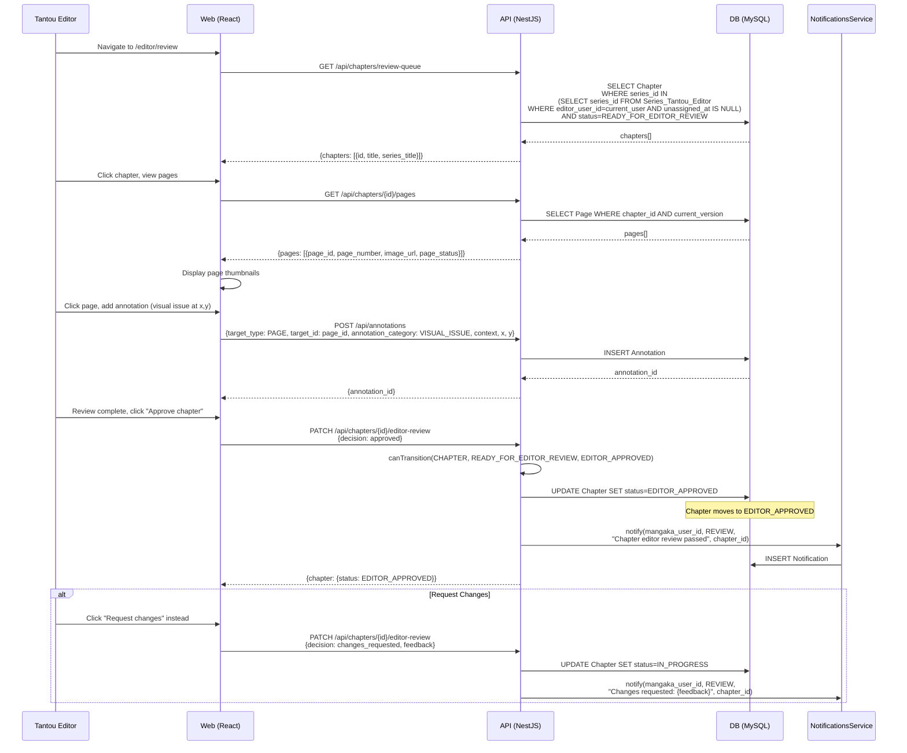
```mermaid
sequenceDiagram
    participant Editor as Tantou Editor
    participant Web as Web (React)
    participant API as API (NestJS)
    participant DB as DB (MySQL)
    participant Notif as NotificationsService

    Editor->>Web: Navigate to /editor/review
    Web->>API: GET /api/chapters/review-queue
    API->>DB: SELECT Chapter<br/>WHERE series_id IN<br/>(SELECT series_id FROM Series_Tantou_Editor<br/>WHERE editor_user_id=current_user AND unassigned_at IS NULL)<br/>AND status=READY_FOR_EDITOR_REVIEW
    DB-->>API: chapters[]
    API-->>Web: {chapters: [{id, title, series_title}]}
    
    Editor->>Web: Click chapter, view pages
    Web->>API: GET /api/chapters/{id}/pages
    API->>DB: SELECT Page WHERE chapter_id AND current_version
    DB-->>API: pages[]
    API-->>Web: {pages: [{page_id, page_number, image_url, page_status}]}
    Web->>Web: Display page thumbnails
    
    Editor->>Web: Click page, add annotation (visual issue at x,y)
    Web->>API: POST /api/annotations<br/>{target_type: PAGE, target_id: page_id, annotation_category: VISUAL_ISSUE, context, x, y}
    API->>DB: INSERT Annotation
    DB-->>API: annotation_id
    API-->>Web: {annotation_id}
    
    Editor->>Web: Review complete, click "Approve chapter"
    Web->>API: PATCH /api/chapters/{id}/editor-review<br/>{decision: approved}
    
    API->>API: canTransition(CHAPTER, READY_FOR_EDITOR_REVIEW, EDITOR_APPROVED)
    API->>DB: UPDATE Chapter SET status=EDITOR_APPROVED
    Note over DB: Chapter moves to EDITOR_APPROVED
    
    API->>Notif: notify(mangaka_user_id, REVIEW,<br/>"Chapter editor review passed", chapter_id)
    Notif->>DB: INSERT Notification
    
    API-->>Web: {chapter: {status: EDITOR_APPROVED}}
    
    alt Request Changes
        Editor->>Web: Click "Request changes" instead
        Web->>API: PATCH /api/chapters/{id}/editor-review<br/>{decision: changes_requested, feedback}
        API->>DB: UPDATE Chapter SET status=IN_PROGRESS
        API->>Notif: notify(mangaka_user_id, REVIEW,<br/>"Changes requested: {feedback}", chapter_id)
    end
```

## 9. Publish a Chapter

Mangaka (or Editor) transitions chapter EDITOR_APPROVED → PUBLISHED, auto-creating a Publication_Schedule.

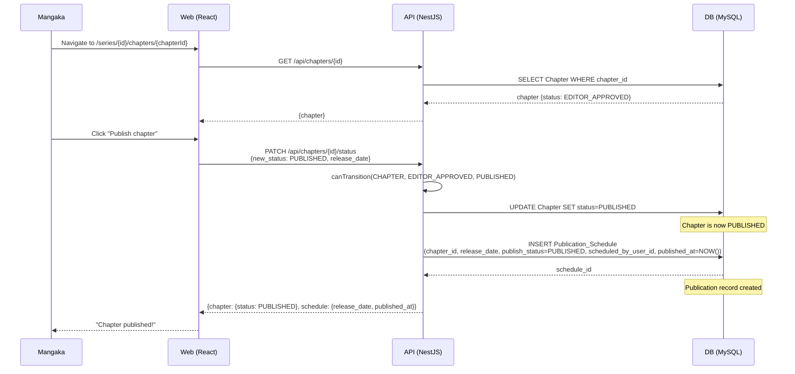
```mermaid
sequenceDiagram
    participant Mangaka
    participant Web as Web (React)
    participant API as API (NestJS)
    participant DB as DB (MySQL)

    Mangaka->>Web: Navigate to /series/{id}/chapters/{chapterId}
    Web->>API: GET /api/chapters/{id}
    API->>DB: SELECT Chapter WHERE chapter_id
    DB-->>API: chapter {status: EDITOR_APPROVED}
    API-->>Web: {chapter}
    
    Mangaka->>Web: Click "Publish chapter"
    Web->>API: PATCH /api/chapters/{id}/status<br/>{new_status: PUBLISHED, release_date}
    
    API->>API: canTransition(CHAPTER, EDITOR_APPROVED, PUBLISHED)
    API->>DB: UPDATE Chapter SET status=PUBLISHED
    Note over DB: Chapter is now PUBLISHED
    
    API->>DB: INSERT Publication_Schedule<br/>(chapter_id, release_date, publish_status=PUBLISHED, scheduled_by_user_id, published_at=NOW())
    DB-->>API: schedule_id
    Note over DB: Publication record created
    
    API-->>Web: {chapter: {status: PUBLISHED}, schedule: {release_date, published_at}}
    Web-->>Mangaka: "Chapter published!"
```

## 10. Voting & Risk Ranking

Editorial Board opens a vote period, casts votes, closes the period to compute rankings and flag at-risk series.

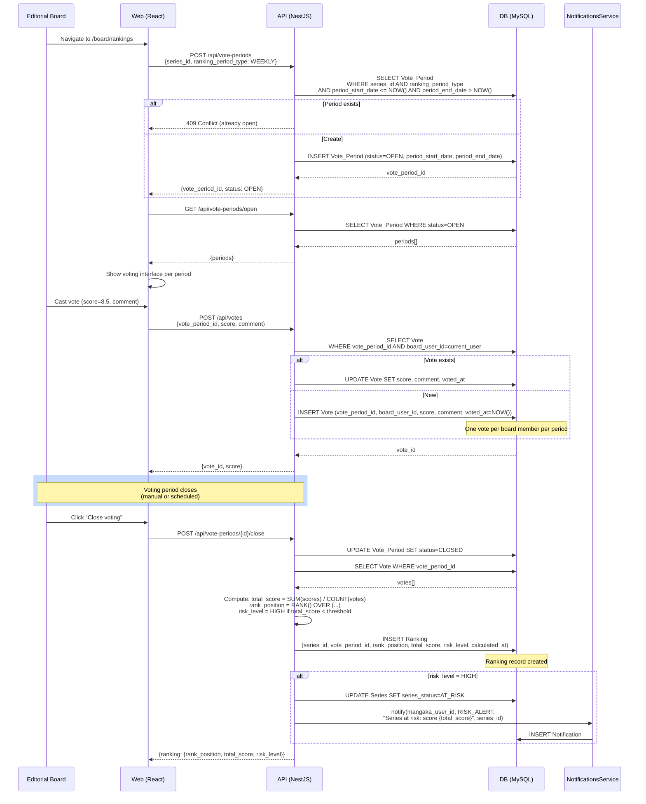
```mermaid
sequenceDiagram
    participant Board as Editorial Board
    participant Web as Web (React)
    participant API as API (NestJS)
    participant DB as DB (MySQL)
    participant Notif as NotificationsService

    Board->>Web: Navigate to /board/rankings
    Web->>API: POST /api/vote-periods<br/>{series_id, ranking_period_type: WEEKLY}
    
    API->>DB: SELECT Vote_Period<br/>WHERE series_id AND ranking_period_type<br/>AND period_start_date <= NOW() AND period_end_date > NOW()
    alt Period exists
        API-->>Web: 409 Conflict (already open)
    else Create
        API->>DB: INSERT Vote_Period (status=OPEN, period_start_date, period_end_date)
        DB-->>API: vote_period_id
        API-->>Web: {vote_period_id, status: OPEN}
    end
    
    Web->>API: GET /api/vote-periods/open
    API->>DB: SELECT Vote_Period WHERE status=OPEN
    DB-->>API: periods[]
    API-->>Web: {periods}
    Web->>Web: Show voting interface per period
    
    Board->>Web: Cast vote (score=8.5, comment)
    Web->>API: POST /api/votes<br/>{vote_period_id, score, comment}
    
    API->>DB: SELECT Vote<br/>WHERE vote_period_id AND board_user_id=current_user
    alt Vote exists
        API->>DB: UPDATE Vote SET score, comment, voted_at
    else New
        API->>DB: INSERT Vote (vote_period_id, board_user_id, score, comment, voted_at=NOW())
        Note over DB: One vote per board member per period
    end
    DB-->>API: vote_id
    API-->>Web: {vote_id, score}
    
    rect rgb(200, 220, 255)
        Note over Board,API: Voting period closes<br/>(manual or scheduled)
    end
    
    Board->>Web: Click "Close voting"
    Web->>API: POST /api/vote-periods/{id}/close
    
    API->>DB: UPDATE Vote_Period SET status=CLOSED
    
    API->>DB: SELECT Vote WHERE vote_period_id
    DB-->>API: votes[]
    API->>API: Compute: total_score = SUM(scores) / COUNT(votes)<br/>rank_position = RANK() OVER (...)<br/>risk_level = HIGH if total_score < threshold
    
    API->>DB: INSERT Ranking<br/>(series_id, vote_period_id, rank_position, total_score, risk_level, calculated_at)
    Note over DB: Ranking record created
    
    alt risk_level = HIGH
        API->>DB: UPDATE Series SET series_status=AT_RISK
        API->>Notif: notify(mangaka_user_id, RISK_ALERT,<br/>"Series at risk: score {total_score}", series_id)
        Notif->>DB: INSERT Notification
    end
    
    API-->>Web: {ranking: {rank_position, total_score, risk_level}}
```

## 11. Editorial Decision

Editorial Board applies a decision (CONTINUE, CANCEL, CHANGE_FREQUENCY, HIATUS) to a Series.

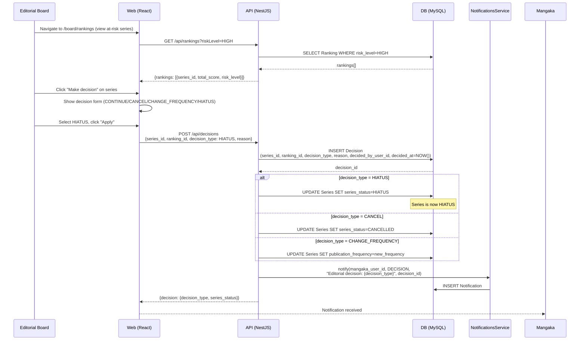
```mermaid
sequenceDiagram
    participant Board as Editorial Board
    participant Web as Web (React)
    participant API as API (NestJS)
    participant DB as DB (MySQL)
    participant Notif as NotificationsService

    Board->>Web: Navigate to /board/rankings (view at-risk series)
    Web->>API: GET /api/rankings?riskLevel=HIGH
    API->>DB: SELECT Ranking WHERE risk_level=HIGH
    DB-->>API: rankings[]
    API-->>Web: {rankings: [{series_id, total_score, risk_level}]}
    
    Board->>Web: Click "Make decision" on series
    Web->>Web: Show decision form (CONTINUE/CANCEL/CHANGE_FREQUENCY/HIATUS)
    
    Board->>Web: Select HIATUS, click "Apply"
    Web->>API: POST /api/decisions<br/>{series_id, ranking_id, decision_type: HIATUS, reason}
    
    API->>DB: INSERT Decision<br/>(series_id, ranking_id, decision_type, reason, decided_by_user_id, decided_at=NOW())
    DB-->>API: decision_id
    
    alt decision_type = HIATUS
        API->>DB: UPDATE Series SET series_status=HIATUS
        Note over DB: Series is now HIATUS
    else decision_type = CANCEL
        API->>DB: UPDATE Series SET series_status=CANCELLED
    else decision_type = CHANGE_FREQUENCY
        API->>DB: UPDATE Series SET publication_frequency=new_frequency
    end
    
    API->>Notif: notify(mangaka_user_id, DECISION,<br/>"Editorial decision: {decision_type}", decision_id)
    Notif->>DB: INSERT Notification
    
    API-->>Web: {decision: {decision_type, series_status}}
    Web-->>Mangaka: Notification received
```

## 12. Earnings & Dispute Lifecycle

Assistant views earnings, opens a dispute on an approved task, admin reviews and resolves with optional payment adjustment in transaction.

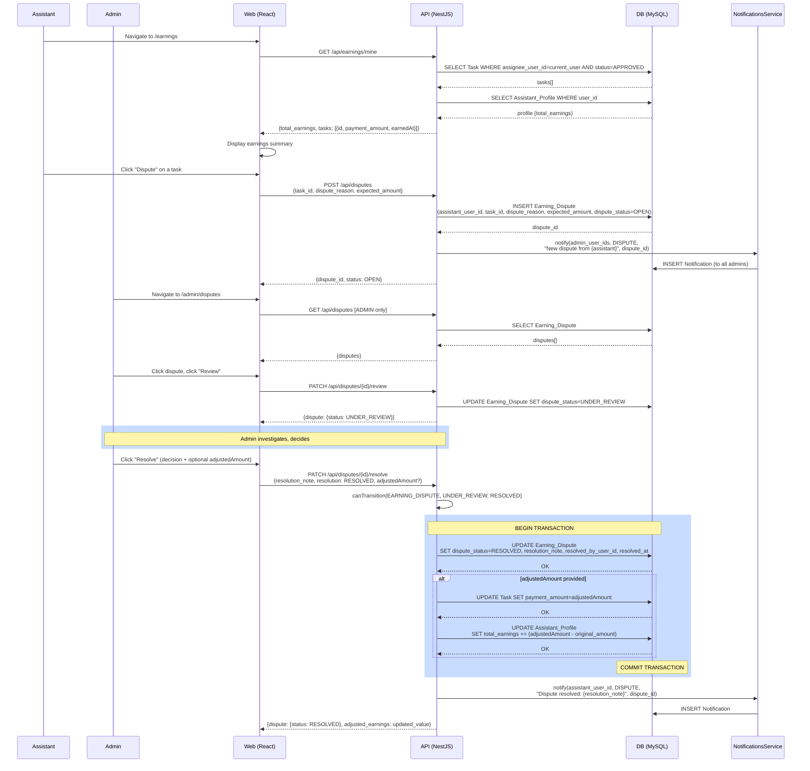
```mermaid
sequenceDiagram
    participant Assistant
    participant Admin
    participant Web as Web (React)
    participant API as API (NestJS)
    participant DB as DB (MySQL)
    participant Notif as NotificationsService

    Assistant->>Web: Navigate to /earnings
    Web->>API: GET /api/earnings/mine
    API->>DB: SELECT Task WHERE assignee_user_id=current_user AND status=APPROVED
    DB-->>API: tasks[]
    API->>DB: SELECT Assistant_Profile WHERE user_id
    DB-->>API: profile {total_earnings}
    API-->>Web: {total_earnings, tasks: [{id, payment_amount, earnedAt}]}
    Web->>Web: Display earnings summary
    
    Assistant->>Web: Click "Dispute" on a task
    Web->>API: POST /api/disputes<br/>{task_id, dispute_reason, expected_amount}
    
    API->>DB: INSERT Earning_Dispute<br/>(assistant_user_id, task_id, dispute_reason, expected_amount, dispute_status=OPEN)
    DB-->>API: dispute_id
    
    API->>Notif: notify(admin_user_ids, DISPUTE,<br/>"New dispute from {assistant}", dispute_id)
    Notif->>DB: INSERT Notification (to all admins)
    
    API-->>Web: {dispute_id, status: OPEN}
    
    Admin->>Web: Navigate to /admin/disputes
    Web->>API: GET /api/disputes [ADMIN only]
    API->>DB: SELECT Earning_Dispute
    DB-->>API: disputes[]
    API-->>Web: {disputes}
    
    Admin->>Web: Click dispute, click "Review"
    Web->>API: PATCH /api/disputes/{id}/review
    API->>DB: UPDATE Earning_Dispute SET dispute_status=UNDER_REVIEW
    API-->>Web: {dispute: {status: UNDER_REVIEW}}
    
    rect rgb(200, 220, 255)
        Note over Admin,API: Admin investigates, decides
    end
    
    Admin->>Web: Click "Resolve" (decision + optional adjustedAmount)
    Web->>API: PATCH /api/disputes/{id}/resolve<br/>{resolution_note, resolution: RESOLVED, adjustedAmount?}
    
    API->>API: canTransition(EARNING_DISPUTE, UNDER_REVIEW, RESOLVED)
    
    rect rgb(200, 220, 255)
        Note over API,DB: BEGIN TRANSACTION
        API->>DB: UPDATE Earning_Dispute<br/>SET dispute_status=RESOLVED, resolution_note, resolved_by_user_id, resolved_at
        DB-->>API: OK
        alt adjustedAmount provided
            API->>DB: UPDATE Task SET payment_amount=adjustedAmount
            DB-->>API: OK
            API->>DB: UPDATE Assistant_Profile<br/>SET total_earnings += (adjustedAmount - original_amount)
            DB-->>API: OK
        end
        Note over DB: COMMIT TRANSACTION
    end
    
    API->>Notif: notify(assistant_user_id, DISPUTE,<br/>"Dispute resolved: {resolution_note}", dispute_id)
    Notif->>DB: INSERT Notification
    
    API-->>Web: {dispute: {status: RESOLVED}, adjusted_earnings: updated_value}
```

## 13. On-Device AI Smart-Select in Studio

Assistant uses Studio's MobileSAM (Segment Anything) for intelligent region selection, with all inference running in-browser.

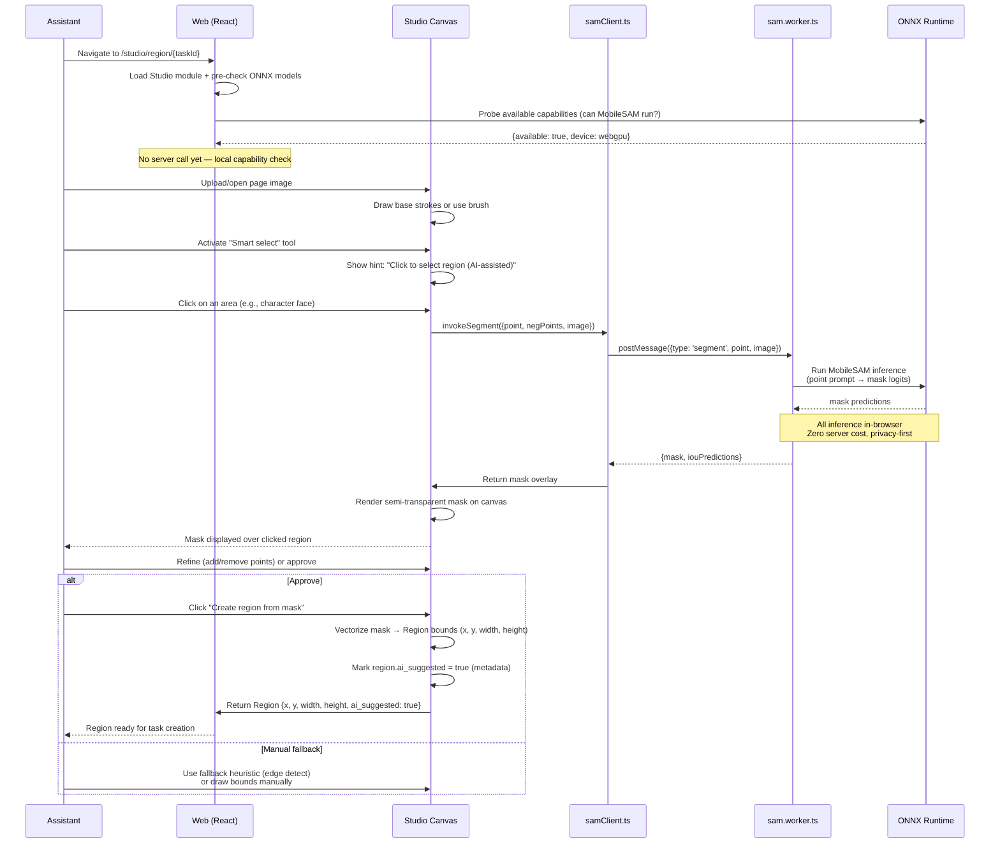
```mermaid
sequenceDiagram
    participant Assistant
    participant Web as Web (React)
    participant Canvas as Studio Canvas
    participant samClient as samClient.ts
    participant Worker as sam.worker.ts
    participant ONNX as ONNX Runtime

    Assistant->>Web: Navigate to /studio/region/{taskId}
    Web->>Web: Load Studio module + pre-check ONNX models
    
    Web->>ONNX: Probe available capabilities (can MobileSAM run?)
    ONNX-->>Web: {available: true, device: webgpu}
    Note over Web: No server call yet — local capability check
    
    Assistant->>Canvas: Upload/open page image
    Canvas->>Canvas: Draw base strokes or use brush
    
    Assistant->>Canvas: Activate "Smart select" tool
    Canvas->>Canvas: Show hint: "Click to select region (AI-assisted)"
    
    Assistant->>Canvas: Click on an area (e.g., character face)
    Canvas->>samClient: invokeSegment({point, negPoints, image})
    
    samClient->>Worker: postMessage({type: 'segment', point, image})
    
    Worker->>ONNX: Run MobileSAM inference<br/>(point prompt → mask logits)
    ONNX-->>Worker: mask predictions
    Note over Worker,ONNX: All inference in-browser<br/>Zero server cost, privacy-first
    
    Worker-->>samClient: {mask, iouPredictions}
    
    samClient->>Canvas: Return mask overlay
    Canvas->>Canvas: Render semi-transparent mask on canvas
    Canvas-->>Assistant: Mask displayed over clicked region
    
    Assistant->>Canvas: Refine (add/remove points) or approve
    
    alt Approve
        Assistant->>Canvas: Click "Create region from mask"
        Canvas->>Canvas: Vectorize mask → Region bounds (x, y, width, height)
        Canvas->>Canvas: Mark region.ai_suggested = true (metadata)
        Canvas->>Web: Return Region {x, y, width, height, ai_suggested: true}
        Web-->>Assistant: Region ready for task creation
    else Manual fallback
        Assistant->>Canvas: Use fallback heuristic (edge detect)<br/>or draw bounds manually
    end
```

---

## Cross-references

- Architecture & state machines: [`../02-architecture/03-domain-model-and-state-machines.md`](../02-architecture/03-domain-model-and-state-machines.md)
- API endpoint reference: [`../03-api/01-api-reference.md`](../03-api/01-api-reference.md)
- Database design: [`../02-architecture/02-database-design.md`](../02-architecture/02-database-design.md)
- Requirements & use cases: [`../01-overview/02-requirements-and-use-cases.md`](../01-overview/02-requirements-and-use-cases.md)
