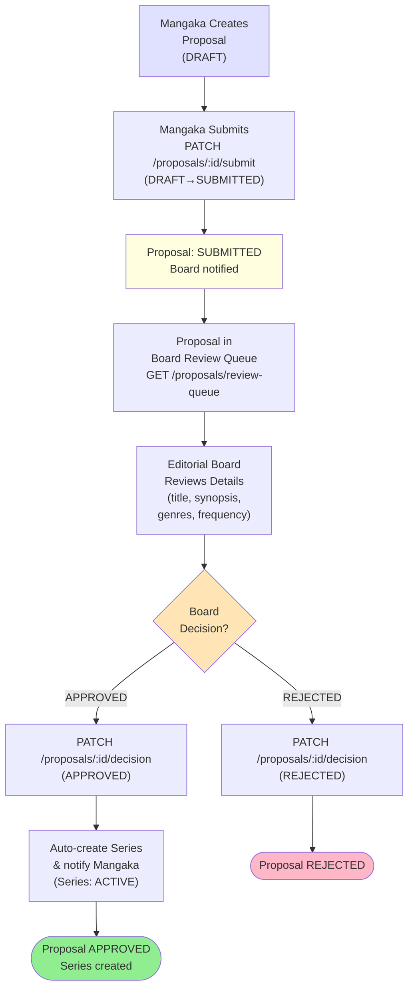
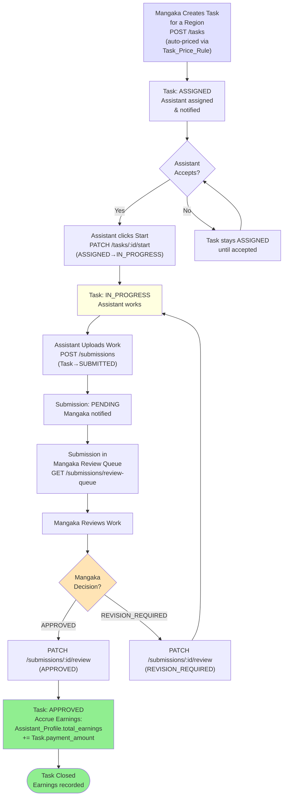
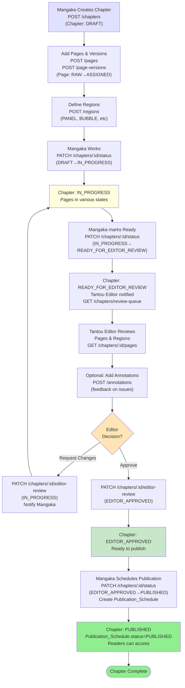
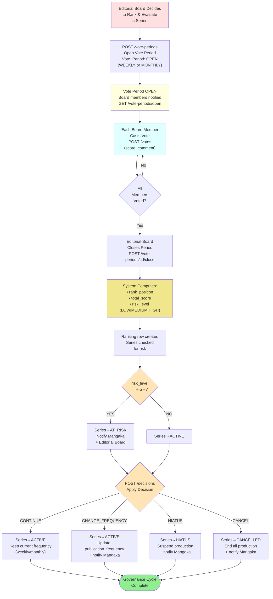
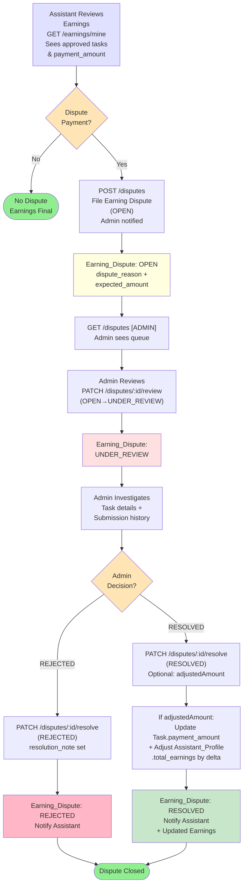

# Activity & Workflow Diagrams
High-level activity flows and swimlane workflows for the Manga Creation & Publishing platform.

---

## 1. End-to-End Production Pipeline

From proposal submission through board governance to published chapter and earnings dispute resolution, with role swimlanes.

```mermaid
flowchart TD
    Start([Mangaka Proposes Series]) --> CreateProp["Create Proposal<br/>(DRAFT)"]
    CreateProp --> SubmitProp["Submit to Board<br/>(SUBMITTED)"]
    SubmitProp --> BoardReview{Board<br/>Review<br/>Proposal}
    BoardReview -->|REJECTED| PropReject["Proposal REJECTED<br/>(End)"]
    BoardReview -->|APPROVED| CreateSeries["Create Series<br/>(ACTIVE)"]
    CreateSeries --> AssignEditor["Editorial Board<br/>Assigns Tantou Editor"]
    AssignEditor --> MangakaWork["Mangaka Creates<br/>Chapter & Pages"]
    MangakaWork --> DefineRegions["Define Regions<br/>(PANEL, BUBBLE, etc)"]
    DefineRegions --> CreateTasks["Create Tasks<br/>(ASSIGNED)<br/>Auto-priced by region_type"]
    CreateTasks --> AssignAssist["Assign to Assistants"]
    AssignAssist --> AssistWork["Assistants Work<br/>& Submit<br/>(SUBMITTED)"]
    AssistWork --> MangakaReview{Mangaka<br/>Reviews<br/>Submission}
    MangakaReview -->|REVISION_REQUIRED| AssistWork
    MangakaReview -->|APPROVED| AccrueEarning["Accrue Assistant<br/>total_earnings<br/>+= payment_amount"]
    AccrueEarning --> ChapterReady["Chapter→<br/>READY_FOR_EDITOR_REVIEW"]
    ChapterReady --> EditorReview{Tantou Editor<br/>Reviews Chapter<br/>& Pages}
    EditorReview -->|Request Changes| ChapterInProg["Chapter→<br/>IN_PROGRESS"]
    ChapterInProg --> MangakaWork
    EditorReview -->|APPROVED| ChapterApproved["Chapter→<br/>EDITOR_APPROVED"]
    ChapterApproved --> PublishSched["Schedule Publication<br/>(SCHEDULED)"]
    PublishSched --> Publish["Publish Chapter<br/>(PUBLISHED)"]
    Publish --> VotePeriodOpen["Editorial Board<br/>Opens Vote Period"]
    VotePeriodOpen --> CastVotes["Board Members<br/>Cast Votes<br/>(score per member)"]
    CastVotes --> CloseVote{Close Vote<br/>Period}
    CloseVote --> ComputeRank["Compute Ranking<br/>(rank_position,<br/>total_score,<br/>risk_level)"]
    ComputeRank --> CheckRisk{Risk Level<br/>= HIGH?}
    CheckRisk -->|YES| SetAtRisk["Series→AT_RISK<br/>(notify mangaka)"]
    CheckRisk -->|NO| SeriesOK["Series→ACTIVE"]
    SetAtRisk --> Decision
    SeriesOK --> Decision{Decision:<br/>CONTINUE|<br/>CANCEL|<br/>HIATUS|<br/>CHANGE_FREQ}
    Decision -->|CONTINUE| SeriesCont["Series→ACTIVE<br/>(continue schedule)"]
    Decision -->|CANCEL| SeriesCancl["Series→CANCELLED"]
    Decision -->|HIATUS| SeriesHiat["Series→HIATUS"]
    Decision -->|CHANGE_FREQ| UpdateFreq["Update<br/>publication_frequency<br/>& Series→ACTIVE"]
    SeriesCont --> EarningReview
    SeriesCancl --> EarningReview
    SeriesHiat --> EarningReview
    UpdateFreq --> EarningReview["Assistant Reviews<br/>Earnings<br/>& May File Dispute"]
    EarningReview --> DisputeCheck{Dispute?}
    DisputeCheck -->|NO| End1([Complete])
    DisputeCheck -->|YES| OpenDispute["Open Dispute<br/>(OPEN)"]
    OpenDispute --> AdminReview["Admin Reviews<br/>(UNDER_REVIEW)"]
    AdminReview --> ResolveDisp{Resolve:<br/>RESOLVED|<br/>REJECTED}
    ResolveDisp -->|RESOLVED| UpdatePayment["Optional: adjust<br/>payment_amount<br/>& earnings"]
    ResolveDisp -->|REJECTED| DispReject["Dispute REJECTED"]
    UpdatePayment --> End2([Complete])
    DispReject --> End2
    PropReject --> End3([End])

    style Start fill:#90EE90
    style End1 fill:#90EE90
    style End2 fill:#90EE90
    style End3 fill:#FFB6C6
    style BoardReview fill:#FFE4B5
    style MangakaReview fill:#FFE4B5
    style EditorReview fill:#FFE4B5
    style CloseVote fill:#FFE4B5
    style CheckRisk fill:#FFE4B5
    style Decision fill:#FFE4B5
    style DisputeCheck fill:#FFE4B5
    style ResolveDisp fill:#FFE4B5
```

**State machine source:** Proposal (§5), Chapter (§5), Task (§5), Submission (§5), Series status (§5), Vote_Period / Ranking / Decision (§5), Earning_Dispute (§5); endpoints (§6).

---

## 2. Proposal Approval Workflow

DRAFT → SUBMITTED → UNDER_REVIEW → (APPROVED creates Series | REJECTED ends).



**State machine source:** PROPOSAL transitions (§5); `/proposals/*` endpoints (§6).

---

## 3. Task Production Loop

ASSIGNED → IN_PROGRESS → SUBMITTED → Mangaka review → APPROVED (earnings) or REVISION_REQUIRED (loop back).



**State machine source:** TASK transitions (§5), SUBMISSION transitions (§5); `/tasks/*`, `/submissions/*` endpoints (§6).

---

## 4. Chapter Lifecycle to Publish

DRAFT → IN_PROGRESS → READY_FOR_EDITOR_REVIEW → EDITOR_APPROVED → PUBLISHED.



**State machine source:** CHAPTER transitions (§5); `/chapters/*` endpoints (§6).

---

## 5. Governance & Ranking Loop

Open Vote Period → Cast Votes → Close & Compute Ranking → Decision (CONTINUE | CHANGE_FREQUENCY | HIATUS | CANCEL) → Update Series status.



**State machine source:** PROPOSAL (vote_period.status OPEN→CLOSED), Ranking (risk_level assignment), Series (AT_RISK, HIATUS, CANCELLED transitions via Decision, §5); `/vote-periods/*`, `/votes`, `/rankings`, `/decisions` endpoints (§6).

---

## 6. Earning Dispute Resolution

OPEN → UNDER_REVIEW → (RESOLVED [optional amount adjustment] | REJECTED).



**State machine source:** EARNING_DISPUTE transitions (§5); `/disputes/*` endpoints (§6).

---

## Cross-Reference
- **Domain model & state machines:** [`../02-architecture/03-domain-model-and-state-machines.md`](../02-architecture/03-domain-model-and-state-machines.md)
- **Sequence diagrams:** [`./02-sequence-diagrams.md`](./02-sequence-diagrams.md)
