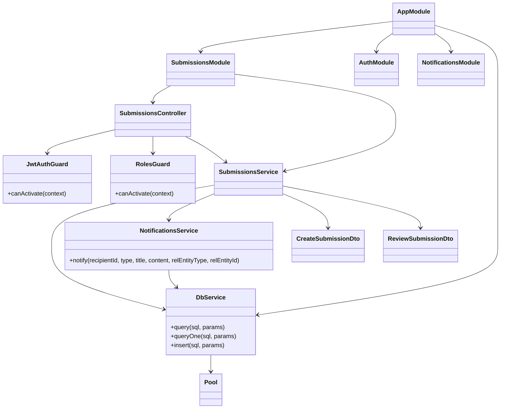
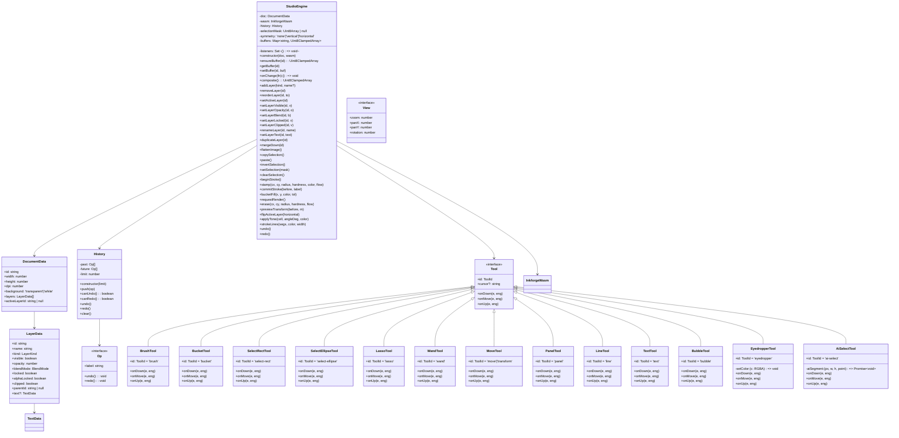

# Class & Structure Diagrams

Mermaid class diagrams for the Manga Studio platform. The API uses raw SQL (no ORM entity classes), so backend diagrams model the NestJS module/service layering and DTOs. The browser Studio has a genuine OO class hierarchy with proper composition.

## 1. Backend Layering (NestJS)



All ~20 feature modules follow this shape: Controller (HTTP layer) → Service (business logic) → DbService (raw SQL queries) + optional cross-cutting services (NotificationsService, etc.). Guards are applied globally or per-endpoint via decorators. DTOs validate and transform incoming payloads via `class-validator` and `class-transformer`.

## 2. Shared Types & State Machines

```mermaid
classDiagram
  class Role <<enumeration>> {
    MANGAKA
    ASSISTANT
    TANTOU_EDITOR
    EDITORIAL_BOARD
    ADMIN
  }
  
  class ProposalStatus <<enumeration>> {
    DRAFT
    SUBMITTED
    UNDER_REVIEW
    APPROVED
    REJECTED
  }
  
  class SeriesStatus <<enumeration>> {
    ACTIVE
    AT_RISK
    HIATUS
    CANCELLED
    COMPLETED
  }
  
  class ChapterStatus <<enumeration>> {
    DRAFT
    IN_PROGRESS
    READY_FOR_EDITOR_REVIEW
    EDITOR_APPROVED
    PUBLISHED
  }
  
  class PageStatus <<enumeration>> {
    RAW
    ASSIGNED
    IN_PROGRESS
    REVIEWING
    COMPLETED
  }
  
  class TaskStatus <<enumeration>> {
    ASSIGNED
    IN_PROGRESS
    SUBMITTED
    REVISION_REQUIRED
    APPROVED
  }
  
  class SubmissionStatus <<enumeration>> {
    PENDING
    UNDER_REVIEW
    REVISION_REQUIRED
    APPROVED
    REJECTED
  }
  
  class RegionType <<enumeration>> {
    PANEL
    BACKGROUND
    CHARACTER
    DIALOGUE_BUBBLE
    EFFECT
  }
  
  class VotePeriodStatus <<enumeration>> {
    OPEN
    CLOSED
  }
  
  class RiskLevel <<enumeration>> {
    LOW
    MEDIUM
    HIGH
  }
  
  class DecisionType <<enumeration>> {
    CONTINUE
    CANCEL
    CHANGE_FREQUENCY
    HIATUS
  }
  
  class EarningDisputeStatus <<enumeration>> {
    OPEN
    UNDER_REVIEW
    RESOLVED
    REJECTED
  }
  
  class AnnotationTargetType <<enumeration>> {
    PAGE
    MANUSCRIPT
    SUBMISSION
  }
  
  class AnnotationCategory <<enumeration>> {
    CONTENT_ISSUE
    DIALOGUE_ISSUE
    SCRIPT_ISSUE
    VISUAL_ISSUE
    GENERAL
  }
  
  class NotificationType <<enumeration>> {
    DEADLINE
    TASK_ASSIGNMENT
    SUBMISSION
    REVISION
    REVIEW
    PROPOSAL_DECISION
    RISK_ALERT
    DECISION
    DISPUTE
    GENERAL
  }
  
  class Transitions <<module>> {
    +PROPOSAL_TRANSITIONS: Record~ProposalStatus, ProposalStatus[]~
    +CHAPTER_TRANSITIONS: Record~ChapterStatus, ChapterStatus[]~
    +PAGE_TRANSITIONS: Record~PageStatus, PageStatus[]~
    +TASK_TRANSITIONS: Record~TaskStatus, TaskStatus[]~
    +SUBMISSION_TRANSITIONS: Record~SubmissionStatus, SubmissionStatus[]~
    +EARNING_DISPUTE_TRANSITIONS: Record~EarningDisputeStatus, EarningDisputeStatus[]~
    +canTransition(map, from, to): boolean
  }
```



State transitions are enforced at the service layer via `canTransition()` and transition maps stored in `packages/shared/src/enums/transitions.ts`. Series status (ACTIVE ↔ AT_RISK, then → HIATUS/CANCELLED/COMPLETED) and Vote_Period status (OPEN → CLOSED) are managed directly in services. Publication status transitions (SCHEDULED → PUBLISHED/CANCELLED) are handled by the publication module.

## 3. Frontend Studio Engine



The `StudioEngine` orchestrates the canvas state (document, layers, history). `DocumentData` is immutable; mutations return new versions. `History` implements undo/redo via a stack of `Op` operations. `LayerData` describes raster or vector properties (visibility, opacity, blend mode, clipping). The `Tool` interface abstracts pointer input; concrete tools (BrushTool, SelectRectTool, etc.) implement behavior. View transformations (zoom, pan, rotation) are handled separately in utility functions (`screenToDoc`, `docToScreen`).

## 4. Frontend AI Assist Layer

```mermaid
classDiagram
  class AIAssist <<interface>> {
    +detectPanels(composite, w, h): Promise~RectN[]~
    +segment(composite, w, h, point): Promise~Uint8Array~
    +colorize(engine): Promise~void~
  }
  
  class OnnxAI {
    -fallback: HeuristicAI
    -panelSession: InferenceSession | null
    +constructor()
    -panels(): Promise~InferenceSession~
    +detectPanels(px, w, h): Promise~RectN[]~
    +segment(px, w, h, point): Promise~Uint8Array~
    +colorize(engine): Promise~void~
  }
  
  class HeuristicAI {
    +detectPanels(composite, w, h): Promise~RectN[]~
    +segment(composite, w, h, point): Promise~Uint8Array~
    +colorize(engine): Promise~void~
  }
  
  class OnnxRuntime <<module>> {
    +createSession(modelPath): Promise~InferenceSession~
    +ort: ONNX Runtime
  }
  
  class SamClient <<module>> {
    +segment(px, w, h, point): Promise~{mask, lw, lh, sw, sh}~
  }
  
  class ColorizeClient <<module>> {
    +colorize(composite, w, h): Promise~Uint8ClampedArray~
  }
  
  class Models <<module>> {
    +MODELS: {panels: string, sam: string, colorize: string}
  }
  
  AIAssist <|-- OnnxAI
  AIAssist <|-- HeuristicAI
  OnnxAI --> HeuristicAI
  OnnxAI --> OnnxRuntime
  OnnxAI --> SamClient
  OnnxAI --> ColorizeClient
  OnnxAI --> Models
```

`OnnxAI` implements the `AIAssist` interface, delegating to on-device ONNX Runtime (lazy-loaded workers for panel detection, SAM selection, and colorization). If model loading or inference fails, it silently falls back to `HeuristicAI` (rule-based heuristics). Region detection can set `Region.ai_suggested=true` when AI succeeds. All inference runs in the browser; no server cost.

## 5. Frontend App & Service Layer

```mermaid
classDiagram
  class AuthProvider {
    -user: AuthUser | null
    -loading: boolean
    +login(email, password): Promise~void~
    +loginWithToken(token): Promise~void~
    +logout(): void
    +fetchMe(): Promise~void~
  }
  
  class AuthUser {
    +id: number
    +email: string
    +name: string
    +role: Role
    +avatarUrl: string | null
  }
  
  class ApiClient <<module>> {
    +api: AxiosInstance
    +getToken(): string | null
    +setToken(t): void
    +clearToken(): void
    +googleLoginUrl: string
  }
  
  class AxiosInstance {
    +interceptors: {request, response}
    +get(path, config?)
    +post(path, data, config?)
    +patch(path, data, config?)
    +delete(path, config?)
  }
  
  class AppShell {
    -data-role: Role
    +render(): React.ReactNode
  }
  
  class Dashboard {
    +render(): React.ReactNode
  }
  
  class ProposalPage {
    +render(): React.ReactNode
  }
  
  class SeriesPage {
    +render(): React.ReactNode
  }
  
  class ReviewPage {
    +render(): React.ReactNode
  }
  
  class BoardProposalPage {
    +render(): React.ReactNode
  }
  
  class BoardSeriesPage {
    +render(): React.ReactNode
  }
  
  class BoardRankingsPage {
    +render(): React.ReactNode
  }
  
  class TaskPage {
    +render(): React.ReactNode
  }
  
  class EarningsPage {
    +render(): React.ReactNode
  }
  
  class EditorReviewPage {
    +render(): React.ReactNode
  }
  
  class AdminPage {
    +render(): React.ReactNode
  }
  
  class DisputePage {
    +render(): React.ReactNode
  }
  
  class StudioPage {
    +render(): React.ReactNode
  }
  
  AuthProvider --> AuthUser
  AuthProvider --> ApiClient
  ApiClient --> AxiosInstance
  AppShell --> Dashboard
  AppShell --> ProposalPage
  AppShell --> SeriesPage
  AppShell --> ReviewPage
  AppShell --> BoardProposalPage
  AppShell --> BoardSeriesPage
  AppShell --> BoardRankingsPage
  AppShell --> TaskPage
  AppShell --> EarningsPage
  AppShell --> EditorReviewPage
  AppShell --> AdminPage
  AppShell --> DisputePage
  AppShell --> StudioPage
```

`AuthProvider` (React Context) manages login state and token lifecycle. `api` (axios instance) automatically injects `Authorization: Bearer {token}` headers and handles 401 responses by clearing the session and redirecting to login. `AppShell` wraps protected routes, sets the `data-role` CSS token (enabling role-themed skins), and renders the navigation bar. Each page component (grouped by role: mangaka, assistant, editor, board, admin, studio) queries the API and renders role-specific UI.

---

**Cross-reference:** See [../02-architecture/01-system-architecture.md](../02-architecture/01-system-architecture.md) for system overview, data flow, and API routes.
