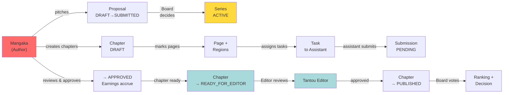

# Role Guide — Mangaka (漫画家 / Series Author)

**Mission:** Own series creative direction from proposal through production—pitch ideas, guide creation, assign priced tasks to assistants, review submissions, and advance chapters toward publication.

---

## Table of Contents

1. [Mission & Ownership](#1-mission--ownership)
2. [Where the Mangaka Fits](#2-where-the-mangaka-fits)
3. [Navigation & Screens](#3-navigation--screens)
4. [Capabilities & Endpoints](#4-capabilities--endpoints)
5. [Key Workflows](#5-key-workflows)
6. [Statuses the Mangaka Drives](#6-statuses-the-mangaka-drives)
7. [Notifications](#7-notifications)
8. [Permissions & Constraints](#8-permissions--constraints)
9. [Cross-Links](#9-cross-links)

---

## 1. Mission & Ownership

The **Mangaka** is the series author and creative lead. The role owns:

- **Series Proposals**: Pitch new series ideas to the Editorial Board, each with title, synopsis, frequency (weekly/monthly), and genre tags. Proposals move from DRAFT → SUBMITTED → UNDER_REVIEW → APPROVED or REJECTED.
- **Production Control**: Once a proposal is approved, the mangaka creates a Series and manages its lifecycle—deciding when chapters enter production, setting deadlines, and advancing chapters through review stages.
- **Team Leadership**: Assign specific panel/background/dialogue tasks to assistants at priced rates. Tasks are auto-priced based on region type and active pricing rules.
- **Quality Gate**: Review assistant submissions (art, backgrounds, effects, dialogue bubbles), approve them (assistant earns payment), or request revisions.
- **Publishing Pipeline**: Move chapters from draft → in-progress → ready for editor review, then await the Tantou Editor's sign-off before advancing to publication.

---

## 2. Where the Mangaka Fits

---

## 3. Navigation & Screens

| Nav Label (VN) | Route | Page File | Purpose |
|---|---|---|---|
| Tổng quan | `/` | `Dashboard.tsx` | Role-aware summary: active series, chapters in progress, pending review submissions, assigned tasks, notifications, at-risk series. |
| Đề xuất | `/proposals` | `Proposals.tsx` | Create new proposals (title, synopsis, frequency, genres); view your proposals; submit DRAFT → SUBMITTED for board review. |
| Series | `/series` | `SeriesList.tsx` | View all your active series (title, status, frequency, chapter count, genres); click to enter series detail. |
| — | `/series/:id` | `SeriesDetail.tsx` | Manage a single series: view metadata, create new chapters with title and deadline. Click a chapter to edit. |
| — | `/series/:seriesId/chapters/:chapterId` | `ChapterWorkspace.tsx` | Production workspace: upload page images, draw regions (panel/background/character/dialogue/effect), assign priced tasks to assistants. |
| Chờ duyệt | `/review` | `ReviewQueue.tsx` | Submissions from assistants: review each submission with file preview, approve (assistant earns), or request revision with feedback. |

---

## 4. Capabilities & Endpoints

| Capability | Method + Path | Notes |
|---|---|---|
| **Proposal Management** |
| Create proposal draft | POST `/api/proposals` | JSON: `{title, synopsis?, proposedFrequency: WEEKLY\|MONTHLY, genreIds[]}`. Returns new Proposal (DRAFT status). |
| View my proposals | GET `/api/proposals/mine` | List of all proposals you created (any status). |
| Submit proposal for board review | PATCH `/api/proposals/:id/submit` | Transition DRAFT → SUBMITTED; board receives notification. |
| **Series Ownership** |
| View my series | GET `/api/series/mine` | List of active Series you author (created when board approved your proposal). |
| Get series detail | GET `/api/series/:id` | Series metadata: title, status (ACTIVE/AT_RISK/HIATUS/CANCELLED/COMPLETED), frequency, chapter count, genres, assigned Tantou Editor (if any). |
| **Chapter Management** |
| Create chapter | POST `/api/chapters` | JSON: `{seriesId, title, deadline?}`. Creates chapter with status DRAFT, auto-incremented chapter_number. |
| Get chapters for series | GET `/api/chapters?seriesId=X` | List chapters in a series (any status). |
| Update chapter status | PATCH `/api/chapters/:id/status` | JSON: `{status: DRAFT\|IN_PROGRESS\|READY_FOR_EDITOR_REVIEW}`. Transitions chapter via state machine. PUBLISHED only after editor approves. |
| **Page & Region Markup** |
| Upload page image | POST `/api/pages` | JSON: `{chapterId, imageUrl}`. Creates Page (RAW status), auto-numbered. Returns page with page_id. |
| Get pages for chapter | GET `/api/pages?chapterId=X` | List pages in a chapter with their status and version count. |
| Create region on page | POST `/api/regions` | JSON: `{pageId, pageVersionId, regionType: PANEL\|BACKGROUND\|CHARACTER\|DIALOGUE_BUBBLE\|EFFECT, x, y, width, height, zIndex, aiSuggested?}`. Auto-associates with active page version. |
| Get regions for page | GET `/api/regions?pageId=X` | List all regions on a page. |
| Delete region | DELETE `/api/regions/:id` | Remove a region markup. |
| **Task Assignment & Pricing** |
| Create task for region | POST `/api/tasks` | JSON: `{regionId, pageId, assigneeUserId, taskDescription?, instruction?, deadline?}`. Payment amount auto-set by active Task_Price_Rule for the region_type. Task status = ASSIGNED. |
| Get tasks for page | GET `/api/tasks?pageId=X` | List tasks on a page (any status). |
| Get available assistants | GET `/api/users/assistants` | List all ASSISTANT users by id, name, avatar, salary_rate, skill_set. Use for assignee picker. |
| **Submission Review** |
| Get submission review queue | GET `/api/submissions/review-queue` | List all PENDING or UNDER_REVIEW submissions from tasks you created. Shows assistant name, task desc, file URL, submitted date. |
| Approve submission | PATCH `/api/submissions/:id/review` | JSON: `{decision: APPROVED}`. Adds Task.payment_amount to Assistant_Profile.total_earnings; removes from queue. |
| Request revision | PATCH `/api/submissions/:id/review` | JSON: `{decision: REVISION_REQUIRED, feedback: "..."}`. Task loops back to ASSIGNED; assistant notified. Submission stays in queue. |
| **Support Endpoints** |
| Get genres | GET `/api/genres` | List all genre names (immutable catalog). |
| Upload file | POST `/api/uploads` | Multipart `file`. Returns `{url, originalName}`. Served at `/uploads/{filename}`. |
| Get dashboard summary | GET `/api/dashboard/summary` | `{activeSeries, chaptersInProgress, pendingReview, openTasks, atRiskSeries}`. |
| Get dashboard series | GET `/api/dashboard/series` | List series with rank, status, frequency, published vs. total chapters, score, risk level. |
| Get dashboard tasks | GET `/api/dashboard/tasks` | List open tasks assigned by you (description, assignee, series, page, payment, deadline, status). |
| Get dashboard submissions | GET `/api/dashboard/submissions` | List pending submissions (task, assistant, submitted date). |
| Get notifications | GET `/api/notifications` | Notifications sent to you (proposal decision, submission ready, editor review result). |

---

## 5. Key Workflows

### Workflow A: Pitch & Approve a New Series

1. **Draft Proposal**: Navigate to Đề xuất (/proposals); fill form with title, synopsis, frequency, and genre tags; click "Tạo đề xuất" (Create).
2. **Submit for Board Review**: Proposal appears in your list as DRAFT. Click "Gửi duyệt" (Submit for review); proposal transitions to SUBMITTED.
3. **Await Board Decision**: Editorial Board reviews in `/board/proposals`; they APPROVE or REJECT your proposal.
4. **On Approval**: Board's approval auto-creates a Series (from your Proposal); mangaka receives PROPOSAL_DECISION notification.
5. **Start Production**: Navigate to Series (/series); click your new series to enter SeriesDetail; create chapters and begin assigning work.

**Related diagrams:** See [Sequence: Proposal Workflow](../04-diagrams/02-sequence-diagrams.md#proposal-to-series-creation); [Activity: Series Lifecycle](../04-diagrams/03-activity-and-workflow-diagrams.md#series-proposal-to-publication).

---

### Workflow B: Set Up a Chapter for Production

1. **Create Chapter**: In SeriesDetail (/series/:id), fill "Chương mới" form with chapter title and optional deadline; click "Tạo chương" (Create chapter). Chapter appears in list (DRAFT status).
2. **Upload Page Images**: Enter ChapterWorkspace (/series/:seriesId/chapters/:chapterId); use left panel "Tải trang" (Upload page) to upload page images. Each becomes a Page (RAW status), auto-numbered.
3. **Mark Regions**: Click a page in the canvas to open it. Use PageCanvas UI to draw regions (panels, backgrounds, characters, dialogue bubbles, effects). Click a region to open TaskAssignDialog.
4. **Create & Assign Tasks**: TaskAssignDialog shows region type (auto-looks up pricing rule). Enter task description, select assignee assistant, set optional deadline. Click "Giao việc" (Assign). Task is created (ASSIGNED status), payment_amount auto-set, assistant receives TASK_ASSIGNMENT notification.
5. **Mark Chapter In Progress**: Return to SeriesDetail; chapter list shows a "Bắt đầu vẽ" (Start drawing) button. Click to transition chapter to IN_PROGRESS.
6. **Iterate**: As assistants work and submit, their work appears in your Chờ duyệt (/review) queue.

**Related diagrams:** See [Sequence: Task Assignment & Submission](../04-diagrams/02-sequence-diagrams.md#task-creation-and-assistant-submission); [Activity: Chapter Production](../04-diagrams/03-activity-and-workflow-diagrams.md#chapter-production-assembly).

---

### Workflow C: Review Assistant Submissions

1. **Inspect Queue**: Navigate to Chờ duyệt (/review). List shows pending submissions: assistant avatar/name, task description, file preview (image or download link), submitted date.
2. **Review Work**: Examine the submitted file (image preview or linked document). Check quality against task instructions.
3. **Approve**: Click "Duyệt" (Approve). Submission status → APPROVED; Task.payment_amount is added to Assistant_Profile.total_earnings; submission removed from queue; assistant receives SUBMISSION notification.
4. **Request Revision**: Click "Yêu cầu sửa" (Request revision); a feedback textarea appears. Enter critique/instructions; click "Gửi yêu cầu" (Send request). Submission status → REVISION_REQUIRED; Task loops back to ASSIGNED; assistant re-works and resubmits; submission stays in queue until approved or rejected.
5. **Close Loop**: Once approved, payment is final (disputes handled by admin later if needed).

**Related diagrams:** See [Sequence: Submission Review](../04-diagrams/02-sequence-diagrams.md#submission-review-and-approval).

---

### Workflow D: Advance Chapter to Editor Review & Publish

1. **Collect Submissions**: Work through submission queue (Workflow C) until all tasks for the chapter are approved.
2. **Mark Chapter Ready**: In SeriesDetail (/series/:id), chapter shows "Gửi duyệt biên tập" (Submit for editor review) button. Click to transition chapter from IN_PROGRESS → READY_FOR_EDITOR_REVIEW.
3. **Tantou Editor Reviews**: Assigned editor (Tantou_Editor) sees chapter in `/editor/review` queue. Editor reviews all pages, leaves annotations, and either approves or requests changes.
4. **Handle Editor Feedback**: If editor requests changes, chapter transitions back to IN_PROGRESS; you may reassign tasks or revise pages. Re-submit when ready.
5. **Publish**: When editor approves, chapter → EDITOR_APPROVED. You then click "Xuất bản" (Publish) in SeriesDetail; chapter transitions to PUBLISHED; a Publication_Schedule record is created; chapter is now live to readers.

**Related diagrams:** See [Sequence: Editor Review to Publication](../04-diagrams/02-sequence-diagrams.md#editor-chapter-review-and-publication).

---

## 6. Statuses the Mangaka Drives

### Proposal Status

| Status | Meaning | Mangaka Action | Next Steps |
|---|---|---|---|
| DRAFT | Initial creation; not yet submitted. | Click "Gửi duyệt" to submit. | → SUBMITTED (board receives notification). |
| SUBMITTED | Awaiting board review. | Wait for board decision. | Board approves → APPROVED (auto-creates Series) or rejects → REJECTED. |
| UNDER_REVIEW | Board is evaluating. | Await decision. | → APPROVED or REJECTED (mangaka receives notification). |
| APPROVED | Board approved; Series created. | Series is now ACTIVE; start production. | Series is immutable; create chapters in the Series. |
| REJECTED | Board declined the proposal. | Proposal is archived. | Can create new proposals. |

### Chapter Status

| Status | Meaning | Mangaka Action | Next Steps |
|---|---|---|---|
| DRAFT | Chapter created; no work assigned yet. | Upload pages, mark regions, create tasks. | Click "Bắt đầu vẽ" → IN_PROGRESS. |
| IN_PROGRESS | Pages and tasks assigned; assistants working. | Review submissions in Chờ duyệt; approve/revise. | Once all tasks approved, click "Gửi duyệt biên tập" → READY_FOR_EDITOR_REVIEW. |
| READY_FOR_EDITOR_REVIEW | Awaiting Tantou Editor approval. | Review annotations if editor requests changes. | Editor approves → EDITOR_APPROVED; editor requests changes → IN_PROGRESS (loop). |
| EDITOR_APPROVED | Editor approved; ready to publish. | Click "Xuất bản" → PUBLISHED. | → PUBLISHED. |
| PUBLISHED | Live to readers; immutable. | Archived; production cycle complete. | Move to next chapter. |

### Task & Submission Statuses (Mangaka View)

| Entity | Status | Meaning | Mangaka View |
|---|---|---|---|
| Task | ASSIGNED | Created; awaiting assistant to start. | Task in your tasks list; waiting for submission. |
| Task | IN_PROGRESS | Assistant has started. | Task marked in-progress; waiting for submission. |
| Task | SUBMITTED | Assistant submitted work. | Submission appears in Chờ duyệt (/review) queue. |
| Submission | PENDING | Submitted; awaiting mangaka review. | In queue; you approve or request revision. |
| Submission | UNDER_REVIEW | Awaiting approval decision. | Briefly displayed; moving to approval. |
| Submission | APPROVED | Mangaka approved; payment accrued. | Removed from queue; assistant earns payment. |
| Submission | REVISION_REQUIRED | Mangaka requested changes. | Resubmitted by assistant; re-enters queue. |

---

## 7. Notifications

The Mangaka **receives** the following notification types:

| Type | Trigger | Example |
|---|---|---|
| PROPOSAL_DECISION | Board approves or rejects your proposal. | "Your proposal 'Hero Academy' was approved!" / "Your proposal was rejected." |
| SUBMISSION | Assistant submits work for a task. | "Taro submitted art for Panel 1, Page 3." |
| REVISION | Assistant resubmits after you requested revision. | "Taro resubmitted corrected art." |
| REVIEW | Editor approves or requests changes on chapter. | "Chapter 1 approved by Editor." / "Editor requests revisions on Chapter 1." |
| GENERAL | System announcements. | "Your series now at risk due to low ranking." |

The Mangaka **sends** (triggers):

| Type | Recipient | Trigger |
|---|---|---|
| TASK_ASSIGNMENT | Assistant | You create a task and assign it. |
| REVISION | Assistant | You request revision on their submission. |
| REVIEW | Self (notification archive) | You approve/revise a submission. |

---

## 8. Permissions & Constraints

### Allowed

- ✓ Create, view, and submit proposals (DRAFT → SUBMITTED).
- ✓ View and manage your own Series (one per approved proposal).
- ✓ Create chapters with title and deadline.
- ✓ Upload pages and mark regions (panels, backgrounds, characters, bubbles, effects).
- ✓ Create tasks for any region, assign to any ASSISTANT, set instruction and deadline.
- ✓ Auto-priced tasks: payment_amount is set from Task_Price_Rule by region_type at creation time.
- ✓ Advance chapter status: DRAFT → IN_PROGRESS → READY_FOR_EDITOR_REVIEW → PUBLISHED (after editor approval).
- ✓ Review assistant submissions: approve (payment accrues) or request revision.
- ✓ Update page versions (via Studio in-browser drawing, stored as Page_Version).
- ✓ View annotations from Tantou Editor on your chapters.

### Forbidden

- ✗ Cannot approve your own proposal (board votes; conflict of interest).
- ✗ Cannot review chapters as editor (that's the Tantou_Editor role).
- ✗ Cannot vote or make editorial decisions (Editorial_Board only).
- ✗ Cannot approve other mangaka's proposals.
- ✗ Cannot assign tasks for other mangaka's chapters.
- ✗ Cannot create admin accounts or change user roles (Admin only).
- ✗ Cannot access assistant earning disputes (Admin only).

### Data-Level Authorization

The system enforces **ownership checks** at the API layer:

- **GET /api/proposals/mine**: Returns only your proposals.
- **GET /api/series/mine**: Returns only your series.
- **POST /api/chapters**: You can only create chapters for series you own.
- **POST /api/tasks**: You can only create tasks for pages in your series/chapters.

See [Security & RBAC](../02-architecture/04-security-and-rbac.md) for detailed permission matrix.

---

## 9. Cross-Links

- **[API Reference](../03-api/01-api-reference.md)** — Detailed endpoint specs, request/response bodies, status codes.
- **[Database Schema](../02-architecture/02-database-design.md)** — Table definitions: Series, Chapter, Page, Region, Task, Submission, Proposal.
- **[State Machines](../02-architecture/03-domain-model-and-state-machines.md)** — Proposal, Chapter, Task, Submission status transitions.
- **[Sequence Diagrams](../04-diagrams/02-sequence-diagrams.md)** — Proposal → Series, Task Assignment, Submission Review, Editor Review.
- **[Activity Diagrams](../04-diagrams/03-activity-and-workflow-diagrams.md)** — Series Proposal, Chapter Production, Publishing Pipeline.
- **[Security & RBAC](../02-architecture/04-security-and-rbac.md)** — Role-based access control, permission matrix, data ownership.
