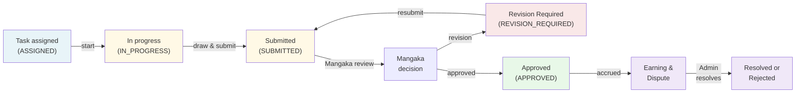

# Role Guide — Assistant (アシスタント / Production Artist)

The Assistant executes assigned production tasks—drawing backgrounds, characters, effects, panels, dialogue bubbles, and other region work—in the in-browser Studio using both traditional tools and optional on-device AI assists. Assistants submit finished work, track earnings accrued from approved submissions, and may dispute earning amounts when payment appears incorrect.

## Mission & ownership

An Assistant's work is priced per region type (panel, background, character, effect, dialogue bubble) and assigned by a Mangaka. The Assistant:

- **Draws** the assigned region in the Studio (in-browser raster editor with optional AI-assisted panel detection, smart selection, and colorization)
- **Submits** work via file upload when ready for Mangaka review
- **Iterates** on revision requests from the Mangaka's review feedback
- **Earns** a fixed payment amount (auto-priced by region type) when the Mangaka approves the submission
- **Tracks** total earnings across all approved tasks
- **Disputes** an earning when the payment amount seems incorrect, with optional adjustment amount proposal

Assistants cannot self-approve; only the Mangaka reviews submissions, and only the Admin resolves disputes.

---

## Where the Assistant fits



The Assistant's workflow is primarily the middle-right arc: **start task** → **work in Studio** → **submit** → **await Mangaka approval**. The right side (**earnings & dispute**) activates only after approval.

---

## Navigation & screens

### Web routes (from `nav.ts`)

| Screen | Route | Description |
|--------|-------|-------------|
| **Tổng quan** (Dashboard) | `/` | Role-aware overview: pending tasks, earnings summary, notifications |
| **Việc của tôi** (My Tasks) | `/my-tasks` | List of assigned, in-progress, and submitted tasks with statuses |
| **Thu nhập** (Earnings) | `/earnings` | Total earnings, per-task ledger, and dispute history |
| **Studio** (Drawing Tool) | `/studio/region/:taskId` | In-browser raster editor for one task's region (full-screen, no shell) |

### My Tasks (`/my-tasks`)

Displays all tasks assigned to the Assistant:

- **Task card layout**: thumbnail of the page image (if available), task description, series/chapter/page metadata, region type, payment amount, deadline, and instruction text
- **Status badge** shows current task state (ASSIGNED, IN_PROGRESS, SUBMITTED, REVISION_REQUIRED, APPROVED)
- **Action buttons**:
  - **Bắt đầu** (Start) — available when task is ASSIGNED; transitions to IN_PROGRESS
  - **Vẽ trong Studio** (Draw in Studio) — available when IN_PROGRESS or REVISION_REQUIRED; opens the drawing editor at `/studio/region/:taskId`
  - **Nộp bài** (Submit) — available when IN_PROGRESS or REVISION_REQUIRED; opens a modal to upload the finished work file
  - *Empty state if no tasks assigned*

### Earnings (`/earnings`)

Displays total accrued earnings and a detailed ledger:

- **Total earnings panel** — large display of aggregated payment from all APPROVED tasks (updates only when Mangaka approves)
- **Task ledger table** (if any tasks approved):
  - Columns: Task description, Series · Chapter · Page, Region type, Amount (₫), Earned date, Action button
  - **Khiếu nại** (Dispute) button — available on each row if no existing dispute; opens an inline form to file a dispute
  - Dispute form: text area for reason, optional text field for proposed amount, Cancel / Submit buttons
- **Disputes section** — lists all disputes filed by this Assistant:
  - Shows task reference, status (OPEN, UNDER_REVIEW, RESOLVED, REJECTED), reason, proposed amount, current amount, resolution note
  - Status badge indicates Admin review progress
  - *Empty state if no disputes*

### Studio (`/studio/region/:taskId`)

Full-screen in-browser drawing application for a single task:

- **Canvas**: 1000×1414px raster (A4 tabloid-ish; loads page image if available as a reference layer)
- **Toolbox**: brush, fill, selection, transform, panel detect, line, text, bubble tools
- **Layers panel**: manage layer stack (add, delete, reorder, opacity, blend modes)
- **History panel**: undo/redo (linear history with checkpoints)
- **AI assists** (optional, on-device):
  - **Panel detect**: YOLO model identifies manga panels; user can auto-draw panel borders
  - **Smart select** (MobileSAM): click a region and the model selects similar areas via SAM
  - **Colorize** (DeOldify): auto-color a grayscale sketch
  - *Heuristic fallback* if ONNX models not available (edge detection, flood-fill heuristics)
- **Save & submit**: export as PNG, upload to server, create submission record, return to task list

See [System Architecture § Studio + AI](../02-architecture/01-system-architecture.md#studio--ai) for technical details on ONNX Runtime Web, web workers, and model availability probes.

---

## The Studio (drawing tool)

The Studio is a full-featured in-browser raster editor (pixel-based, like Photoshop but simpler). It is **not a vector tool**; it produces PNG output suitable for manga panel/background/character work.

### Core features

- **Layers**: stack and blend multiple drawing/fill layers; each layer tracks undo history
- **Tools**: Brush (with size/opacity/hardness), Eraser, Fill Bucket, Selection (rectangle/freehand), Transform (rotate/scale), Panel Border (snap-to-grid), Line, Text, Speech Bubble
- **View**: Pan (middle-click + drag), Zoom (scroll wheel or pinch), Grid overlay toggle, fit-to-screen
- **WASM acceleration**: pixel operations (fill, blend, transform) run in AssemblyScript (compiled to WebAssembly) via `packages/canvas-wasm` for speed

### AI assists (optional, privacy-friendly)

All AI runs **in the browser** on-device; no data is sent to a server.

| Assist | Model | Function | Fallback |
|--------|-------|----------|----------|
| **Panel detect** | YOLO5 (onnxruntime-web) | User clicks → model detects comic panels in the image; draws panel borders | Edge-based heuristic in `HeuristicAI` |
| **Smart select** | MobileSAM (web worker) | Click object → SAM refines selection boundary (smart hand-drawn selections) | Flood-fill + edge detection |
| **Colorize** | DeOldify (web worker) | Colorize grayscale sketch; integrates into undo history | Not available (user must paint manually) |

**Model availability**: on startup, `modelExists(MODELS.panels)` probes for cached ONNX models. If found, ONNX-powered AI is active; otherwise, Heuristic (always-on, no download) is used.

**Privacy**: no image data leaves the browser; inference is local. No cost to the studio (no API calls). Assistants can work offline (except file upload).

---

## Capabilities & endpoints

### API calls made by Assistant

| Endpoint | Method | Purpose | Auth |
|----------|--------|---------|------|
| `/api/tasks/mine` | GET | Load all assigned tasks (list view) | JWT (ASSISTANT) |
| `/api/tasks/:id/start` | PATCH | Transition task from ASSIGNED → IN_PROGRESS | JWT (ASSISTANT) |
| `/api/uploads` | POST | Upload finished work PNG (multipart form-data) | JWT (ASSISTANT) |
| `/api/submissions` | POST | Create submission record (task → SUBMITTED) | JWT (ASSISTANT) |
| `/api/earnings/mine` | GET | Load total earnings + per-task ledger | JWT (ASSISTANT) |
| `/api/disputes` | POST | File a new dispute on an approved task | JWT (ASSISTANT) |
| `/api/disputes/mine` | GET | Load all disputes filed by this Assistant | JWT (ASSISTANT) |

**Upload**: POST `/api/uploads` with `file` (multipart). Response: `{ url: string, originalName: string }` (file is stored in `./uploads/` and served at `/uploads/:filename`).

**Submission body** (POST `/api/submissions`):
```json
{
  "taskId": number,
  "fileUrl": string,
  "versionNote": string (optional)
}
```

**Dispute body** (POST `/api/disputes`):
```json
{
  "taskId": number,
  "reason": string,
  "expectedAmount": number (optional)
}
```

---

## Key workflows

### (a) Pick up & start a task

1. Navigate to **Việc của tôi** (`/my-tasks`)
2. View all ASSIGNED tasks (each shows series, chapter, page, region type, payment, deadline)
3. Click **Bắt đầu** on a task card
4. Task transitions to IN_PROGRESS; the "Start" button disappears, "Draw in Studio" and "Submit" appear

### (b) Draw in Studio + use AI assist

1. Click **Vẽ trong Studio** from the task card
2. Studio opens at `/studio/region/:taskId` (full-screen, no navigation shell)
3. Page image loads as a reference layer (if available)
4. Use brush, selection, fill tools to produce the artwork
5. *(Optional)* Use AI assists:
   - **Panel Detect**: Click the panel-border tool, then click on image → model outlines panels → confirm or draw manually
   - **Smart Select**: Select tool → click object → SAM refines selection → fill/paint within selection
   - **Colorize**: Colorize button → select grayscale areas → model colorizes
6. Undo/redo as needed (History panel)
7. Done; click **Save & Submit** (or return to task list without saving)

### (c) Upload & submit

1. In Studio, click **Save & Submit**
2. PNG is exported and uploaded to server (via POST `/api/uploads`)
3. Submission record is created (POST `/api/submissions`, task → SUBMITTED)
4. User is redirected to `/my-tasks`
5. Task card now shows **Đang chờ duyệt** (Awaiting review) badge
6. A notification is sent to the Mangaka

### (d) Handle a revision request

1. Submission is reviewed by the Mangaka
2. If feedback is given (REVISION_REQUIRED), task → REVISION_REQUIRED, Submission → REVISION_REQUIRED
3. Assistant receives a notification with feedback
4. From task card, click **Vẽ trong Studio** again (or re-open the same task)
5. Previous version is loaded; edit and improve
6. Click **Save & Submit** again to upload the new version (Submission.version_number increments)
7. Loop until Mangaka approves

### (e) Track earnings

1. Navigate to **Thu nhập** (`/earnings`)
2. View **Tổng thu nhập** (total earnings) panel — shows sum of all APPROVED tasks' payment_amount
3. Scroll to **ledger table** — each row is one approved task (series/chapter/page, region type, amount, earned date)
4. Total updates in real-time as Mangaka approves submissions

### (f) File an earning dispute

1. On **Thu nhập** page, in the ledger table, click **Khiếu nại** on an approved task
2. Inline form appears: text area for reason, optional number field for proposed amount
3. Enter reason (required): "Payment seems low for complex background" or "Unexpected deduction"
4. Enter proposed amount (optional): if you think the correct price should be X ₫
5. Click **Gửi khiếu nại** (Submit dispute)
6. Dispute is created (OPEN), Admin is notified
7. Task row now shows "Đã khiếu nại" (Already disputed) instead of the button
8. Dispute appears in **Khiếu nại của tôi** section below the ledger
9. Admin reviews and resolves (can approve your proposed amount or suggest a different one); you are notified

---

## Statuses the Assistant drives

### Task state machine

```
ASSIGNED
  └─ (Assistant clicks "start")
    └─ IN_PROGRESS
        └─ (Assistant submits work via Studio)
          └─ SUBMITTED
              └─ (Mangaka reviews)
                ├─ APPROVED (final; earnings accrue)
                └─ REVISION_REQUIRED
                    └─ (Assistant re-submits)
                      └─ SUBMITTED (loop)
```

Only the Assistant can trigger **ASSIGNED→IN_PROGRESS** (start). Only the Assistant triggers **IN_PROGRESS→SUBMITTED** (upload submission). The Mangaka then decides SUBMITTED→APPROVED or SUBMITTED→REVISION_REQUIRED.

### Submission state machine

```
PENDING
  └─ (Mangaka reviews)
    ├─ APPROVED (earnings accrue on Task's payment_amount)
    ├─ REVISION_REQUIRED (feedback issued; Assistant can re-submit)
    └─ REJECTED (work declined; task may be reassigned or task closes)
```

Each upload creates a new Submission with version_number. Multiple submissions can exist for one task.

### Earning_Dispute state machine

```
OPEN
  └─ (Admin begins review)
    └─ UNDER_REVIEW
        ├─ RESOLVED (Admin applied adjustment or approved proposed amount; payment updated)
        └─ REJECTED (Admin declined; original payment stands)
```

Only the Assistant can create (OPEN). Admin resolves.

---

## Earnings model

### Payment amount

- **Source**: set when a Task is created (POST `/api/tasks`), auto-priced via active `Task_Price_Rule` filtered by `region_type`
- **Example rules**:
  - PANEL: 50,000 ₫
  - BACKGROUND: 100,000 ₫
  - CHARACTER: 150,000 ₫
  - DIALOGUE_BUBBLE: 25,000 ₫
  - EFFECT: 75,000 ₫
- **Payment** is locked on the Task; if rules change, new tasks use new prices

### Accrual trigger

- Earnings **do not accrue** on submission upload
- Earnings **accrue** only when the Mangaka **approves** the submission (PATCH `/api/submissions/:id/review` with `approval: APPROVED`)
- On approval: `Assistant_Profile.total_earnings += Task.payment_amount`
- The approved date (`earnedAt`) is recorded; this is when money "arrives"

### Dispute & adjustment

- Assistant files a dispute (POST `/api/disputes`) if a payment looks wrong
- Admin reviews (PATCH `/api/disputes/:id/review` → UNDER_REVIEW)
- Admin resolves (PATCH `/api/disputes/:id/resolve` with optional `adjustedAmount`)
  - If `adjustedAmount` is provided: `Task.payment_amount` is updated; Assistant's total is adjusted by the delta (may increase or decrease)
  - If dispute is REJECTED: payment stands unchanged
- Assistant is notified of the resolution

---

## Notifications

Assistants receive notifications (inbox bell on header) for:

- **TASK_ASSIGNMENT**: "New task assigned to you"
- **REVISION**: "Your submission has feedback; please revise"
- **REVIEW**: "Your submission has been approved" or "Your submission was rejected"
- **DISPUTE**: "Your dispute has been resolved" (resolution note + adjusted amount included)

Assistants send notifications when:

- **SUBMISSION**: Mangaka is notified when Assistant uploads work
- **DISPUTE**: Admin is notified when Assistant files a dispute

---

## Permissions

Assistants are **role-locked** at the API level (`@Roles(Role.ASSISTANT)` guards):

- **Can read**: own tasks (`/tasks/mine`), own submissions (via task review), own earnings (`/earnings/mine`), own disputes (`/disputes/mine`)
- **Can write**: start task, upload submission, file dispute
- **Cannot**: view other assistants' work, modify other tasks, approve submissions, resolve disputes, reassign tasks

Permissions are enforced via JWT authentication and database schema (foreign keys to current user).

---

## Cross-links

- **System Architecture**: [System Architecture § Studio + AI](../02-architecture/01-system-architecture.md#studio--ai) — WASM, ONNX Runtime, model loading, heuristic fallback
- **API Reference**: [API Reference § tasks](../03-api/01-api-reference.md) and [API Reference § submissions](../03-api/01-api-reference.md), [API Reference § disputes](../03-api/01-api-reference.md)
- **State Machines**: [Domain Model & State Machines](../02-architecture/03-domain-model-and-state-machines.md) — task, submission, dispute FSM rules and `canTransition()` enforcement
- **RBAC**: [Security & RBAC](../02-architecture/04-security-and-rbac.md) — JWT guard, role scope, permission matrix
