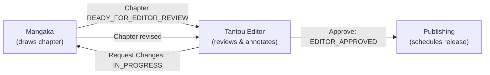

# Role Guide — Tantou Editor (担当編集 / Series Editor)

Responsible for chapter quality assurance: reviews chapters that reach READY_FOR_EDITOR_REVIEW state, leaves categorized annotations on specific pages, and approves chapters for publication or requests revisions from the mangaka.

---

## Mission & Ownership

The Tantou Editor (tantou = "assigned to; responsible for") is the dedicated editor for a series. Once assigned by the Editorial Board:

- **Review authority:** see only chapters from your assigned series in the READY_FOR_EDITOR_REVIEW state
- **Annotation tools:** leave feedback directly on pages with typed comments, spatial coordinates (x,y), and a category (content, dialogue, script, visual, or general)
- **Gate decision:** approve the chapter (→EDITOR_APPROVED, ready for publishing) or request changes (→IN_PROGRESS, notifies mangaka to revise)
- **Scope:** limited to assigned series; cannot create or manage proposals, tasks, or series assignments

---

## Where the Tantou Editor Fits

The Tantou Editor sits between chapter production and publication, ensuring quality and consistency across all pages of an assigned series.

---

## Navigation & Screens

| Screen | Route | VN Label | Purpose |
|--------|-------|----------|---------|
| Dashboard | `/` | Tổng quan | Role-aware summary; notifications bell for review assignments |
| Review Queue | `/editor/review` | Duyệt chương | List of chapters awaiting editor review for your assigned series |
| Chapter Review | `/editor/review/:chapterId` | Duyệt chương — đọc trang | Full-page viewer, annotation placement, and final decision |

### Review Queue (`/editor/review`)

Displays all chapters in READY_FOR_EDITOR_REVIEW state across **your assigned series only** (data-level authorization). Each chapter card shows:

- **Series name** (small label)
- **Chapter number & title**
- **Page count** (e.g., "18 trang")
- **Deadline** (if set)
- **Action buttons:**
  - "Xem & duyệt" (View & Review) → opens chapter review page
  - "Duyệt" (Approve) → immediately approves with no annotation step
  - "Yêu cầu sửa" (Request Changes) → expands inline feedback textarea, requires feedback text before submit

If no chapters are awaiting review, displays an empty state.

### Chapter Review (`/editor/review/:chapterId`)

Full-page editor for reviewing a single chapter:

1. **Header:** title "Duyệt chương — đọc trang" (Chapter Review — Page Reading), back button to review queue
2. **Pages panel (left side):**
   - Each page displayed as a clickable image
   - **Click image** → opens annotation form at that x,y coordinate (stored as % of image width/height)
   - **"Thêm góp ý" (Add Annotation) button** → opens form with default center position (50%, 50%)
   - **Annotation markers** → colored circles numbered (1, 2, ...) overlaid at stored coordinates; color indicates category
3. **Annotations sidebar (right side):**
   - List of all annotations for the current page
   - Each shows: category label, context text, timestamp
   - **"Đã xử lý" (Mark Resolved) button** → marks `is_resolved=1` (editor acknowledges the issue is fixed)
   - Resolved annotations fade out visually but remain visible
4. **Annotation form (inline under page image):**
   - **Loại góp ý (Category dropdown):** CONTENT_ISSUE, DIALOGUE_ISSUE, SCRIPT_ISSUE, VISUAL_ISSUE, GENERAL
   - **Nội dung góp ý (Textarea):** free-text feedback
   - **Lưu góp ý (Save)** / **Hủy (Cancel)**
5. **Decision panel (bottom):**
   - Two modes: decision view or revise feedback form
   - **Decision view:** "Yêu cầu sửa" (Request Changes) button, "Duyệt chương" (Approve Chapter) button
   - **Revise feedback form (expanded):** textarea for feedback message to the mangaka, "Yêu cầu sửa" (submit) and "Hủy" (cancel) buttons

---

## Annotations

Annotations are polymorphic feedback items. From an editor's perspective:

| Field | Value |
|-------|-------|
| `target_type` | `PAGE` (editor reviews chapters, which are collections of pages) |
| `target_id` | page ID on which annotation is placed |
| `category` | one of: `CONTENT_ISSUE`, `DIALOGUE_ISSUE`, `SCRIPT_ISSUE`, `VISUAL_ISSUE`, `GENERAL` |
| `context` | editor's text comment (e.g., "Dialogue bubble is cut off", "This panel composition is weak") |
| `x_coordinate` | % position (0–100) of click within image width; nullable for non-spatial feedback |
| `y_coordinate` | % position (0–100) of click within image height; nullable for non-spatial feedback |
| `is_resolved` | boolean flag; set to true when mangaka addresses the issue |
| `created_by_user_id` | your user ID (filled by backend) |
| `created_at` | timestamp |
| `resolved_at` | timestamp when marked resolved; null if not yet resolved |

**Note:** each editor can place many annotations on a single page. The system stores spatial coordinates relative to image dimensions so annotations remain aligned if the page image is later replaced with a higher-resolution version.

---

## Capabilities & Endpoints

All endpoints require JWT authentication (Bearer token in Authorization header) and `TANTOU_EDITOR` role. Roles are enforced at the service layer.

| Action | Endpoint | Method | Response | Notes |
|--------|----------|--------|----------|-------|
| Load review queue | `GET /api/chapters/review-queue` | GET | EditorChapter[] | Returns READY_FOR_EDITOR_REVIEW chapters from *assigned series only*. No pagination (assumes <50 concurrent chapters per editor). |
| Load chapter pages | `GET /api/chapters/:id/pages` | GET | EditorPage[] | Returns all Page objects for the chapter; includes `imageUrl` (URL to latest PageVersion). |
| Create annotation | `POST /api/annotations` | POST | { id, … } | Body: `{targetType:"PAGE", targetId:pageId, category, context, x, y}`. Returns full Annotation object. |
| List annotations for page | `GET /api/annotations?targetType=PAGE&targetId=:pageId` | GET | Annotation[] | Query params filter by target. Returns all annotations for that page (resolved + unresolved). |
| Mark annotation resolved | `PATCH /api/annotations/:id/resolve` | PATCH | { isResolved: true, … } | Sets `is_resolved=1` and `resolved_at=now()`. No body required. |
| Approve chapter | `PATCH /api/chapters/:id/editor-review` | PATCH | { status: "EDITOR_APPROVED", … } | Body: `{decision:"APPROVE"}`. Transitions chapter READY_FOR_EDITOR_REVIEW → EDITOR_APPROVED. Notifies mangaka. |
| Request changes | `PATCH /api/chapters/:id/editor-review` | PATCH | { status: "IN_PROGRESS", … } | Body: `{decision:"REVISE", feedback:"..."}`. Transitions chapter READY_FOR_EDITOR_REVIEW → IN_PROGRESS and stores feedback. Notifies mangaka with feedback text. |

**Authorization:** the backend enforces that you can only review chapters from series to which you are currently assigned (via `Series_Tantou_Editor.unassigned_at IS NULL`). Any attempt to review a chapter from a non-assigned series returns a 403 Forbidden.

---

## Key Workflows

### Workflow 1: Open Your Review Queue

1. Navigate to `/editor/review` (Duyệt chương)
2. List loads via `GET /api/chapters/review-queue` (automatic on page load)
3. Each card shows series name, chapter #, title, page count, deadline
4. If no chapters, empty state appears: "Không có chương nào chờ duyệt."

### Workflow 2: Review a Chapter with Annotations

1. Click "Xem & duyệt" on a chapter card → navigate to `/editor/review/:chapterId`
2. Pages load via `GET /api/chapters/:chapterId/pages` and annotations load via `GET /api/annotations?targetType=PAGE&targetId=:pageId` for each page
3. For each page:
   - **Click the image** at a problem area → annotation form appears with x,y coordinates
   - **Or click "Thêm góp ý"** button → form opens with center coordinates (50, 50)
4. Fill annotation form:
   - Select category (e.g., "Vấn đề hội thoại")
   - Type context (e.g., "This speech bubble overlaps with the panel border")
   - Click "Lưu góp ý" → `POST /api/annotations` fires, annotation appears as numbered marker on image
5. **Review all pages**, leave annotations where needed
6. **On current page, view existing annotations** in the right sidebar:
   - Each shows category, text, creation time
   - Click "Đã xử lý" to mark resolved (`PATCH /api/annotations/:id/resolve`)
7. Repeat for all pages

### Workflow 3: Final Decision (Approve or Request Changes)

After reviewing all pages and leaving annotations:

#### Option A: Approve

1. At bottom of chapter review page, click "Duyệt chương" (Approve Chapter)
2. `PATCH /api/chapters/:chapterId/editor-review` with body `{decision:"APPROVE"}` fires
3. Chapter transitions to EDITOR_APPROVED state
4. Backend notifies mangaka: "Your chapter #X was approved by [EditorName]"
5. You return to review queue (`/editor/review`)

#### Option B: Request Changes

1. At bottom of chapter review page, click "Yêu cầu sửa" (Request Changes)
2. Inline form expands below decision buttons: feedback textarea
3. Type detailed feedback (e.g., "Page 3 dialogue needs clarity, see annotations. Page 5 panel layout is confusing—consider restructuring.")
4. Click "Yêu cầu sửa" (submit)
5. `PATCH /api/chapters/:chapterId/editor-review` with body `{decision:"REVISE", feedback:"..."}` fires
6. Chapter transitions back to IN_PROGRESS state
7. Backend notifies mangaka with feedback text and lists unresolved annotations
8. Mangaka returns to work on the chapter
9. Once mangaka revises and marks chapter READY_FOR_EDITOR_REVIEW again, it reappears in your queue

---

## Statuses the Editor Drives

| Entity | Start State | Decision | End State | Notifies |
|--------|-------------|----------|-----------|----------|
| **Chapter** | READY_FOR_EDITOR_REVIEW | Approve | EDITOR_APPROVED | mangaka (success) |
| **Chapter** | READY_FOR_EDITOR_REVIEW | Request Changes | IN_PROGRESS | mangaka (feedback + annotations list) |
| **Annotation** | is_resolved=false | Mark Resolved | is_resolved=true | (none; internal flag) |

**Note:** only the chapter decision transitions drive notifications. Annotation resolution is silent (for tracking work).

---

## Assignment Model

- **Assigned by:** Editorial Board (via `PUT /api/series/:seriesId/editor`)
- **Representation:** `Series_Tantou_Editor` table with columns:
  - `series_id` (foreign key to Series)
  - `editor_user_id` (your user ID)
  - `assigned_at` (timestamp when assigned)
  - `unassigned_at` (null while active, populated when removed)
- **Active assignment:** `unassigned_at IS NULL`
- **Data scope:** review queue `GET /api/chapters/review-queue` returns only chapters from series where you have an active assignment
- **Reassignment:** if the board unassigns you from a series (via `DELETE /api/series/:seriesId/editor`), you lose access to that series' review queue and chapters

You can be assigned to **multiple series** simultaneously. The review queue shows chapters from all assigned series.

---

## Notifications

| Trigger | From | Content | Action |
|---------|------|---------|--------|
| Series assignment | Editorial Board | "You are now editor for [Series Title]" | none; check review queue to start |
| Chapter ready for review | System | "[Series #X] Chapter #N is ready for your review" | link to `/editor/review/:chapterId` |
| (Future) Review request | Mangaka (if rejected) | "[Series] Author requests your urgent review of Chapter #N" | (for future notification prioritization) |

---

## Permissions

**Can do:**
- View review queue (chapters READY_FOR_EDITOR_REVIEW from assigned series)
- View chapter pages and page versions
- Create, list, and resolve annotations on pages
- Approve or request changes on chapters
- Receive editor assignment notifications
- View dashboard summary (role-aware)
- Read own profile
- Change password, update profile (basic)

**Cannot do:**
- Create proposals or series (Editorial Board only)
- Create or manage tasks (Mangaka only)
- Assign editors to series (Editorial Board only)
- Approve submissions (Mangaka only)
- Vote or make editorial decisions (Editorial Board only)
- Access chapters from non-assigned series
- Delete annotations (soft-delete only via resolution flag)
- Override chapter status outside editor-review endpoints

See [Security & RBAC](../02-architecture/04-security-and-rbac.md) for technical enforcement (`@Roles(Role.TANTOU_EDITOR)` and series-level authorization checks).

---

## Cross-References

- **Domain Model:** [Domain Model & State Machines](../02-architecture/03-domain-model-and-state-machines.md) (Chapter, Page, Annotation schema)
- **State Machines:** [Domain Model & State Machines](../02-architecture/03-domain-model-and-state-machines.md) (Chapter READY_FOR_EDITOR_REVIEW → EDITOR_APPROVED | IN_PROGRESS)
- **API Reference:** [API Reference](../03-api/01-api-reference.md) (annotation & chapter-review endpoints)
- **Editorial Board Role:** [Editorial Board Guide](04-editorial-board.md) (assigns editors)
- **Mangaka Role:** [Mangaka Guide](01-mangaka.md) (creates chapters, responds to reviews)
