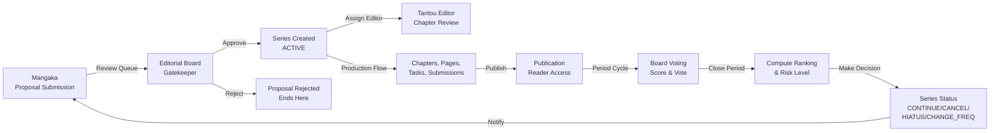

# Role Guide — Editorial Board (編集委員会 / Governance)

The Editorial Board is the governance body and gatekeeper of the publication pipeline. It approves or rejects series proposals, assigns specialized Tantou editors to greenlit series, orchestrates quarterly voting cycles on series performance, computes rankings with risk assessment, and makes binding editorial decisions that determine a series' continuation, cancellation, frequency change, or hiatus—decisions that shape mangaka earnings and publisher strategy.

---

## Table of Contents

1. [Mission & Ownership](#mission--ownership)
2. [Where the Board Fits](#where-the-board-fits)
3. [Navigation & Screens](#navigation--screens)
4. [Capabilities & Endpoints](#capabilities--endpoints)
5. [Governance Mechanics](#governance-mechanics)
6. [Key Workflows](#key-workflows)
7. [Statuses the Board Drives](#statuses-the-board-drives)
8. [Notifications](#notifications)
9. [Permissions](#permissions)
10. [Cross-links](#cross-links)

---

## Mission & Ownership

The Editorial Board serves three critical functions:

1. **Proposal Gatekeeper**: Reviews and approves or rejects new series proposals submitted by mangakas. Approval auto-creates an active Series record and gates entry into the production pipeline.
2. **Talent Allocation**: Assigns and unassigns Tantou editors (specialized chapter reviewers) to each series, ensuring quality oversight of ongoing production.
3. **Governance Authority**: Runs periodic voting cycles (weekly or monthly) where board members score series performance, computes rankings with risk metrics, and issues editorial decisions (continue, cancel, change frequency, or place on hiatus) that are binding on the series and trigger mangaka notifications.

The Board does **not**:
- Create or submit proposals (that is mangaka work)
- Produce content (not a role in production tasks, chapters, pages, submissions)
- Manage financials (that is admin/dispute resolution work)

---

## Where the Board Fits

The Board sits at **two gates**:
- **Front gate** (proposal approval, editor assignment) — controls entry into production
- **Governance gate** (vote cycle, ranking, decision) — controls series fate after publication begins

---

## Navigation & Screens

The Editorial Board has four navigation items (Vietnamese labels in app):

| Screen | Route | Purpose |
|--------|-------|---------|
| Tổng quan | `/` | Dashboard — role-aware overview (pending counts, recent decisions) |
| Duyệt đề xuất | `/board/proposals` | Proposal review queue; approve or reject each proposal |
| Phân công BT | `/board/series` | Active series list; assign or unassign Tantou editor via dropdown |
| Xếp hạng | `/board/rankings` | Leaderboard view; cast votes, close voting periods, make editorial decisions |

### Screen: Duyệt Đề xuất (Proposal Review)

Displays a queue of proposals in `UNDER_REVIEW` status. For each proposal card, the board member sees:
- Proposal title, synopsis, proposed frequency (weekly/monthly), genres
- Mangaka name and pen name
- Two action buttons: **Duyệt** (Approve) and **Từ chối** (Reject)

Clicking **Duyệt** sends `PATCH /api/proposals/:id/decision` with `decision: "APPROVED"`, which:
- Sets the proposal status to `APPROVED`
- Auto-creates a new `Series` record with `series_status: ACTIVE`, inheriting the proposal's title, frequency, and genres
- Sends a `PROPOSAL_DECISION` notification to the mangaka
- Removes the proposal from the queue

Clicking **Từ chối** sends the same endpoint with `decision: "REJECTED"`, which:
- Sets the proposal status to `REJECTED`
- Sends a `PROPOSAL_DECISION` notification to the mangaka
- Does not create a Series

### Screen: Phân công BT (Series & Editor Assignment)

Displays a table of all active series (status `ACTIVE`, `AT_RISK`, `HIATUS`, `CANCELLED`, `COMPLETED`). Columns include:
- **Series** — title and mangaka name
- **Trạng thái** — current series status (displayed as a status badge)
- **Chương** — chapter count
- **Biên tập** — dropdown selector for Tantou editor assignment

The dropdown shows:
- `— chưa gán —` (unassigned) as default
- A list of all available Tantou editors (name and avatar from `/api/users/editors`)

Selecting an editor sends `PUT /api/series/:id/editor` with `{ editorUserId: <id> }`, which:
- Records a new `Series_Tantou_Editor` row with `assigned_at: NOW` and `unassigned_at: NULL`
- Sends a notification to the selected editor
- Updates the dropdown display

Selecting `— chưa gán —` (after confirmation) sends `DELETE /api/series/:id/editor`, which:
- Sets `unassigned_at: NOW` on the active assignment record (soft delete; history preserved)
- Sends a notification to the previously assigned editor
- Clears the dropdown

### Screen: Xếp hạng (Voting, Ranking & Decision)

Divided into three sections:

#### A. Bảng xếp hạng (Leaderboard)

Displays a table of computed rankings for all series with voting data:

| Column | Values |
|--------|--------|
| Hạng | Rank position (1, 2, 3, ...) or `—` if unranked |
| Series | Series title |
| Điểm | Total score (sum of all votes) or `—` |
| Rủi ro | Risk level badge: `RISK LOW`, `RISK MEDIUM`, `RISK HIGH` |
| Trạng thái | Current series status badge |
| Quyết định | Decision form (below) |

For each series row, the board member can enter a decision inline:
1. Select a `decisionType` from a dropdown: `Tiếp tục` (CONTINUE), `Hủy` (CANCEL), `Tạm dừng` (HIATUS), `Đổi tần suất` (CHANGE_FREQUENCY)
2. If `CHANGE_FREQUENCY` is selected, a second dropdown appears to choose new frequency: `Hàng tuần` (WEEKLY) or `Hàng tháng` (MONTHLY)
3. Enter a `reason` (text field)
4. Click **Ra quyết định** (Submit Decision) to send `POST /api/decisions` with the decision data

On submission, the series status is updated and a `DECISION` notification is sent to the mangaka. The leaderboard refetches to show updated statuses.

#### B. Kỳ bình chọn đang mở (Open Voting Periods)

Displays a list of currently open voting periods (status `OPEN`). For each period card:
- Series name, period type (WEEKLY/MONTHLY), end date
- If the board member has already voted (`hasVoted: 1`), a `Đã bình chọn` (Already Voted) badge is shown
- Otherwise, vote input form:
  - **Điểm (1-5)** — number input for the score
  - **Bình luận (tuỳ chọn)** — optional text comment
  - **Bình chọn** button to submit `POST /api/votes` with `{ votePeriodId, score, comment }`
- **Đóng & tính hạng** button to close the period with `POST /api/vote-periods/:id/close`, which computes the Ranking and may flag the series as `AT_RISK` if risk level is MEDIUM/HIGH

Each board member can cast **one vote per voting period** (enforced by unique key on `Vote(vote_period_id, board_user_id)`).

#### C. Mở kỳ bình chọn mới (Open New Voting Period)

A form to initiate a new voting period:
- Series dropdown (select from `/api/series/all`)
- Period type dropdown (WEEKLY or MONTHLY)
- Start date and end date pickers
- **Mở kỳ** button to send `POST /api/vote-periods` with the form data

Creates a new `Vote_Period` record with status `OPEN`, ready for board members to vote.

---

## Capabilities & Endpoints

All endpoints are JWT-guarded and require `EDITORIAL_BOARD` role. The table below lists all actions the board can perform:

| Action | Method | Endpoint | Purpose |
|--------|--------|----------|---------|
| Load proposal queue | GET | `/api/proposals/review-queue` | Fetch proposals in `UNDER_REVIEW` status for review |
| Approve/reject proposal | PATCH | `/api/proposals/:id/decision` | Send `{ decision: "APPROVED" \| "REJECTED" }` |
| List all series | GET | `/api/series/all` | Fetch series for assignment and decision screens |
| Assign editor | PUT | `/api/series/:id/editor` | Send `{ editorUserId: <id> }` to link a Tantou editor |
| Unassign editor | DELETE | `/api/series/:id/editor` | Remove active editor assignment (soft delete) |
| List editors | GET | `/api/users/editors` | Fetch available Tantou editors for assignment dropdown |
| Open vote period | POST | `/api/vote-periods` | Send `{ seriesId, periodType, startDate, endDate }` |
| List open periods | GET | `/api/vote-periods/open` | Fetch voting periods with status `OPEN` |
| Cast vote | POST | `/api/votes` | Send `{ votePeriodId, score (1-5 decimal), comment? }` |
| Close vote period | POST | `/api/vote-periods/:id/close` | Compute Ranking rows and risk levels; may set series `AT_RISK` |
| List rankings | GET | `/api/rankings` | Fetch computed ranking data (rank_position, total_score, risk_level) |
| Make decision | POST | `/api/decisions` | Send `{ seriesId, decisionType, newFrequency?, reason }` |
| List decisions | GET | `/api/decisions?seriesId=...` | Fetch past decisions for audit/reference |

---

## Governance Mechanics

### Proposal Approval

When a board member clicks **Duyệt** on a proposal:
- The proposal state machine transitions `UNDER_REVIEW → APPROVED`
- A new `Series` record is created with:
  - `proposal_id` (foreign key to the approved proposal)
  - `title`, `mangaka_user_id` (inherited from proposal)
  - `publication_frequency` (from proposal's `proposed_frequency`)
  - `series_status: ACTIVE`
- The mangaka receives a `PROPOSAL_DECISION` notification
- The series is now eligible for editor assignment and production (chapters, pages, tasks)

### Editor Assignment

When the board assigns a Tantou editor to a series via the dropdown:
- A `Series_Tantou_Editor` record is created with `assigned_at: NOW` and `unassigned_at: NULL`
- The editor receives a notification of the assignment
- The editor can now see the series in `/editor/review` and approve/request-changes on chapters

When unassigned (soft delete):
- The `unassigned_at` field is set to the current timestamp
- History is preserved for audit
- The editor is notified of the unassignment

### Voting Cycle

A voting period lifecycle:

1. **Open** (`POST /api/vote-periods`): Board initiates a period for a series with a start and end date. Status is set to `OPEN`.
2. **Vote** (`POST /api/votes`): Each board member casts one vote (score 1–5 decimal + optional comment). Votes are recorded with `voted_at` timestamp.
   - **Uniqueness**: A board member can vote only once per period (enforced by unique key `(vote_period_id, board_user_id)`).
   - **No RBAC**: Any authenticated board member can vote, not just a specific subset.
3. **Close** (`POST /api/vote-periods/:id/close`): Board closes the period, triggering a ranking computation:
   - Compute `total_score = SUM(Vote.score)` for all votes in the period
   - Compute `rank_position = ROW_NUMBER()` ordered by total_score DESC
   - Compute `risk_level` using a heuristic (e.g., if score < threshold, `MEDIUM` or `HIGH`)
   - Insert a `Ranking` row with these values
   - If `risk_level` is `MEDIUM` or `HIGH`, set the series status to `AT_RISK` and send a `RISK_ALERT` notification to the mangaka

### Editorial Decision

Once ranking is computed, the board makes an editorial decision on each series (typically for `AT_RISK` series, but can apply to any):

- **CONTINUE**: Series continues as-is; no status change.
- **CANCEL**: Series status → `CANCELLED`; production halts.
- **HIATUS**: Series status → `HIATUS`; production paused, may resume later.
- **CHANGE_FREQUENCY**: Series status remains; `publication_frequency` is updated to the new value (WEEKLY or MONTHLY).

A `Decision` record is created with `decision_type`, `new_frequency` (if applicable), `reason`, `decided_by_user_id`, and `decided_at`. The mangaka receives a `DECISION` notification summarizing the board's choice.

---

## Key Workflows

### Workflow A: Review & Decide a Proposal

**Trigger**: New proposal submitted by mangaka.
**Board Steps**:
1. Navigate to `/board/proposals`
2. Review the proposal queue (title, synopsis, frequency, genres, author)
3. Click **Duyệt** (approve) or **Từ chối** (reject)
4. (If approved) Series is auto-created with status `ACTIVE`; mangaka is notified

**Supporting Endpoints**:
- `GET /api/proposals/review-queue` — load queue
- `PATCH /api/proposals/:id/decision` — approve or reject

---

### Workflow B: Assign a Tantou Editor to a New Series

**Trigger**: Series created (post-approval); board wants to link an editor.
**Board Steps**:
1. Navigate to `/board/series`
2. Find the series row (status `ACTIVE`)
3. In the **Biên tập** column, click the dropdown and select an editor name
4. Editor is assigned; receives notification

**Supporting Endpoints**:
- `GET /api/series/all` — load series list
- `GET /api/users/editors` — load editor dropdown options
- `PUT /api/series/:id/editor` — perform assignment

---

### Workflow C: Run a Voting Cycle

**Trigger**: Weekly or monthly governance review period.
**Board Steps**:
1. Navigate to `/board/rankings` → **Mở kỳ bình chọn mới** section
2. Select a series, period type (WEEKLY/MONTHLY), and start/end dates
3. Click **Mở kỳ** to open the period
4. (Later, during the period) Board members navigate to **Kỳ bình chọn đang mở** section
5. Each member enters a score (1–5) and optional comment, then clicks **Bình chọn**
6. When voting concludes, click **Đóng & tính hạng** to compute rankings and risk levels
7. (Automatically) Series with risk (`MEDIUM`/`HIGH`) are flagged `AT_RISK`

**Supporting Endpoints**:
- `POST /api/vote-periods` — open period
- `GET /api/vote-periods/open` — list open periods
- `POST /api/votes` — cast vote
- `POST /api/vote-periods/:id/close` — close and compute ranking

---

### Workflow D: Make a Decision on an At-Risk Series

**Trigger**: Ranking computed; series is `AT_RISK` (or board chooses to make a decision for any series).
**Board Steps**:
1. Navigate to `/board/rankings` → **Bảng xếp hạng** section
2. Find the series row (often marked with `RISK MEDIUM` or `RISK HIGH`)
3. In the **Quyết định** column:
   - Select a decision type (Tiếp tục, Hủy, Tạm dừng, Đổi tần suất)
   - If **Đổi tần suất**, select the new frequency
   - Enter a reason
   - Click **Ra quyết định**
4. Series status updates; mangaka is notified of the decision

**Supporting Endpoints**:
- `GET /api/rankings` — load leaderboard with ranking data
- `POST /api/decisions` — submit decision
- `GET /api/decisions?seriesId=...` — view decision history (optional)

---

## Statuses the Board Drives

The Board directly drives or influences these status transitions:

### Proposal Status
- **DRAFT** → **SUBMITTED** (mangaka) → **UNDER_REVIEW** (automatic on submission)
- **UNDER_REVIEW** → **APPROVED** or **REJECTED** (board decision)
- **APPROVED**, **REJECTED** (terminal; no further changes)

### Vote Period Status
- **OPEN** (created by `POST /api/vote-periods`)
- **CLOSED** (set by `POST /api/vote-periods/:id/close`, after ranking computed)

### Series Status
- **ACTIVE** (default, post-approval)
- **AT_RISK** (automatic, when voting period closes with risk_level MEDIUM or HIGH)
- **HIATUS** (board decision)
- **CANCELLED** (board decision)
- **COMPLETED** (typically set by admin or system upon final publication)

The Board **initiates or enables** these transitions through approval, editor assignment, voting, and decision-making.

---

## Notifications

The Board's actions trigger these notification types (sent to affected users):

| Trigger | Notification Type | Recipient | Content |
|---------|-------------------|-----------|---------|
| Approve proposal | `PROPOSAL_DECISION` | Mangaka | Approval of series; series is now ACTIVE |
| Reject proposal | `PROPOSAL_DECISION` | Mangaka | Rejection reason (if provided) |
| Assign editor | (Custom) | Tantou Editor | Assignment to a series |
| Unassign editor | (Custom) | Tantou Editor | Unassignment from a series |
| Close vote period with risk | `RISK_ALERT` | Mangaka | Series flagged AT_RISK; risk level disclosed |
| Make decision | `DECISION` | Mangaka | Decision type, reason, and next steps |

All notifications include related entity ID and type for deep linking in the UI.

---

## Permissions

The Editorial Board role (`EDITORIAL_BOARD`) is **strictly limited** to governance actions:

**Allowed**:
- Review and decide proposals (`/board/proposals`)
- Assign and unassign editors (`/board/series`)
- Open, vote, close voting periods (`/board/rankings`)
- Make editorial decisions (`/board/rankings`)
- Read-only access to series, editors, rankings, decisions

**Not Allowed**:
- Create or author proposals (mangaka only)
- Produce content (create chapters, pages, tasks, submit work)
- Review and approve submissions (mangaka only)
- Manage finances or resolve disputes (admin only)
- Access user management or system administration (admin only)

RBAC is enforced at the API layer via `@Roles(Role.EDITORIAL_BOARD)` guards. JWT tokens include the role claim; API rejects requests without the correct role.

---

## Cross-links

- **Role Overview**: [Documentation Index](../README.md)
- **Mangaka Guide**: [01-mangaka.md](01-mangaka.md) — proposal creation, series management, production workflow
- **Tantou Editor Guide**: [03-tantou-editor.md](03-tantou-editor.md) — chapter review and annotation
- **Assistant Guide**: [02-assistant.md](02-assistant.md) — task assignment and submission
- **Admin Guide**: [05-admin.md](05-admin.md) — user management, disputes, system configuration
- **API Reference**: [../03-api/01-api-reference.md](../03-api/01-api-reference.md) — full endpoint documentation
- **State Machines**: [Domain Model & State Machines](../02-architecture/03-domain-model-and-state-machines.md) — proposal, series, vote period, decision transitions
- **Notifications**: [API Reference — Notifications](../03-api/01-api-reference.md) — notification types and triggers
- **Pipeline Overview**: [Product Overview](../01-overview/01-product-overview.md) — full publication workflow

---

**Document Version**: 1.0 (2026-05-31)  
**Status**: Current (verified against shipped code)
