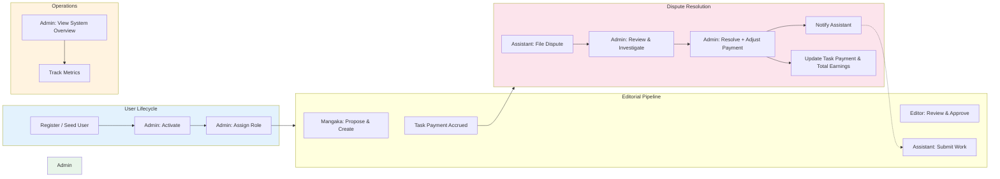

# Role Guide — Admin (Quản trị viên hệ thống / Platform Administrator)

Operates the platform by managing user accounts (activation + role assignment with safeguards), monitoring a real-time system overview, and adjudicating assistant earning disputes with optional payment amount adjustment.

---

## Table of Contents

1. [Mission & Ownership](#1-mission--ownership)
2. [Where the Admin Fits](#2-where-the-admin-fits)
3. [Navigation & Screens](#3-navigation--screens)
4. [Capabilities & Endpoints](#4-capabilities--endpoints)
5. [Dispute Adjudication Mechanics](#5-dispute-adjudication-mechanics)
6. [User Management Mechanics](#6-user-management-mechanics)
7. [Key Workflows](#7-key-workflows)
8. [Statuses the Admin Drives](#8-statuses-the-admin-drives)
9. [Notifications](#9-notifications)
10. [Operational Notes](#10-operational-notes)
11. [Permissions](#11-permissions)

---

## 1. Mission & Ownership

The Admin is the sole platform operator responsible for three core functions:

1. **User Lifecycle Management** — activate newly seeded or registered users; assign and adjust roles across the 5 roles (MANGAKA, ASSISTANT, TANTOU_EDITOR, EDITORIAL_BOARD, ADMIN); enforce system integrity by preventing the deactivation or demotion of the last active admin.
2. **System Health Visibility** — view real-time platform metrics (total users, users per role, series count, chapter count, proposal count, open task count) from a single dashboard overview.
3. **Earning Dispute Adjudication** — review assistant complaints about task payment amounts; investigate the original payment and the assistant's expected amount; resolve by approving (with optional adjusted payment), rejecting, or requesting more information; notify the assistant of the decision and apply any payment adjustment automatically to both the Task record and the Assistant's total earnings.

The Admin is a **cross-cutting operational role**, invisible to the editorial workflow but essential for platform integrity, legal compliance, and assistant welfare.

---

## 2. Where the Admin Fits



The Admin sits at the boundary of **user onboarding** (activation + role assignment) and **earnings governance** (dispute resolution). Every user must be activated by the Admin before they can log in; every earnings dispute must be adjudicated by the Admin to be final.

---

## 3. Navigation & Screens

Admin has **four web routes**, accessible from the role-specific navigation menu:

| Screen | Route | Vietnamese Label | Purpose |
|--------|-------|-----------------|---------|
| Dashboard (role-aware summary) | `/` | Tổng quan | Quick metrics: user count, series count, chapters, proposals, open tasks |
| Console (Admin overview) | `/admin` | Quản trị | System metrics grid + user list with activation toggles and role selector |
| Disputes | `/admin/disputes` | Khiếu nại | Earning dispute list, review state, resolution modal with notes and amount adjustment |
| Hồ sơ | `/users/me` | Hồ sơ | Update profile: edit name, bio, upload avatar to self-hosted S3; view account settings. |

---

### 3.1 Console Screen (`/admin`)

**Displays:**

- **Overview metrics grid** (8 cards): Total users, Mangaka count, Assistant count, Editor count, Series count, Chapter count, Proposal count, Open task count.
  - All counts fetch from the backend `/api/admin/overview` endpoint and update on page load.
  - No real-time push; refresh the page to see latest counts.
  
- **User list table** with columns:
  - **Name** — user's full_name from User record
  - **Email** — unique email address
  - **Role** — dropdown selector with all 5 roles; user can change role immediately (no confirm)
  - **Status** — toggle button: "Khoá" (deactivate/lock) if activated, "Mở khoá" (activate/unlock) if deactivated
    - Deactivation requires a browser confirm dialog; deactivated users cannot log in.
    - Attempting to deactivate the last active ADMIN fails with error message "Cannot deactivate/demote the last active admin".

**Actions:**
- Click role dropdown → select new role → saves immediately via PATCH `/api/admin/users/:id`
- Click activation toggle → confirm in dialog → saves immediately via PATCH `/api/admin/users/:id`
- Error messages display below title if either action fails.

---

### 3.2 Disputes Screen (`/admin/disputes`)

**Displays a filterable list of earning disputes** with columns:

- **Trợ lý** (Assistant) — full name of the assistant who filed the dispute
- **Việc** (Task) — task_description of the disputed task (or "—" if null)
- **Đề xuất vs Hiện tại** (Expected vs Current Amount) — assistant's expected_amount vs current Task.payment_amount, formatted with Vietnamese currency (₫)
- **Lý do** (Reason) — the dispute_reason provided by the assistant (truncated to 1 line)
- **Trạng thái** (Status) — stamp/badge showing OPEN / UNDER_REVIEW / RESOLVED / REJECTED
- **Hành động** (Action) — context-dependent controls

**Row states and actions:**

1. **OPEN** — dispute just filed, awaiting admin review
   - Buttons: "Bắt đầu xem xét" (Start review → PATCH `/api/disputes/:id/review` → UNDER_REVIEW) + "Giải quyết" (open resolve modal)

2. **UNDER_REVIEW** — admin has started reviewing but not yet resolved
   - Buttons: "Giải quyết" (open resolve modal)

3. **RESOLVED** or **REJECTED** — dispute is final
   - Display: show the resolution_note as plain text (read-only)
   - No actions available

**Resolve Modal** (opened by "Giải quyết" button):

Presents two input fields and three action buttons:

- **Ghi chú giải quyết** (Resolution note) — textarea, required; can be approval explanation or rejection reason
- **Số tiền điều chỉnh (tuỳ chọn)** (Adjusted amount) — optional number input; if provided, updates Task.payment_amount and Assistant_Profile.total_earnings by delta
- Buttons:
  - **Xác nhận giải quyết** — submit as RESOLVED with the note and optional adjusted amount; requires browser confirm dialog
  - **Từ chối** — submit as REJECTED with the note; requires browser confirm dialog + note must be non-empty
  - **Huỷ** — close modal without saving

---

## 4. Capabilities & Endpoints

All Admin endpoints require `Authorization: Bearer <token>` with `role=ADMIN` in the JWT.

| Method | Endpoint | Purpose | Request Body | Response |
|--------|----------|---------|--------------|----------|
| GET | `/api/admin/overview` | Fetch system metrics | N/A | `{users, mangaka, assistants, editors, board, series, chapters, proposals, openTasks}` (count integers) |
| GET | `/api/admin/users` | Fetch all users | N/A | Array of `{id, email, name, role, isActivated, authProvider, createdAt}` |
| PATCH | `/api/admin/users/:id` | Update user activation or role | `{isActivated?, role?}` (partial) | `{ok: true}` or error |
| GET | `/api/disputes` | List all earning disputes | N/A | Array of `{id, taskId, reason, expectedAmount, status, resolutionNote, resolvedAt, createdAt, currentAmount, task, assistant}` |
| PATCH | `/api/disputes/:id/review` | Mark dispute as UNDER_REVIEW | N/A | `{ok: true}` or error |
| PATCH | `/api/disputes/:id/resolve` | Resolve or reject dispute | `{status: 'RESOLVED'\|'REJECTED', resolutionNote, adjustedAmount?}` | `{ok: true}` or error |

**Notes:**
- All list endpoints return sorted/ordered results (users by role then name; disputes by status priority then creation date).
- `/api/disputes` returns disputes in priority order: OPEN → UNDER_REVIEW → RESOLVED → REJECTED.
- `adjustedAmount` in the resolve endpoint is optional; if omitted or null, no payment adjustment occurs.

---

## 5. Dispute Adjudication Mechanics

Earning disputes follow a strict state machine enforced by shared `EARNING_DISPUTE_TRANSITIONS` (defined in `@manga/shared`):

```
OPEN → [UNDER_REVIEW, RESOLVED, REJECTED]
UNDER_REVIEW → [RESOLVED, REJECTED]
RESOLVED → [] (terminal)
REJECTED → [] (terminal)
```

**Dispute lifecycle:**

1. **OPEN** — Assistant files a dispute via POST `/api/disputes` on an APPROVED task. Trigger: Assistant sees a task marked APPROVED with a payment_amount they consider unfair.
   - Backend checks: task exists, task status is APPROVED (no revisions), assistant is assignee.
   - Admins are notified of new dispute with type DISPUTE.

2. **UNDER_REVIEW** — Admin clicks "Bắt đầu xem xét" on an OPEN dispute. Transition: PATCH `/api/disputes/:id/review`.
   - No changes to task or earnings yet; purely a status signal that admin is investigating.

3. **RESOLVED or REJECTED** — Admin completes investigation via "Giải quyết" modal. Transition: PATCH `/api/disputes/:id/resolve`.
   - **If RESOLVED:**
     - resolution_note is recorded (e.g., "Approved; payment was correct" or "Approved; adjusting to 150,000 ₫").
     - If `adjustedAmount` is provided:
       - Calculate delta = adjustedAmount - Task.payment_amount (original)
       - Update Task.payment_amount to adjustedAmount
       - Update Assistant_Profile.total_earnings += delta (retroactive accrual adjustment)
     - Notify assistant: title "Khiếu nại đã được giải quyết", content = resolution_note, type = DISPUTE
   - **If REJECTED:**
     - resolution_note is recorded (e.g., "Payment amount was justified based on region type").
     - No adjustment to Task or earnings.
     - Notify assistant: title "Khiếu nại bị từ chối", content = resolution_note, type = DISPUTE

**Payment adjustment example:**
- Original task payment: 100,000 ₫
- Assistant files dispute expecting 150,000 ₫
- Admin reviews and agrees; resolves with adjustedAmount = 150,000 ₫
- Delta = 150,000 - 100,000 = +50,000 ₫
- Task.payment_amount becomes 150,000 ₫
- Assistant_Profile.total_earnings is incremented by 50,000 ₫
- Assistant is notified: "Khiếu nại đã được giải quyết: Approved; adjusting to 150,000 ₫"

---

## 6. User Management Mechanics

**Activation gate (`is_activated`):**

- New users (registered via login or seeded in bulk) default to `is_activated = 0` (deactivated).
- Deactivated users cannot log in (JWT issuance fails if user is not activated).
- Admin must manually activate users before they can access the platform.
- Action: Console screen → User row → Status toggle "Mở khoá" (if currently locked) → confirm → saves via PATCH `/api/admin/users/:id` with `{isActivated: true}`.

**Role assignment:**

- Users can be assigned to any of the 5 roles: MANGAKA, ASSISTANT, TANTOU_EDITOR, EDITORIAL_BOARD, ADMIN.
- Role determines:
  - Navigation menu and available screens
  - API endpoint permissions (JWT role claim + RolesGuard)
  - Profile table accessed (Mangaka_Profile, Assistant_Profile, etc.)
- Action: Console screen → User row → Role dropdown → select → saves immediately via PATCH `/api/admin/users/:id` with `{role: "ADMIN"}` (or other role).
- No confirmation required for role changes (unlike activation).

**Last-admin guard (integrity safeguard):**

- The system requires at least one active ADMIN user at all times.
- If attempting to deactivate an ADMIN user (via toggle) when they are the last active ADMIN, error: "Cannot deactivate/demote the last active admin".
- If attempting to change an ADMIN's role to non-ADMIN when they are the last active ADMIN, error: "Cannot deactivate/demote the last active admin".
- This prevents accidental lockout of the platform.

---

## 7. Key Workflows

### Workflow A: Activate a Newly Seeded or Registered User & Assign Role

**Scenario:** A new user has registered via email or been bulk-seeded in the database. They cannot log in yet because `is_activated=0`. Admin needs to onboard them.

**Steps:**

1. **Navigate to Console** — `/admin`
2. **Locate the user** in the User list table (search/scroll; list shows all users unsorted by default in the code, but is sorted by role + name in the query).
3. **Activate** — Click the Status toggle ("Mở khoá" if locked) → confirm dialog → saves `is_activated=1` → button now shows "Khoá".
4. **Assign role** — Click the Role dropdown → select desired role (e.g., ASSISTANT) → saves immediately.
5. **Notify user** (out of platform) — Send login credentials and confirmation to the user's email.

**Related endpoints:**
- GET `/api/admin/users` (fetch list)
- PATCH `/api/admin/users/:id` (activate + set role)

---

### Workflow B: Investigate & Resolve an Earning Dispute (With or Without Amount Adjustment)

**Scenario A: Assistant claims unfair payment; Admin approves adjustment.**

1. **Navigate to Disputes** — `/admin/disputes`
2. **Review list** — Disputes are sorted by status (OPEN first). Scan the table:
   - Assistant name, Task description, Expected vs Current amount, Reason, Status, Actions.
3. **Start review (optional but recommended for audit trail)** — Click "Bắt đầu xem xét" on an OPEN dispute.
   - Dispute moves to UNDER_REVIEW.
   - No immediate changes to payments.
4. **Open resolve modal** — Click "Giải quyết".
5. **Fill resolution:**
   - **Resolution note:** "Approved; task pricing was below market rate for detail work. Adjusting."
   - **Adjusted amount:** "150000" (the new fair amount)
6. **Confirm resolve** — Click "Xác nhận giải quyết" → confirm browser dialog.
7. **Result:**
   - Dispute moves to RESOLVED.
   - Task.payment_amount updated from (say) 100,000 to 150,000 ₫.
   - Assistant_Profile.total_earnings incremented by +50,000 ₫.
   - Assistant notified: "Khiếu nại đã được giải quyết: Approved; task pricing was below market rate for detail work. Adjusting."

**Scenario B: Admin rejects dispute (payment was justified).**

1. **Navigate to Disputes** → locate dispute → Click "Giải quyết".
2. **Fill resolution:**
   - **Resolution note:** "Rejected. Payment amount was calculated per active Task_Price_Rule for PANEL region type. No adjustment warranted."
   - **Adjusted amount:** (leave blank; no payment change)
3. **Click "Từ chối"** → confirm dialog.
4. **Result:**
   - Dispute moves to REJECTED.
   - No changes to Task.payment_amount or Assistant earnings.
   - Assistant notified: "Khiếu nại bị từ chối: Rejected. Payment amount was calculated per active Task_Price_Rule for PANEL region type. No adjustment warranted."

**Related endpoints:**
- GET `/api/disputes` (fetch all)
- PATCH `/api/disputes/:id/review` (mark UNDER_REVIEW)
- PATCH `/api/disputes/:id/resolve` (finalize with optional adjustment)

---

## 8. Statuses the Admin Drives

| Entity | Status Field | Values Driven by Admin | Transitions |
|--------|--------------|------------------------|-------------|
| User | `is_activated` | 0 (deactivated), 1 (activated) | Admin toggle in Console |
| User | `role` | MANGAKA, ASSISTANT, TANTOU_EDITOR, EDITORIAL_BOARD, ADMIN | Admin dropdown in Console |
| Earning_Dispute | `dispute_status` | OPEN → UNDER_REVIEW → RESOLVED or REJECTED | Admin "Start review" → "Resolve" / "Reject" |

---

## 9. Notifications

**Notifications Admin receives:**

- **Type: DISPUTE** — "Khiếu nại thu nhập mới" (New earning dispute filed)
  - Triggered: When an assistant files a dispute via POST `/api/disputes`
  - Content: The assistant's dispute reason
  - Related entity: Earning_Dispute record
  - **Action:** Navigate to `/admin/disputes` to review

**Notifications Admin sends:**

- **Type: DISPUTE** — "Khiếu nại đã được giải quyết" (Dispute resolved) or "Khiếu nại bị từ chối" (Dispute rejected)
  - Triggered: When admin resolves a dispute via PATCH `/api/disputes/:id/resolve`
  - Content: The resolution_note entered by the admin
  - Recipient: The assistant who filed the dispute
  - Related entity: The Earning_Dispute record

---

## 10. Operational Notes

**Audit trail:**

- The `Audit_Log` table schema is present in `db/01-schema.sql` with fields: actor_user_id, action (CREATE/UPDATE/DELETE/APPROVE/REJECT/PUBLISH/CANCEL/ASSIGN/SUBMIT/REVISE/VOTE/DECIDE), entity_type, entity_id, before_value JSON, after_value JSON, ip_address, user_agent, created_at.
- **Current backlog status:** `Audit_Log` is **not yet wired** by code. Admin actions (activate, deactivate, role change, dispute resolution) are **not logged** to the audit table as of 2026-05-31. This is a **planned hardening feature** for compliance and forensics.
- Recommendation: Enable audit logging before production launch (track all user activation/deactivation, role changes, and dispute resolutions).

**Security Hardening (shipped as of 2026-06-05):**

- **Login Rate-Limiting:** API enforces throttler guard on login endpoint (`@Throttle()` via `@nestjs/throttler`). Failed login attempts are rate-limited to prevent brute-force attacks.
- **Global Exception Filter:** All unhandled exceptions are caught by a global exception filter; internal error details are sanitized and not leaked to clients. Clients see generic error responses.
- **Upload Path-Traversal Guard:** File upload endpoint validates uploaded filenames and keys to prevent path traversal attacks (e.g., `../../../etc/passwd`). Only safe alphanumeric + safe punctuation allowed.
- **Self-Hosted S3 Storage:** Avatar and file uploads now go to self-hosted SeaweedFS (S3-compatible) at `:8333`, not disk. All uploads are protected behind signed S3 URLs (not publicly enumerable).

**System configuration:**

- The `System_Config` table (config_key PK, config_value, description, updated_by_user_id, updated_at) is present in schema but **not yet wired**. Future use cases: disable registration, set dispute approval workflow thresholds, configure pricing rules override.

**Missing UI / backlog:**

- User search / filter in Console (currently unimplemented; list loads all users).
- Dispute search / filter (currently unimplemented; list loads all disputes).
- Bulk user activation or role assignment (single-row actions only).
- Dispute analytics (by assistant, by reason category, by resolution outcome).

**Cross-link:** See `../02-architecture/04-security-and-rbac.md` §9 "Hardening Backlog" for related security enhancements (audit logging, rate-limiting, IP allowlisting).

---

## 11. Permissions

**Admin has exclusive control over:**

- **User management:** Activate/deactivate any user; assign roles to any user (except last-admin guard).
- **Dispute adjudication:** List, review, and resolve all earning disputes; optionally adjust payment amounts and update assistant earnings retroactively.
- **System visibility:** View real-time metrics (user counts, series counts, task counts) via Overview dashboard.
- **Profile management:** Edit own profile (`/users/me`): name, bio, avatar upload to self-hosted S3.
- **Security audit:** Admin is responsible for monitoring login attempt logs, exception patterns, and upload anomalies (via server logs and database audit trail when enabled).

**Admin cannot:**

- Create users (must be registered via login or pre-seeded via database migration).
- Delete users (no deletion endpoint exists; only deactivation).
- Modify task descriptions, pricing rules, or series metadata directly (only dispute resolution can adjust task payment).
- Access or modify other roles' data (e.g., cannot mark a Mangaka's proposal as approved; that is EDITORIAL_BOARD's role).

**RBAC implementation:**

- All Admin endpoints enforce `@UseGuards(JwtAuthGuard, RolesGuard)` + `@Roles(Role.ADMIN)` in NestJS controllers.
- If a non-Admin attempts an Admin endpoint, API returns 403 Forbidden.
- See `../02-architecture/04-security-and-rbac.md` §4 "Permission Matrix" for the full role matrix.

---

## Cross-links

- [Role Guide — Mangaka](./01-mangaka.md)
- [Role Guide — Assistant](./02-assistant.md)
- [Role Guide — Tantou Editor](./03-tantou-editor.md)
- [Role Guide — Editorial Board](./04-editorial-board.md)
- [System Architecture](../02-architecture/01-system-architecture.md)
- [Database Design](../02-architecture/02-database-design.md)
- [Domain Model & State Machines](../02-architecture/03-domain-model-and-state-machines.md)
- [Security & RBAC](../02-architecture/04-security-and-rbac.md)
