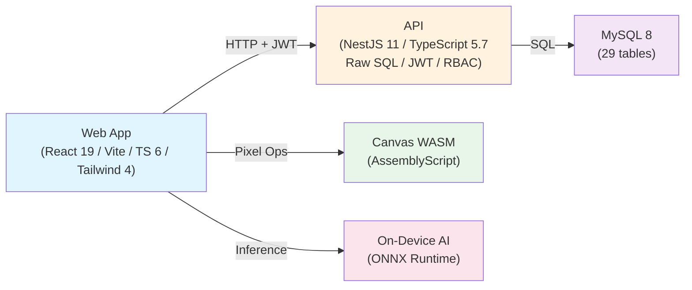

# Manga Creation Workflow & Publishing Management System
## SWP391 Capstone Project — May 31, 2026

---

# Agenda

- The Problem & Solution
- Platform Architecture & Tech Stack
- Core Features (Studio, AI, Governance, Earnings)
- Security, Quality, & Verification
- Live Demo & Q&A

---

# The Problem

A manga studio coordinates **mangaka** (artists), **assistants**, **editors**, and a **board** across:
- Pitch → Approval → Production → Review → Publish → Reader Feedback → Rankings → Editorial Decisions → Payments

**Today:** Spreadsheets, chat, email chaos — no unified workflow, no state enforcement, no audit trail.

**Result:** Delays, disputes, missed deadlines, lost context.

---

# What It Is / Is NOT

**IS:**
- Internal operational & publishing platform for studio staff
- End-to-end pipeline: proposals through earnings & disputes
- 5-role RBAC with tailored dashboards & workflows
- State machines + audit + notifications

**IS NOT:**
- A public manga reader app
- A monetized consumer platform
- Cloud or SaaS infrastructure

---

# Solution: The Pipeline

```
Series Proposal → Board Approval → Series → Tantou Editor
→ Chapter → Page → Region → Task → Assistant Submission
→ Mangaka Review → Editor Review → Publish → Board Vote
→ Ranking + Risk → Decision → Earnings & Disputes
```

Stages are **state-enforced** (transition maps); **notifications** trigger at each gate; **earnings accrue** on approval; **disputes** are admin-resolvable.

---

# The Five Roles

| Role | Responsibility |
|------|---|
| **Mangaka** | Proposes series; creates chapters & pages; reviews submissions; assigns tasks |
| **Assistant** | Performs work (colorize, detail, lettering); submits; can dispute earnings |
| **Tantou Editor** | Assigned to a series; reviews chapters; gives feedback; approves for publish |
| **Editorial Board** | Votes on series performance; decides: continue/cancel/change frequency/hiatus |
| **Admin** | User activation; role management; dispute resolution; system config |

---

# End-to-End Pipeline (Expanded)

1. **Series Proposal** — Mangaka drafts & submits a pitch (title, synopsis, genres, frequency).
2. **Board Decision** — Board approves or rejects. Approved → Series created.
3. **Tantou Assignment** — Board assigns a dedicated editor to the series.
4. **Chapter Workflow** — Mangaka: draft → in-progress → ready for editor. Editor: review → approve → ready to publish.
5. **Page & Regions** — Mangaka creates pages; marks regions (panels, bubbles, backgrounds).
6. **Task Assignment** — Mangaka creates tasks for assistants; price auto-set by region type.
7. **Submission & Review** — Assistant submits work; mangaka reviews; iterates or approves.
8. **Publish** — Chapter scheduled & published on date.
9. **Voting Period** — Board votes; system ranks series; calculates risk level.
10. **Editorial Decision** — Board decides on series status (continue, hiatus, cancel, frequency change).
11. **Earnings & Disputes** — Earnings accrue on approval; assistants can dispute; admin resolves.

---

# Architecture Overview



---

# Tech Stack

| Layer | Technology | Version |
|-------|---|---|
| **Frontend** | React | 19.2 |
| **Build** | Vite | 8 |
| **Language (Web)** | TypeScript | 6.0 |
| **Styling** | Tailwind CSS | 4.3 |
| **Routing** | react-router-dom | 7.16 |
| **HTTP** | axios | 1.16 |
| **Backend** | NestJS | 11 |
| **Language (API)** | TypeScript | 5.7 |
| **Database** | MySQL | 8 |
| **DB Driver** | mysql2 | 3.22 |
| **Auth** | JWT + Passport | @nestjs/jwt 11, passport-jwt |
| **Testing (Web)** | vitest + @testing-library/react | 4, jsdom |
| **Testing (API)** | jest + ts-jest | 30 |

---

# Data & Workflow Engine

**29 tables** grouped by concern:
- Users & Profiles (5 role profiles)
- Genre & Series (proposals → series)
- Chapter / Page / Manuscript / Region
- Task & Submission (work assignment & handoff)
- Annotation (editorial feedback)
- Publishing (schedules)
- Voting / Ranking / Decision (board governance)
- Earnings & Disputes
- Cross-cutting (Notification, Audit_Log, System_Config)

**State Machines** (verified at service layer):
- Proposal: DRAFT → SUBMITTED → UNDER_REVIEW → APPROVED/REJECTED
- Chapter: DRAFT → IN_PROGRESS → READY_FOR_EDITOR_REVIEW → EDITOR_APPROVED → PUBLISHED
- Page: RAW → ASSIGNED → IN_PROGRESS → REVIEWING → COMPLETED
- Task: ASSIGNED → IN_PROGRESS → SUBMITTED → APPROVED/REVISION_REQUIRED
- Submission: PENDING → UNDER_REVIEW → APPROVED/REVISION_REQUIRED/REJECTED
- Earning Dispute: OPEN → UNDER_REVIEW → RESOLVED/REJECTED

Legal transitions enforced by `canTransition(map, from, to)` at every state change.

---

# The Studio — In-Browser Raster Drawing

A full-featured drawing editor in the browser (assistants & mangaka):
- **Layers:** organize artwork into depth-sorted layers
- **Brush & Fill:** stroke and flood tools with color + opacity
- **Selection:** rectangular, freehand, by-color
- **Transform:** rotate, scale, skew
- **Text & Bubbles:** speech bubbles, captions, labels
- **Panels:** panel detection & annotation
- **Undo/Redo:** full history
- **Import/Export:** PNG, JSON document format
- **WASM Acceleration:** pixel operations (blur, filters, etc.) compiled from AssemblyScript

No server-side rendering — all ops client-side.

---

# On-Device AI (Differentiator)

**ONNX Runtime Web** in the browser — privacy-preserving, zero-server cost:
- **Panel Detection (YOLO):** auto-identify panel boundaries in a page
- **Smart Select (MobileSAM):** click a region; AI predicts boundary
- **Colorize (DeOldify):** auto-colorize black-and-white artwork
- **Heuristic Fallback:** if ONNX models unavailable, edge-detection fallback always works

**Behavior:**
- Models lazy-loaded (download on first use)
- Inference runs in Web Worker (non-blocking UI)
- Results marked `Region.ai_suggested=true` (human review required)
- No API calls; all compute on device

**Advantage:** Assistants can work offline; studio avoids cloud inference costs.

---

# Governance: Vote Period & Ranking

**Weekly/Monthly Vote Periods** — Board members score each series:
1. Period opens; board gets voting panel
2. Each member casts a score (numeric + optional comment)
3. Period closes; system **calculates**:
   - **Rank position** (by total score, descending)
   - **Risk level** (LOW/MEDIUM/HIGH based on threshold)
   - Series marked AT_RISK if HIGH
4. Board reviews rankings and makes **editorial decisions**:
   - CONTINUE (keep current frequency)
   - CHANGE_FREQUENCY (shift WEEKLY ↔ MONTHLY)
   - HIATUS (pause, keep archived)
   - CANCEL (end series)

Decisions + risk updates notify mangaka immediately.

---

# Earnings & Disputes

**Auto-Pricing:**
- When mangaka creates a task, system looks up active `Task_Price_Rule` for the region_type
- `payment_amount` set automatically (e.g., PANEL = $100, DIALOGUE_BUBBLE = $50)

**Accrual:**
- On submission **APPROVED**, Assistant's `total_earnings` increases by task's `payment_amount`
- Earnings reported in `/earnings` dashboard

**Disputes:**
- Assistant can file a dispute on an approved task (reason + expected amount)
- Dispute enters OPEN → UNDER_REVIEW → RESOLVED/REJECTED workflow
- **Admin resolution:** optionally adjust `payment_amount` (delta applied to earnings)
- Notifications sent to assistant on every state change

---

# Security & RBAC

**Authentication:**
- JWT tokens issued on login (local email+password or Google OAuth)
- Refresh tokens stored locally; used to fetch new JWT

**Authorization:**
- 5-role enum (MANGAKA, ASSISTANT, TANTOU_EDITOR, EDITORIAL_BOARD, ADMIN)
- `@UseGuards(JwtAuthGuard, RolesGuard)` + `@Roles(Role.X)` on every endpoint
- Role-based nav + dashboard theming (`data-role` CSS scope)

**Data Validation:**
- Global `ValidationPipe({whitelist, transform})` on all requests
- DTO class-validator rules

**Ownership Guards:**
- User can only access own data (tasks, earnings, submissions, etc.)
- Last-admin guard prevents accidental de-escalation

**Audit Trail:**
- `Audit_Log` table captures: actor, action (CREATE/UPDATE/DELETE/APPROVE/PUBLISH), entity type/id, before/after JSON, IP, user-agent, timestamp

---

# Quality & Verification

**API (NestJS):**
- 46 jest tests + `pnpm build` → green
- Coverage: auth, proposals, series, chapters, tasks, submissions, rankings, disputes, earnings

**Web (React):**
- 124 vitest tests + `tsc -b` (strict) + `pnpm build` → green
- Coverage: auth, dashboard, nav, forms, hooks

**Live End-to-End Smokes** (real DB, 5 demo logins):
- Sprint 5 smoke: 19 assertions / 0 fail
- Sprint 6 smoke: 13 assertions / 0 fail
- Sprint 7 smoke: 11 assertions / 0 fail
- **Total:** 43 / 0 fail
- Run: `node docs/superpowers/smoke-sprint{5,6,7}.mjs`

**Integration:**
- Dev branch `dev/sprint3-studio` merged to `development`
- PR #5 tracks main integration
- Full pipeline (proposal → publish → vote → decision → earnings) end-to-end verified

---

# Roadmap & Backlog

**Near-term (post-demo):**
- Wire `Audit_Log` → dashboard (admin audit trail view)
- Wire `System_Config` → admin settings panel
- Profile edit (users update own avatar, bio, etc.)
- Task_Price_Rule admin UI (update pricing tiers)

**Production hardening:**
- Object storage (S3/MinIO) for uploads instead of disk
- Refresh token rotation + expiry
- Rate limiting (API endpoints)
- Session management (concurrent login limit)

**Optional enhancements:**
- Email notifications (task assignment, decisions, etc.)
- Analytics dashboard (series trends, earnings over time)
- Bulk task creation from page metadata

---

# Live Demo Script

**Demo Logins** (password `Dung123456@` for all):

| Email | Role | Responsibility |
|---|---|---|
| `dungminer69@gmail.com` | Mangaka | Create series & chapters |
| `mai.assistant@inkframe.studio` | Assistant | Submit work |
| `hiroshi.editor@inkframe.studio` | Tantou Editor | Review chapters |
| `yamamoto.board@inkframe.studio` | Editorial Board | Vote & decide |
| `admin@inkframe.studio` | Admin | Manage users & disputes |

**Click Path (6 steps):**
1. **Login as Mangaka** → Dashboard → Create a new series proposal
2. **Login as Board** → Review queue → Approve proposal → Assign Tantou editor
3. **Login as Mangaka** → Create a chapter → Add pages & regions → Create tasks → Assign to assistant
4. **Login as Assistant** → My tasks → Download task → Work in Studio (draw/use AI) → Submit
5. **Login as Mangaka** → Review submissions → Approve (earnings accrue)
6. **Login as Board** → Open voting period → Vote → Close → View rankings + decide (continue/cancel) → Mangaka gets notified

---

# Thank You

**Questions?**

For technical deep-dive: see the `documents/` set — API reference, database design, state machines, and role guides.

For live code: `apps/api/src/`, `apps/web/src/`, `packages/shared/src/enums/`, `db/01-schema.sql`.

