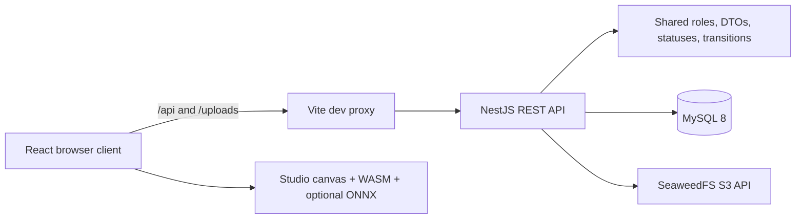

# README Architecture Guide Implementation Plan

> **For agentic workers:** REQUIRED SUB-SKILL: Use superpowers:subagent-driven-development (recommended) or superpowers:executing-plans to implement this plan task-by-task. Steps use checkbox (`- [ ]`) syntax for tracking.

**Goal:** Extend the root README with verified architecture, API, role-demo, testing, production-readiness, and FAQ guidance.

**Architecture:** Keep `README.md` as the practical entry point and link to `documents/` for deep reference material. Add one Mermaid system diagram and copy-safe examples whose routes, payloads, commands, and security notes are verified against repository source.

**Tech Stack:** Markdown, Mermaid, pnpm workspaces, React/Vite, NestJS, MySQL, SeaweedFS, PowerShell validation.

---

### Task 1: Verify source facts

**Files:**
- Read: `apps/backend/src/auth/auth.controller.ts`
- Read: `apps/backend/src/auth/dto/login.dto.ts`
- Read: `apps/backend/src/auth/dto/verify-2fa.dto.ts`
- Read: `apps/backend/src/tasks/tasks.controller.ts`
- Read: `apps/backend/src/submissions/submissions.controller.ts`
- Read: `apps/backend/src/submissions/dto/create-submission.dto.ts`
- Read: `apps/frontend/src/lib/api.ts`
- Read: `apps/frontend/vite.config.ts`
- Read: `package.json`

- [ ] **Step 1: Verify API routes and request fields**

Run:

```powershell
rg -n "@Post\('login'\)|@Post\('2fa/verify'\)|@Get\('mine'\)|@Patch\(':id/start'\)|@Post\(\)" apps/backend/src/auth apps/backend/src/tasks apps/backend/src/submissions
rg -n "email|password|challengeToken|code|taskId|fileUrl|versionNote" apps/backend/src/auth/dto apps/backend/src/submissions/dto
```

Expected: the source confirms `/auth/login`, `/auth/2fa/verify`, `/tasks/mine`, `/tasks/:id/start`, and `/submissions`, together with the documented payload fields.

- [ ] **Step 2: Verify browser request behavior**

Run:

```powershell
Select-String -Path apps/frontend/src/lib/api.ts,apps/frontend/vite.config.ts -Pattern 'baseURL|Authorization|/api|/uploads|localhost:3000'
```

Expected: Axios defaults to `/api`, bearer tokens are attached by the interceptor, and Vite proxies API and upload traffic to port `3000`.

- [ ] **Step 3: Verify workspace commands**

Run:

```powershell
(Get-Content -Raw package.json | ConvertFrom-Json).scripts | Format-List
pnpm -r list --depth -1
```

Expected: root scripts and workspace names match the testing commands planned below.

### Task 2: Add navigation and architecture guidance

**Files:**
- Modify: `README.md`

- [ ] **Step 1: Add a table of contents after the opening overview**

Add links to these existing and new sections:

```markdown
## Table of Contents

- [Overview](#overview)
- [Production Workflow](#production-workflow)
- [Roles and Capabilities](#roles-and-capabilities)
- [Technology Stack](#technology-stack)
- [Architecture Overview](#architecture-overview)
- [Repository Structure](#repository-structure)
- [Quick Start](#quick-start)
- [Demo Authentication and Development OTP](#demo-authentication-and-development-otp)
- [API Examples](#api-examples)
- [Role-based Demo Walkthrough](#role-based-demo-walkthrough)
- [Testing Strategy](#testing-strategy)
- [Production Checklist](#production-checklist)
- [Troubleshooting and FAQ](#troubleshooting-and-faq)
- [Documentation](#documentation)
- [Contributing](#contributing)
```

- [ ] **Step 2: Add a Mermaid architecture flowchart after Technology Stack**

Use this structure:



Follow the diagram with a numbered request flow covering client validation, bearer-token attachment, NestJS guards, DTO validation, service/database execution, and response/toast handling.

- [ ] **Step 3: Review the diagram labels and prose**

Run:

```powershell
Select-String -Path README.md -Pattern '^```mermaid$|flowchart LR|NestJS REST API|SeaweedFS S3 API|Request flow'
```

Expected: one architecture Mermaid block and one request-flow explanation are present.

### Task 3: Add safe API examples

**Files:**
- Modify: `README.md`

- [ ] **Step 1: Add login and 2FA examples**

Add a section that uses these routes and JSON shapes:

```http
POST /api/auth/login
Content-Type: application/json

{
  "email": "mai.assistant@inkframe.studio",
  "password": "<demo-or-local-password>"
}
```

```http
POST /api/auth/2fa/verify
Content-Type: application/json

{
  "challengeToken": "<challenge-token-from-login>",
  "code": "<six-digit-code>"
}
```

Explain that a successful 2FA response provides the access token used by protected endpoints. Do not include a real token or OTP.

- [ ] **Step 2: Add assistant task and submission examples**

Add these protected requests:

```http
GET /api/tasks/mine
Authorization: Bearer <access-token>
```

```http
PATCH /api/tasks/42/start
Authorization: Bearer <access-token>
```

```http
POST /api/submissions
Authorization: Bearer <access-token>
Content-Type: application/json

{
  "taskId": 42,
  "fileUrl": "/uploads/task-42.png",
  "versionNote": "First completed pass"
}
```

State that IDs and upload URLs are examples and that the UI normally obtains the upload URL from `POST /api/uploads` before creating a submission.

- [ ] **Step 3: Verify examples against source**

Run:

```powershell
Select-String -Path README.md -Pattern '/api/auth/login|/api/auth/2fa/verify|/api/tasks/mine|/api/tasks/42/start|/api/submissions|challengeToken|versionNote'
```

Expected: every verified route and payload field appears in the README.

### Task 4: Add demo, testing, production, and FAQ guidance

**Files:**
- Modify: `README.md`

- [ ] **Step 1: Add a role-based demo walkthrough**

Document this sequence as a table with `Step`, `Role`, `Action`, and `Expected result` columns:

1. Editorial Board reviews a proposal.
2. Mangaka opens a chapter, uploads a page, defines a region, and assigns a task.
3. Assistant starts the task, works in Studio, and submits an uploaded result.
4. Mangaka approves or requests revision.
5. Tantou Editor reviews the chapter and annotations.
6. Editorial Board manages voting, ranking, and decisions.
7. Admin reviews users and disputes.

Each result must use descriptive wording and link readers to `documents/05-roles/` for exact role rules.

- [ ] **Step 2: Add a testing strategy**

Document these commands and responsibilities:

```powershell
pnpm test
pnpm -F @manga/shared test
pnpm -F @manga/canvas-wasm test
pnpm -F backend test
pnpm -F frontend test
pnpm build
```

Explain that shared tests cover statuses/transitions, canvas tests cover WASM-facing operations, backend tests cover services/auth/workflows, frontend tests cover components and Studio behavior, and `pnpm build` validates production compilation.

- [ ] **Step 3: Add a production checklist**

Add unchecked Markdown checklist items for:

- Replacing development JWT and OAuth values.
- Configuring SMTP and disabling `OTP_DEV_ECHO`.
- Restricting `CLIENT_URL`/CORS.
- Provisioning and backing up MySQL.
- Provisioning S3-compatible storage and validating the bucket.
- Running tests and the production build.
- Reviewing rate limits, logs, health monitoring, and rollback procedures.
- Confirming no local demo credential is enabled in the production environment.

- [ ] **Step 4: Expand troubleshooting into Troubleshooting and FAQ**

Retain existing database, port, OTP, and storage troubleshooting. Add concise answers for:

- Which folder/branch should be edited after cloning.
- Why saved frontend changes may not appear when another Vite process owns port `5173`.
- Where Swagger and deeper API documentation are located.
- Why uploads fail when SeaweedFS is unavailable.

### Task 5: Validate and commit the README

**Files:**
- Validate: `README.md`
- Commit: `README.md`

- [ ] **Step 1: Verify relative Markdown links**

Run:

```powershell
$content = Get-Content -Raw README.md
$matches = [regex]::Matches($content, '\[[^\]]+\]\((?!https?://|#)([^)]+)\)')
$missing = foreach ($match in $matches) {
  $path = $match.Groups[1].Value.Split('#')[0]
  if ($path -and -not (Test-Path -LiteralPath $path)) { $path }
}
if ($missing) { $missing | ForEach-Object { "MISSING: $_" }; exit 1 }
'All relative README links exist'
```

Expected: `All relative README links exist`.

- [ ] **Step 2: Check Markdown and scope hygiene**

Run:

```powershell
git diff --check -- README.md
git diff --stat -- README.md
git status --short
```

Expected: no whitespace errors; only `README.md` is uncommitted after the planning artifacts are committed.

- [ ] **Step 3: Run repository verification**

Run:

```powershell
pnpm test
pnpm build
```

Expected: all workspace tests pass and all workspace builds exit successfully.

- [ ] **Step 4: Stage and commit only the README**

Run:

```powershell
git add -- README.md
git diff --cached --check
git diff --cached --stat
git commit -m "docs: add architecture and demo guide"
```

Expected: one focused README commit authored by `PhatNHSE196512 <ZtuLthuyX264@gmail.com>`.

- [ ] **Step 5: Verify final branch state**

Run:

```powershell
git status --short
git log -3 --pretty=format:'%h | %an <%ae> | %s'
```

Expected: the working tree is clean and the latest implementation and planning commits use the verified GitHub email.
